We can all acknowledge that 2021 was another challenging year. At the same time, there have been many moments of collective joy and success. We think that the only way of dealing with a year like this one is through acceptance, mutual support and collective action. No mud, no lotus. As Donna Haraway puts it in [Staying with the Trouble](https://www.dukeupress.edu/staying-with-the-trouble):

> Mixed-up times are overflowing with both pain and joy — with vastly unjust patterns of pain and joy, with unnecessary killing of ongoingness but also with necessary resurgence. Our task to is to make trouble, to stir up potent response to devastating events, as well as to settle troubled waters and rebuild quiet places.

For us, the co-op has offered a safe haven and a means of prefiguring the kind of future that we imagine. We feel deeply grateful to have spent the year supporting so many organisers, campaigners and communities who are fighting oppression in all its forms and offering new visions of our future/s. Not only that, we've been able to mature our understanding of the work that needs to be done and lean deeper into the cross-pollinating mission that is our namesake.

## Highlights

The four of us (Alex, Chris, Gemma and Jan) have worked on 38 projects over the past year. We're delighted to have continued working with organisations we worked with in 2020, including [Progressive International](https://progressive.international/), [London Renters Union](https://londonrentersunion.org/), [Nurses United](https://www.nursesunited.org.uk/), [The World Transformed](https://theworldtransformed.org/) and [Novara Media](https://novaramedia.com/). We've also started new collaborations with a whole lot of exciting organisations, including [350.org](https://350.org/), [Joseph Rowntree Foundation](https://www.jrf.org.uk/) and [Green New Deal Rising](https://www.gndrising.org/).

Working with the same organisers over a number of years enables us to deepen our relationships and our knowledge of their domain, which in turn allows us to find more strategic ways of supporting their work. 

Overall, it feels like the type of work we're doing is evolving. We’ve spent a lot of time this year exploring how to make communities cohesive and vibrant. We’ve done a number of projects where we help organisations (like [Community Organisers](https://www.corganisers.org.uk/), [Local Welcome](https://www.localwelcome.org/) and [GoodGym](https://www.goodgym.org/)) reflect upon and deepen their membership offering.

### Rapid prototyping

We’ve worked on some shorter projects and design sprints where we collectively generate ideas, build prototypes, test our assumptions and discover new questions. For example, we created a series of prototypes to understand how the [Joseph Rowntree Foundation](https://commonknowledge.coop/writing/digital-approaches-for-social-change-organisations/) might practice radical transparency and leverage their resources to support grassroots action on poverty:

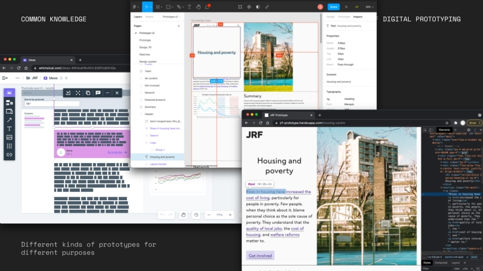

We also collaborated with [Cooperation Town](https://commonknowledge.coop/writing/cooperation-town-design-sprint-part-1-intro) to co-design a proof-of-concept app that would empower new organisers to learn from each other as they set up new food co-ops:

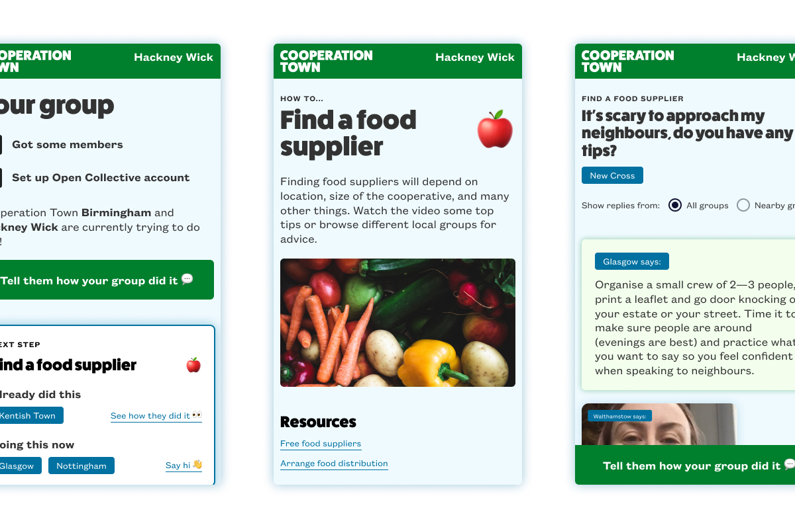

### Worker organising

We’ve worked on lots of projects focused on organising workers, including the [Game Worker Solidarity](https://gameworkersolidarity.com/) project, which maps and documents collective movements by game workers:

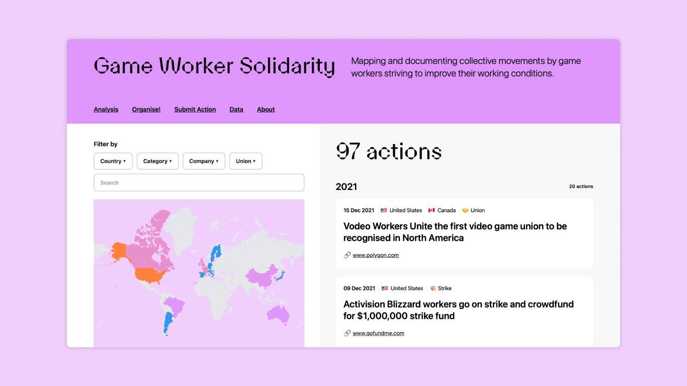

Together with [Autonomy](https://autonomy.work/) we initiated [Transform your Work](https://transformyour.work/), a toolkit of approaches, step-by-step guides and historical examples of worker organising:

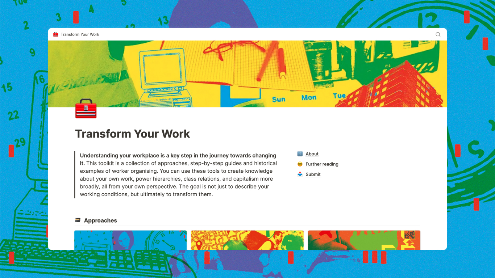

### Zetkin Foundation

We continued our fruitful collaboration with [Zetkin Foundation](https://zetkin.org/en/zetkin/). As well as working on the user experience design of the next generation of their platform for organising activism, we collaborated with them to design the [Supporter App](https://apps.apple.com/app/id1581608175). 

This was a joint venture between three Scandinavian left parties: [Enhedslisten](https://enhedslisten.dk/), [Sosialistisk Venstreparti](https://www.sv.no/) and [Vänsterpartiet](https://www.vansterpartiet.se/). The app provides people with simple and fun ways to get involved with each party in the lead up to their respective elections.

When working on this project, we revisited some of our ideas from a similar project that we did with Momentum in 2019: a web app called *My Plan to Win*. The app helped Labour supporters plan their daily activity during the crucial final weeks of the election campaign.

### Green New Deal Rising

One of our favourite projects this year was working on the visual identity for [Green New Deal Rising](https://www.gndrising.org/). This was a fairly unusual project for us (as it was primarily identity design) and it came at a time when we were already very busy, but we saw how strategically important it was so we did it anyway.

We asked our friends at [Autonomous Design Group](https://www.weareadg.org/) to help out with the project. It was a joy to work with both them and the Green New Deal Rising team to develop an iconic and replicable mark for the movement.

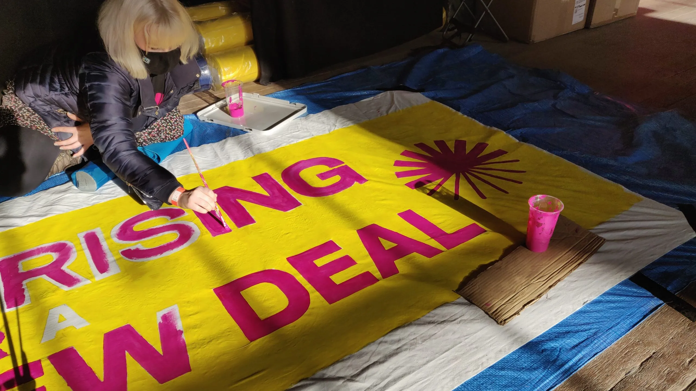

We’re so impressed with how their team has since taken the identity and run with it in such creative ways. Seeing the [impact](https://www.gndrising.org/updates/were-just-getting-started/) that an ambitious organisation with focus and skill can have in just four short months is incredible.

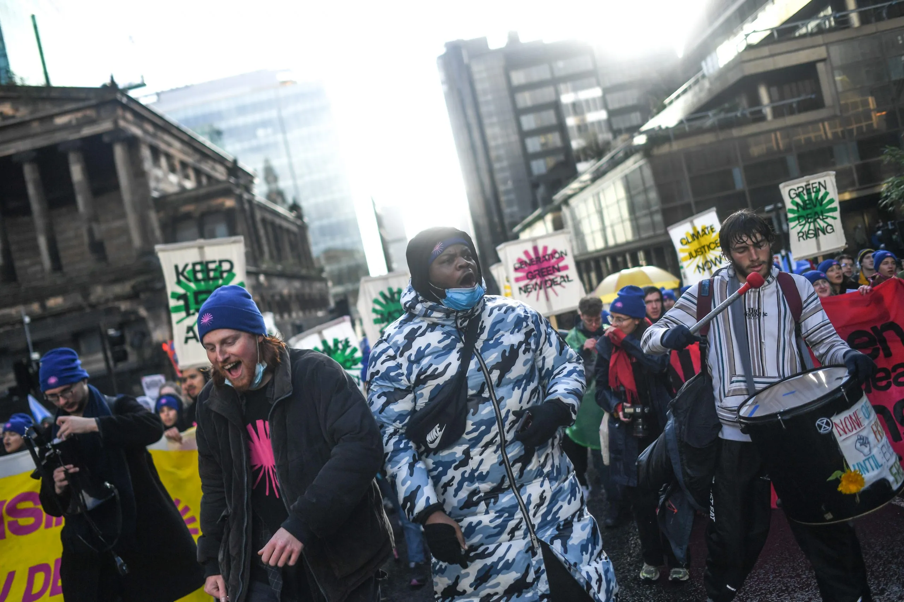

## Co-op news

We’ve grown a lot as a collective over the past year. Alongside our consultancy work, we spent a lot of time on our own internal dynamics. There have been difficult times as well as good ones, but we managed to weather the storms and learn from them. We’ve learned that conflict can actually be healthy and generative. 

We had help from Pete Burden from [See Step](https://www.seestep.com/), who ran a few sessions to help us listen to each other, understand our own needs and give constructive feedback. We feel much more resilient and cohesive as a team because of this.

### Governance

We collectively wrote policies and added to our internal handbook, created employment contracts for ourselves and became full-time PAYE employees of the co-op. Shortly after, we decided to [move to a four day week](https://commonknowledge.coop/writing/moving-to-a-four-day-week/) at no loss of pay. All of this has had a huge impact on our sense of stability as a collective and on our work-life balance.

We set up rotating responsibility areas to ensure that accountability was shared evenly amongst members. These have gone through several refactors, but in their current iteration they are: Financial Administration, Public Communication, Opportunity Development and Governance.

### Members

[Sonia Turcotte](https://soniaturcotte.com/) worked with us for the first half of the year. As well as collaborating with us on design and research projects, they taught us so much about accessibility, power and privilege.

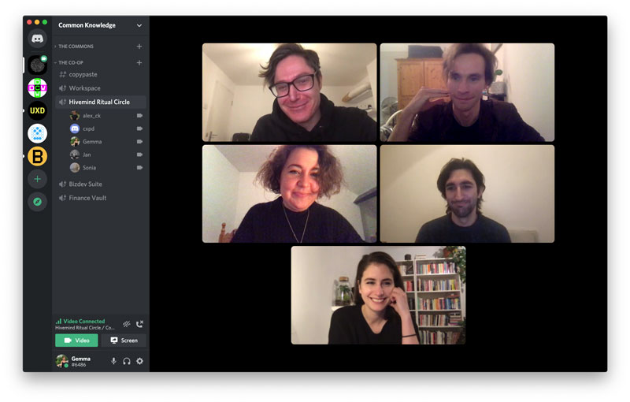

Towards the end of the year we hired [Anna Cunnane](https://www.annacunnane.co.uk/), an apprentice software developer from [Founders and Coders](https://www.foundersandcoders.com/). She starts working with us this week, which is super exciting!

### Intentions

In 2021 we ran 24 [agile sprints](https://www.agile-academy.com/en/agile-dictionary/sprint/). For each sprint we set an intention. These began the year by cycling the agile values, then drawing from our own values, then just getting a “feel” for what the intention of the sprint should be after planning it. 

Over the course of the sprint, we would reflect on our intention and discuss it. Sometimes this really worked well. Other times (memorably: “Focus”) the intention became a bit ironic. But overall it was a very useful practice. We recommend that other teams consider doing this too!

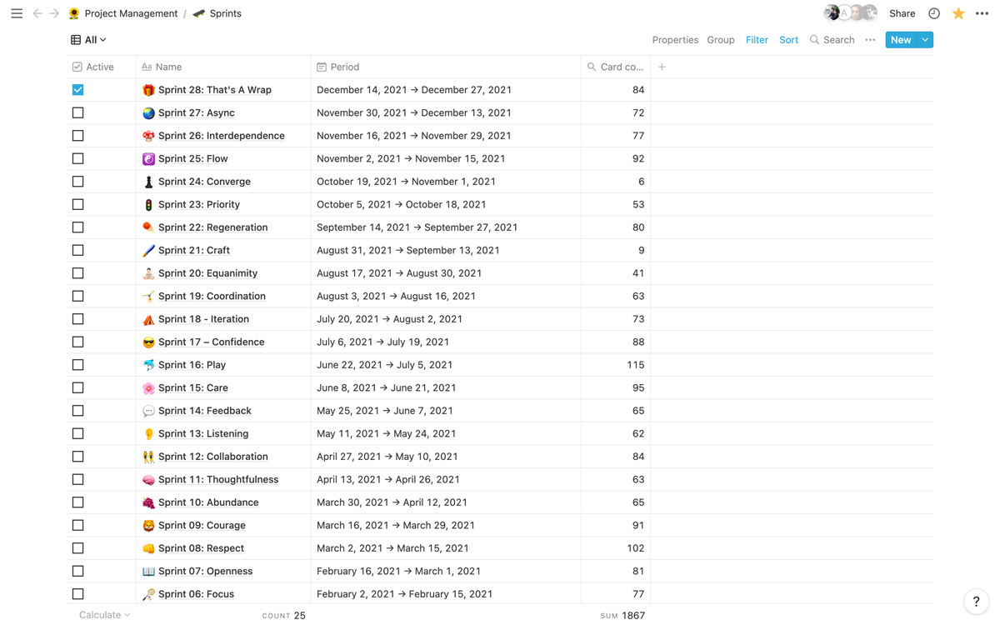

### Tools

After a few years using Notion heavily for almost all our work, we’ve started branching out to a number of different platforms:

- We ditched both our CRM ([Capsule](https://capsulecrm.com/)) and scheduling tool ([Float](https://www.float.com/)). We migrated to [Productive](http://productive.io) for planning, business development and finance management instead.
- We started using [Missive](https://missiveapp.com/) as a shared inbox with lots of collaborative features.
- We’ve used [Loom](https://www.loom.com/) a lot for asynchronous video communications – it allows you to create quick videos of both your screen and face at the same time.
- We’re trying out [Twist](https://twistapp.com/) for asynchronous communication and [Dovetail](https://dovetailapp.com/) as a research repository.

### Co-working space

We said goodbye to our wonderful and supportive co-working space, [Space4](https://space4.tech/), and moved to Pelican House where the [Rosa Luxembourg Stiftung](https://www.rosalux.eu/en/topic/1567.rls-office-london.html) has set up a space. It might be a while before we’re using this regularly, but we’re excited to be sharing a space with so many of our collaborators.

### Team retreat

We went on our first team retreat to a little cottage by a lake in West Sussex. After almost two years of working remotely, this time together was hugely beneficial for our work, our relationships and our mental health. We’re planning to meet IRL at least every quarter from now on.

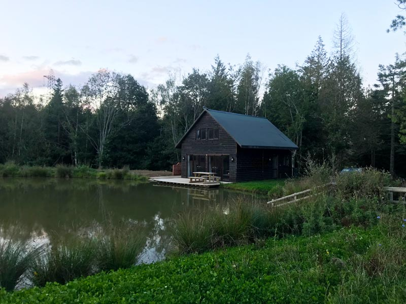

During the retreat, we reviewed our vision, mission and values. Afterwards, with some help from writer [Linsey Rendell](https://www.linseyrendell.com/), we wrote a [new version of these](https://github.com/commonknowledge/vision-mission-values). We still see these as a work in progress and we don’t think we’ll ever stop iterating, but this new version is a snapshot of our current thinking.

### Financial support

We received grants from the [National Lottery Community Fund](https://www.tnlcommunityfund.org.uk/), [Rosa Luxemburg Stiftung](https://www.rosalux.de/en/) and [Barry Amiel & Norman Melburn trust](http://www.amielandmelburn.org.uk/). This support allowed us to recover from the financial damage caused by covid-19, carve out some breathing space and work on some self-initiated projects. 

We didn’t apply for any new grants this year as most application processes tends to be quite exhausting for a small team! We might pick this up in the new year though.

If you want to fund us (cheers!) or you’re applying for grants yourself and want to talk about the process – [get in touch](mailto:hello@commonknowledge.coop).

### Teaching and learning

It was really great to run more workshops this year. We always learn a lot from the process and participants, so we’re keen to do more of this in the new year.

- In January, Sonia and Gemma ran a workshop on community-led design practices for the [MA Graphic Media Design course](https://www.arts.ac.uk/subjects/communication-and-graphic-design/postgraduate/ma-graphic-media-design-lcc) at London College of Communication.
- Gemma worked with [Agile Collective](https://agile.coop/) and [Outlandish](https://outlandish.com/) to run a series of masterclasses for the [UnFound Accelerator](https://www.uk.coop/resources/unfound-accelerator-application-guidance/about-unfound-accelerator), a programme designed for early-stage platform co-op founders. We shared our knowledge on running design sprints, roadmapping, testing assumptions and more.
- Alex started a series of [co-teaching sessions on Digital Organising](https://www.eventbrite.co.uk/e/digital-organising-learning-lunch-tickets-185742529907), in collaboration with Act Build Change.
- Gemma continued participating in a small action learning group made up of other co-op members from Space4. We shared the model we’d developed with other co-ops at this year’s [CoTech](https://coops.tech/) gathering, in the hope of replicating it across the network.
- Jan participated in a similar action learning group initiated by the Rosa Luxembourg Stiftung: [Feminise Politics Now!](https://www.rosalux.eu/en/article/1918.feminize-politics-now.html)
- We also ran our own internal book club where we discussed [Going Horizontal](https://goinghorizontal.co/) by Samantha Slade and reflected on how we could make our co-op structure even more horizontal. We also learnt that keeping internal book groups going was quite hard as they often get bumped for other priorities!

### Public communications

We were honoured to be asked to contribute to a few publications and interviews, including:

- An interview for [*Caps Lock*](https://www.valiz.nl/en/publications/caps-lock), a book by Ruben Pater about graphic design and capitalism.
- A chapter for [*Practicing Sovereignty: Digital Involvement in Times of Crises*](https://sovereignty.weizenbaum-institut.de/projects/practicing-sovereignty-the-anthology/). We wrote about the complexities that come with striving for digital sovereignty as democratic membership organisations.
- An article on how to run a design sprint for [*Stir to Action* magazine](https://www.stirtoaction.com/magazine-issues/issue-34).
- An interview with [*General Intellect Unit*](http://generalintellectunit.net/e/068-common-knowledge/) podcast.

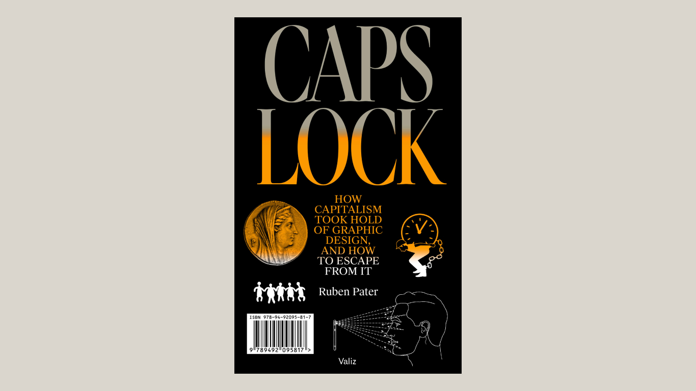

We love doing interviews and writing about our work. If you want us to speak on your podcast, write for your publication or speak at your event – [get in touch](mailto:hello@commonknowledge.coop).

## Collaborators

We feel deeply grateful for all the people who collaborated with or supported us over the past year, including:

- [Sonia Turcotte](https://soniaturcotte.com/)
- Our fellow CoTech co-ops: [InFact](https://www.infactcoop.com/), [Code-Operative](https://code-operative.co.uk/), [Agile Collective](https://agile.coop/), [Outlandish](https://outlandish.com/), [Jarrow Insights](https://jarrow-insights.co/#Home), [Good Praxis](https://www.goodpraxis.coop/), [Founders and Coders](https://www.foundersandcoders.com/), [The Developers Society](https://www.dev.ngo/), [Yalla](https://www.yallacooperative.com/), [Animorph](https://animorph.coop/) and many more!
- Cade and Ben from the [New Design Congress](https://newdesigncongress.org/)
- [Shauna Buckley](https://shaunabuckley.com/) and [Yuli Serfaty](https://yuliserfaty.com/) for their design talent
- [Autonomous Design Group](https://www.weareadg.org/)
- Will and Jack from [Autonomy](http://autonomy.work)
- Richard, River and Daniel from [Zetkin Foundation](https://zetkin.org/en/)
- Pete Burden from [See Step](https://www.seestep.com/)
- Siôn Whellens from Principle Six and [Calverts](https://www.calverts.coop/)
- [Third Sector Accountancy](https://www.thirdsectoraccountancy.coop/) - our accountants. A cooperative like us who really understand social change work. Recommended!
- [Rosa Luxembourg Stiftung](https://www.rosalux.eu/en/topic/1567.rls-office-london.html) for their support and ongoing work facilitating the UK left.
- [The Social Practice](https://www.thesocialpractice.org/)
- [Act Build Change](https://actbuildchange.com/)

See you next year!

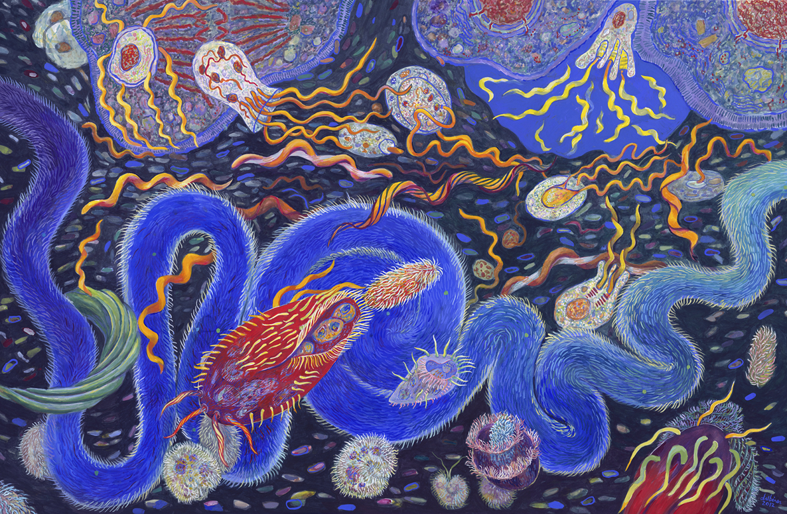
*[Endosymbiosis: Homage to Lynn Margulis](https://www.cybermuse.com/blog/2012/2/13/endosymbiosis-homage-to-lynn-margulis.html)* by Shoshanah Dubiner
