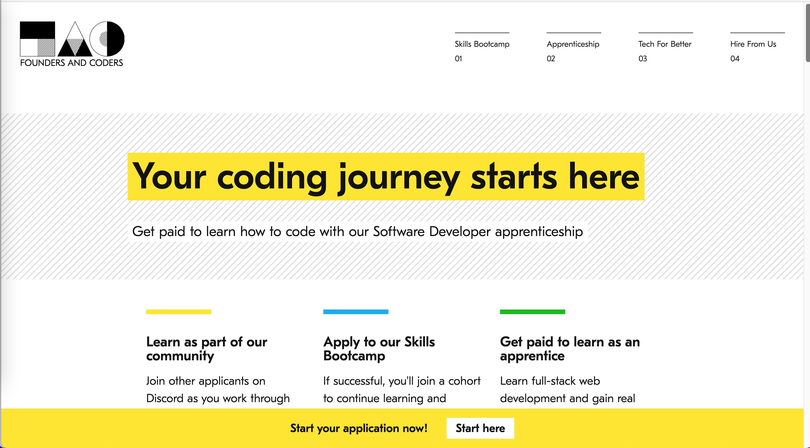
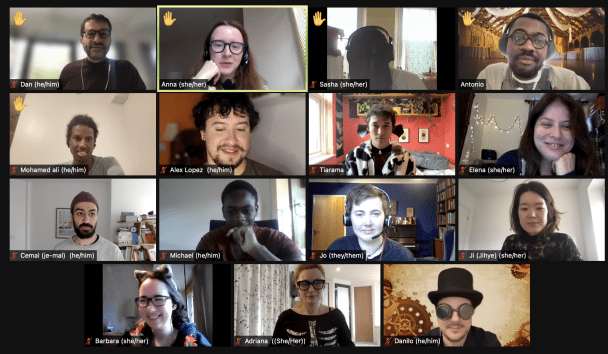
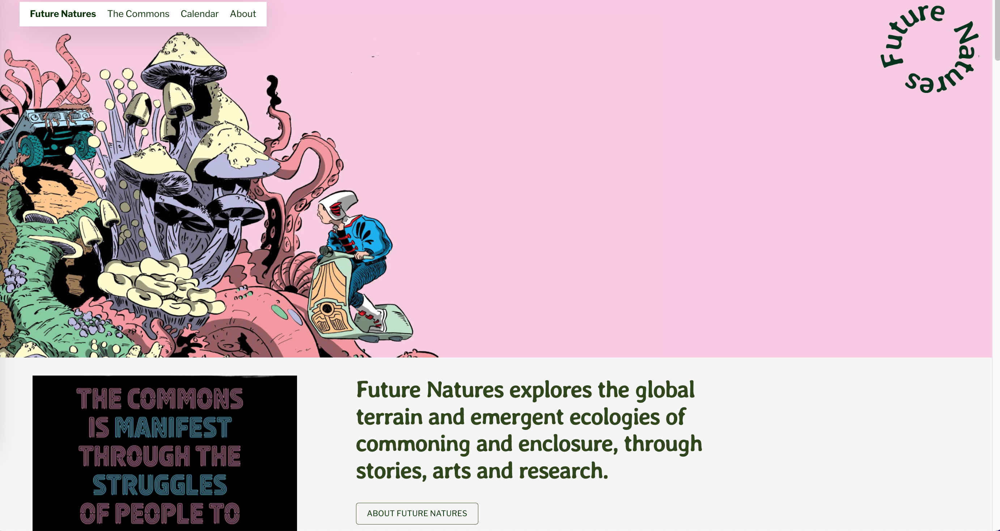

I’m Anna and I’m the software engineering apprentice here at Common Knowledge. I thought it might be interesting to write about my experiences as a software engineering apprentice since September 2021.

I used to work in book publishing but about 3 years ago I started learning to code in my spare time. I started with just a few minutes a day and taught myself the basics of HTML, CSS and JavaScript.

I was attracted to coding as a way of solving real life problems. It felt like an almost magical power to be able to think of something and then create it in code.

Once I felt like this was something I wanted to do full-time I started looking at software development bootcamps in London.

I decided on Founders and Coders because

1. Tuition was free
2. The apprenticeship route was available
3. The entry requirements were rigorous
4. It had good reviews within the industry
5. I liked the emphasis on inclusion

The Founders and Coders [website](https://www.foundersandcoders.com/)

### What is a software development apprenticeship?

The software developer apprenticeship (Level 4), as delivered by Founders and Coders, is split into three parts. It starts with sessions delivered in the evenings focussing on web development skills and employability. This was the most challenging part of the programme for me as I was still working full time in my publishing job.

I then got the opportunity to meet the lovely people at Common Knowledge. I really identified with their mission and they were so friendly during the interview that I was thrilled when they offered me an apprenticeship.

The next stage in the process was 12 weeks of  full time study of Javascript, Node.js and React. This period taught me about working closely with other people (which was even more difficult over Zoom) and getting comfortable with not knowing the answer.

My cohort dressed up for Halloween

Finally in January 2022 I joined Common Knowledge full time and started writing code for real client projects. I appreciated that I could get stuck in straight away and they gave me the space to try things myself and make mistakes.

For me the apprenticeship was a great opportunity. It allowed me to get a job before I started retraining and significantly reduced the financial risk. It has set me up with real world experience as well as a recognised qualification.

### What have been the highlights of the apprenticeship so far?

I’m proud of the work I’ve done on [FutureNatures.org](http://futurenatures.org/). The site is built in WordPress with the Gutenberg FSE (Full Site Editor). We’ve used existing and custom blocks and post types for the different types of content that the site needs. We have written custom CSS for the theme that was developed by our brilliant designer Gemma.

I’ve had a lot of exposure to new frameworks and software development approaches since I started at Common Knowledge. It’s expanded my horizons and made me excited about the possibilities for my future learning and career. 

I’ve also met some very cool people doing things I admire both within the co-op and within the larger movement that CK operates in. This is the kind of network I want to be embedded within for the rest of my career. 

I’ve enjoyed getting an insight into how the co-op is run. Working within a co-op there is a real feeling of solidarity and mutual care.

### And the challenges…

There have also been challenges during the apprenticeship. In particular, it has been difficult to start again in a new industry. I had a few years of experience in publishing so I was used to having a certain degree of competence. 

Most of the time I don’t understand what I’m doing and I’m constantly pushing at the boundaries of my knowledge. This is the best way to learn but it doesn’t feel comfortable most of the time. My colleagues have told me that this is what being a developer is about and that you never stop learning. Common Knowledge has been great however at guiding me through this and Founders and Coders have offered ongoing support.

I really hope that this post has been useful for people curious about getting into software development via the apprenticeship route. I’m hoping to finish my assessments and graduate from the programme by the end of 2022. 

You can read more about me and my progress on my [personal site](https://www.annacunnane.co.uk/) and on [Twitter](https://twitter.com/AnnaThereseCu). To find out more about Founders and Coders and apply go to [https://www.foundersandcoders.com/](https://www.foundersandcoders.com/)
