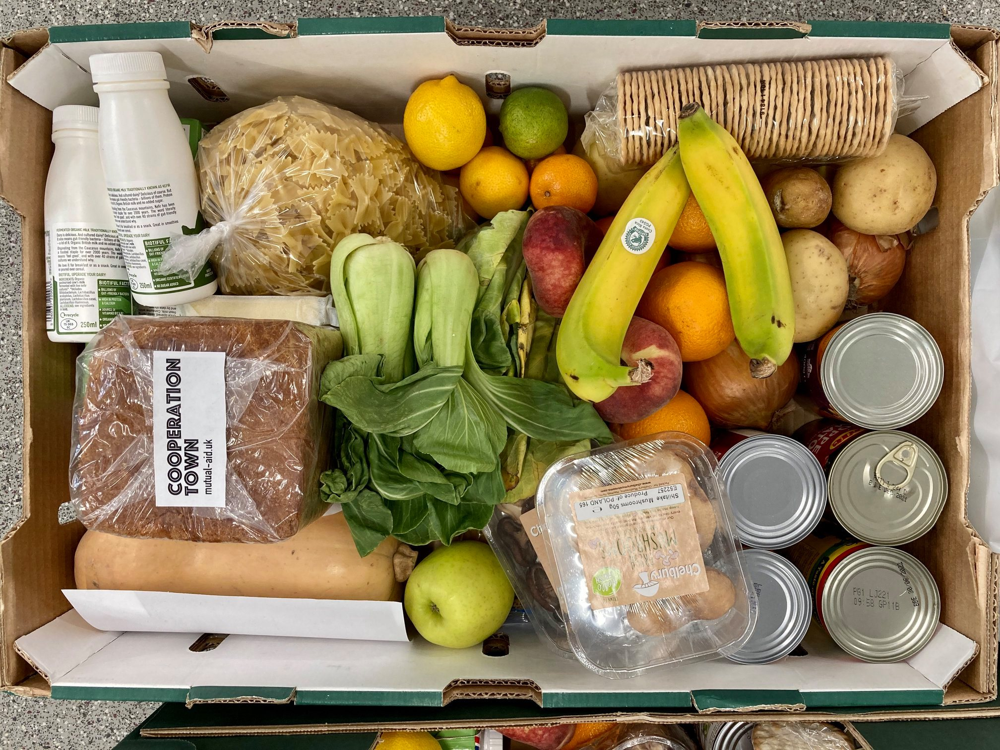
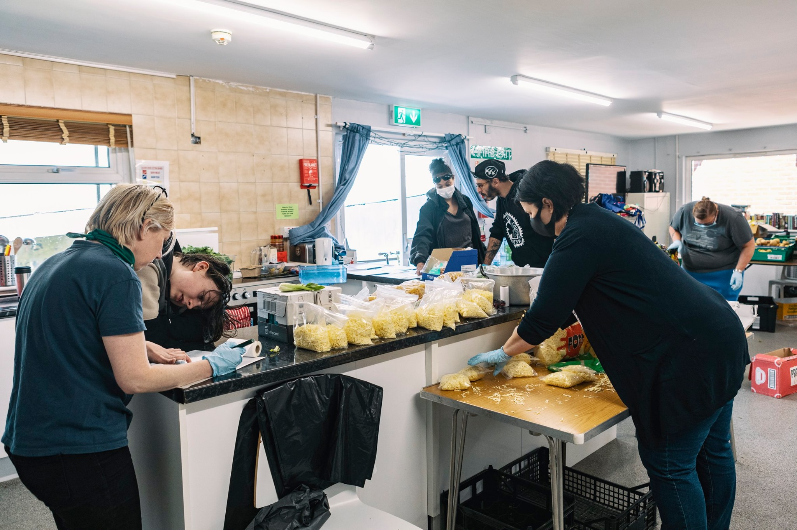
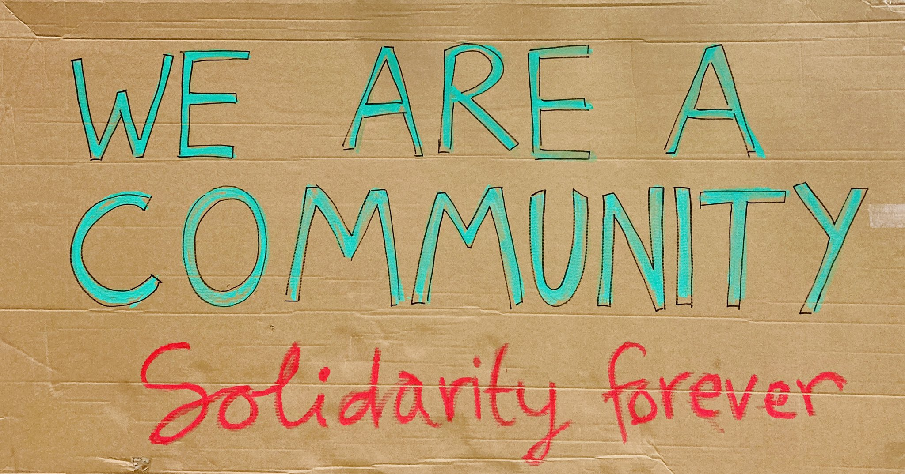

[Cooperation Town](https://cooperation.town/) was set up over the winter of 2019–2020, just a few months before lockdown. Since then, it has evolved from a small self-organised group of Kentish Town council estate residents into a growing national network of neighbourhood food cooperatives.

Throughout the last year we've followed the network's organisers in their efforts to popularise the idea, incubate new groups and share knowledge between them to build momentum. As the network has expanded, they've come across many of the same issues around growth and reproduction that we've noticed in other self-organised groups.

We decided to facilitate a week-long workshop, in the form of a ["design sprint"](https://www.gv.com/sprint/), with organisers from the Cooperation Town network. Together, we explored these challenges and potential online-offline solutions. In this series of posts, we'll share what this process looked like, what we tried and what we learned throughout.

Common Knowledge's mission has always been to work directly with grassroots activists to design digital tools that make radical change possible. We are very grateful to [The National Lottery's Coronavirus Community Support Fund](https://www.tnlcommunityfund.org.uk/funding/covid-19) for enabling us to work on this project.

## Wait, what's a food co-op?

Food co-ops are small, 10-20 household groups of neighbours who benefit from the economies of scale of working together as a team. They arrange a regular supply of affordable food to all their homes by pooling money and time, making decisions together and then distributing roles to make it happen.

Compared to a food bank or a food larder, a food co-op is more involved. Co-op members do tend to get cheaper food, through bulk orders from the surplus food providers like the [Felix Project](https://thefelixproject.org/), [FareShare](https://fareshare.org.uk/) or local suppliers. Through membership and participation often emerges strong neighbourly bonds, a community rhythm and a bolstered appreciation of the power you have, through others around you, to change things for the better.

After figuring out food supplies, some Cooperation Town co-ops have gone on to recognise other neighbourly needs, for example childcare provision, that could also be organised collectively. They began to think bigger and more creatively.

In this way, networks like Cooperation Town seed new community connections and begin to paint a more vibrant, dynamic and empowering picture of a social reality than what many experience today in Britain.

## Another world is possible… but how do we get there?

It can be exciting to hear about this idea and see it work. Many people have voiced interest in starting a food co-op in their area after hearing about Cooperation Town. But what the network's organisers noticed is that turning that enthusiasm into action is a challenge that repeatedly resurfaces in the 'lifecycle' of each group and the network at large.

Community organisers and those substantially involved in 'people work' are well-versed in [the power of direct one-to-one relationships](https://www.corganisers.org.uk/what-is-community-organising/our-framework/). They have the capacity to allay fears, build confidence and fill in many of the blanks that it takes to get things moving. It's what Cooperation Town's network coordinators have spent much of their attention doing with new and emerging groups, and has arguably been the driving force of the network so far.

As the network continues to expand, they are increasingly concerned to shift gear away from this one-to-many organising model, in recognition of some very well-documented limitations experienced by many networks, and [towards a more 'distributed' model](https://blueprintsfc.org/guide/distributed-organizing/):

> Though more horizontal when compared to traditional command and control leadership, distributed organizing often relies on a central coordination group to launch the network and to drive it towards common goals and milestones. When done properly, it can help a movement or campaign scale rapidly and channel huge amounts of collective power.

For example, there's only so many hours in the day to keep in touch with everyone which can risk the sustainability of the strategy. Besides, who knows best? Increasingly the groups' participants are those asking, figuring it out and answering questions. Coordinators of a network can capture some golden nuggets of 'good practice' but there's no single answer in what is a very context-dependent community project.

A reliance on paid network staff, cash grants and a select few financially self-reliant volunteers can cement a hierarchical power 'over' relationship stemming from philantrophists 'down' to participants, encouraging forms of gatekeeping that are common in NGO-led and progressive initiatives. We're reminded of an [observation by Stripe Partners' field notes from Dundee](https://medium.com/digitalfund/live-fieldnotes-dundee-d579bdcd1357):

> Eddie [a food larder organiser] feels a lack of autonomy over the everyday decisions that get made; everything that he wants to do or change has to be voted on and signed off by the centre’s local management group. This has meant that he once had to turn down funding as he hadn’t sought the correct permission from the committee to apply for the grant in the first place and so the action was blocked.

Autonomy is what Cooperation Town wants to cultivate at a group level. To get there, they need to form the right kind of relationships at the network level to match.

Exploring what this might look like encourages us to imagine how everyday people can work locally and support one another trans-locally through solidarity not charity, everyday government by the third sector and liberal, conditional generosity.

## Enter, a design sprint

That's a lot of talk, but what happens next? 

Back in 2018, Common Knowledge started its life with a design sprint that asked the question: how do we engage people who want to get involved in direct action politics but don't know where to start?

Organisations of all sizes use variations of a design sprint to cut through a complex problem like the one facing Cooperation Town, where there are many possible next steps but also many questions and uncertainties about what will uncover the most favourable outcomes. Both Cooperation Town and ourselves had plenty of ideas about what could happen next, but we weren't certain which way to take things.

So, we decided to run a collaborative design sprint together to explore these questions.

## Stay tuned

In our next post, we'll share how it went and what we learned. If you'd like to hear when we publish this, subscribe to our newsletter or follow us on Twitter.

## Further reading
- [How to Run Design Sprints for Social Impact Projects](https://www.mightybytes.com/blog/how-to-design-sprints-social-impact-projects/) by Mighty Bytes
- [Design sprints for social change](https://reasondigital.com/blog/design-sprints-for-social-change/) by Reason Digital