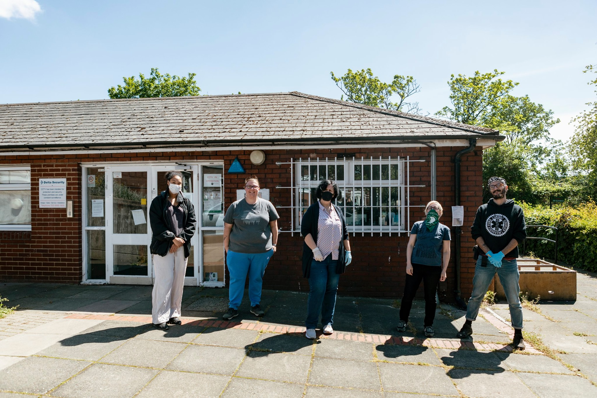
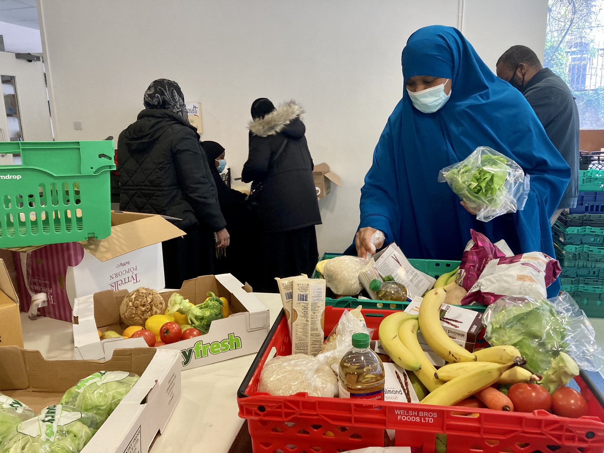

In [part one](/writing/cooperation-town-design-sprint-part-1-intro/), we introduced Cooperation Town's organising model and how our collaboration came about. In this post we want to open up how and what we learned in the design sprint itself.

A 'design sprint' is a highly structured team process. Fundamental to the process is collectively deciding a clear goal and flagging any uncertainties. From there, you move quickly to create a temporary prototype and then test it with real-world participants to reveal new insights. 

What makes this process so rewarding is that, within a week, you get to see how your ideas perform in the real world, without investing substantial time and energy into a fully functional but untested solution.

In the case of Cooperation Town, we wanted to watch and learn how food co-op organisers might work with the rest of network to overcome the puzzles of starting and growing their groups, mediated by a digital platform.

## Preparation

To prepare for this sprint, we started with [Miro's remote design sprint template](https://miro.com/templates/remote-design-sprint/), took note of the recommendations made in some articles by people who've done it before (check out the footnotes ⬇️) and then worked some of the original scheduling made in the *Sprint!* book back into the agenda. If you don't have the book, that's fine! They've put almost [everything, including the agenda](https://www.thesprintbook.com/how), online for free.

Suffice to say, our working practices took a bit of rejigging due to lockdown and the ongoing operation of the Cooperation Town network and its food co-ops, who were all still continuing to distribute food.

We probably spent half as long on workshopping compared to an in-the-room sprint. This was mainly due to how exhausting video calls can be compared to real-life meetings. Spending more time might have helped us refine our thinking at each step, but the goal of a design sprint isn't to produce perfect outcomes so much as to kickstart an experimental and reflective cycle that keeps on going.

## Day 0: A technical warm-up helps to level the field

**Tools we used:** 

- [Miro](miro.com/) for whiteboarding and integrated [video conferencing](https://miro.com/marketplace/video-chat/) (which was really good!)
- [Zoom](zoom.us/) for user testing
- [Notion](notion.so/) for supporting documentation
- [Google Drive](drive.google.com/) for file archives

Because these tools might have been unfamiliar and not everyone had met each other, we arranged a quick technical warm-up session with us and our Co-op Town collaborators. This was useful because it meant we were able to lift each other up to 'power user' level. It gave everyone a bit more fluency and confidence to participate equally in the substantive exercises.

We also took this opportunity to do a schedule check for the rest of the week and learned that there'd be some last-minute trainings and other commitments, which warranted moving the schedule around to maximise participation. The last thing we wanted was inconsistent team presence in the workshops, which really relies on building up a shared understanding. We continued with a morning schedule check everyday for the rest of the sprint.

## Day 1: designing a problem

We'd already agreed on the broad problem we were planning to address in the sprint. On Day 1, we introduced the workshop by revisiting that high-level scope and then zooming into the nitty gritty.

This was a really exciting and eye-opening day. We spent the time learning as much as possible about the organising experience. We had a lot of puzzles and ideas around digitally-mediated peer-to-peer learning, so we had invited an e-learning professional, Sarah Hasan, to join the workshops and give their take.

Here's a sample of what came up in this session:

### What isn't being shared between groups?

First, more on the **centralisation** problem we mentioned in [our last post](https://commonknowledge.coop/writing/cooperation-town-design-sprint-part-1-intro). Information signposting is solely the responsibility of the network coordinator. 

Food co-operatives are notionally straight-forward to set up: there's a website and a starter pack filled with questions and answers. However, this information on its own isn't enough – most new co-ops need someone to talk them through the process of getting one started. 

While these coordinators have a good sense of the steps that tend to be more difficult, it takes direct calls to find out where they are now so that they could support people to move along. Without this support, new groups might not get off the ground.

### People learn in different ways

**Accessibility** was something that came up a lot, including observations that everyone has **different learning styles**. The coordinators had created an amazing starter pack in an attempt to de-centre themselves from the work of organising.

However, while the starter pack contains loads of valuable information, it's a PDF, which is [a very inaccessible format](https://gds.blog.gov.uk/2018/07/16/why-gov-uk-content-should-be-published-in-html-and-not-pdf/). It's also quite text-heavy, which means lots of people wouldn't read it for literacy or accessibility or preferential reasons. In particular, it didn't work well for non-native English speakers. When people did read it, they didn't necessarily get very far through it or find what they were looking for. Organisers were asking the network coordinators for something more visual.

To address these issues and demystify the process, Co-op Town have a comic book and a film in the works. They've also encouraged some groups to post stories on '[how we did it](https://cooperation.town/cooperation-hull/)'. It's unclear, however, what the effect of these new formats might be, because at the moment there's **not much feedback on what works and what doesn't.**

The concern here is that centrally created, flashy materials can't easily incorporate experiences and new ideas from the field — meaning this might not qualify as a reliable tactic for reproducing this network model with other similar projects.

### New can seem scary

The starter pack was also inaccessible because it made it **hard to imagine how to apply it in practice**. Although it made it clear that you were meant to adapt things to your own context for yourself, people seemed puzzled about what the outcome looked like and the steps along the way.

Worse, new starters were often **intimidated** by the amount of effort involved and **unconfident in their abilities.** Speaking to an unfamiliar neighbour and boldly inviting neighbours to a brand new project can seem scary. 

To address this, the network coordinators would spend a substantial amount of time on 1-to-1 phone calls with new starters. During these calls, they helped people recognise that the progress they'd made and that they were *already* organising. The key goal for the coordinators was to give new starters the confidence to just try stuff out and work it out as they go.

(In Common Knowledge's Sprint 0, back in 2018, we spoke with many community organisers and noted a similar pattern: that more experienced organisers attributed their success to trial and error, reflect and repeat, whereas newer organisers baulked at the potential to commit a social faux-pas and make an idiot of themselves — which is totally understandable!)

### And many other ideas

At this point, we had so many different ideas bubbling up. The topics we were discussing included:

- There's no one-size-fits-all process for starting a food co-op, so any plan distributed by network coordinators will inevitably be either too general or too specific, and thus not align with each co-op's individual situation. Could we encourage new starters to take inspiration from and then **adapt a plan**, rather than just following instructions?
- Could we elicit more experienced organisers to **share their stories** through different mediums, to inspire new starters on what their journey might look like?
- Is there an opportunity for new organisers to **experience, practice, rehearse** and, in the particularly apt terminology of union organising, "inoculate" themselves against unfamiliar scenarios that are likely to arise on the way to a fully functioning food co-op?
- We noted that building a **safe and structured learning community** was something important to consider throughout. A major risk was that any solution might have the reverse effect of knocking peoples' confidence, which is something we get a bit of a feel for in the user testing on Day 5.

### Defining the scope

After a speed-mapping exercise of the entire journey, the group honed in on the process of developing a living starter pack that could be used, improved and adapted by the local groups themselves.

What we specifically *didn't* want to solve were the challenges of getting food, knocking on doors or finding a food venue. We wanted to see people sharing advice about these activities with one another, but we were wary of focusing too much on food delivery and not so much on the actual crux of the project: **encouraging self-organisation.**

### Identifying a long-term goal

To make tracks we needed to agree a long-term goal. In a design sprint, this helps to extend the imagination far into the future, by imagining the most optimistic results of our interventions. Although a design sprint is only a week, we all saw this sprint as part of a longer collaboration and wanted to agree on the long-term impact of our work together.

We all took turns writing this goal individually, discussed and voted upon everyone's contributions and then collectively wrote this as our goal:

> Create a tool that gives all co-op members the confidence to see themselves as an organiser, as part of a wider network where they do not feel less or more important than anyone else.

It was interesting to see "create a tool" at the beginning of this goal. This speaks strongly to our background ambition: to reproduce the success of this project through social-digital infrastructure. 

At Common Knowledge, we focus on people working with technology, recognising that online and offline interactions in communities are mutually constitutive. We spend a lot of our time working on organisational strategy, coaching and other activities that are tangential to software development.

### Identifying our questions

We had a lot of questions. On reflection, we probably should have cut these down to produce deeper insights. However, given that the organisation was yet to do much exploration of how digital technology could help them, we settled on a broad set of questions that could help to inform future work and collaborations.

- **Accessibility and community engagement.** *Will people who don't like to read long-form text [or have accessibility needs] use the tool and find it useful?* *Can we make this tool feel like something related to a live community rather than another website that articles and resources get dumped on?*
- **Decentralised network and self-organisation.** *Can we create a tool that doesn't centralise knowledge, given that it is by necessity developed in a centralised fashion?* *Can we avoid implicit hierarchies between organisers with different levels of experience?*
- **Diversity.** *How can we ensure that a diversity of people join this network?*
- **Formats that boost confidence.** *Will people feel truly confident without any face-to-face / 1-to-1 training?* *Will people learn to follow instructions or to make their own plan?*

## Further reading

Thanks for reading this far! In [part three](/writing/cooperation-town-design-sprint-part-3), we talk more about how we created the prototype, tested it with organisers and what we learned!

- [How To Do A Design Sprint Remotely Amidst Coronavirus Pandemic?](https://medium.com/nomoko/how-to-do-a-design-sprint-remotely-amidst-coronavirus-pandemic-870bb57febd5)
- [The Sprint Book - Remote Workshops](https://www.thesprintbook.com/remote)
- [Remote working in design: Part 2 of a Design Sprint Trilogy](https://prototypr.io/post/remote-working-in-design-part-2-of-a-design-sprint-trilogy/)
- [How To Lead a Remote Design Sprint](https://spotify.design/article/how-to-lead-a-remote-design-sprint)
- [The Design Sprint Note-n-Map](https://sprintstories.com/the-design-sprint-note-n-map-a9bf0ca88f51)
