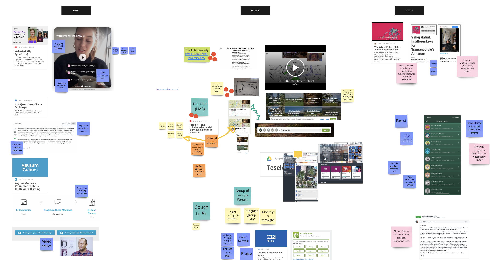
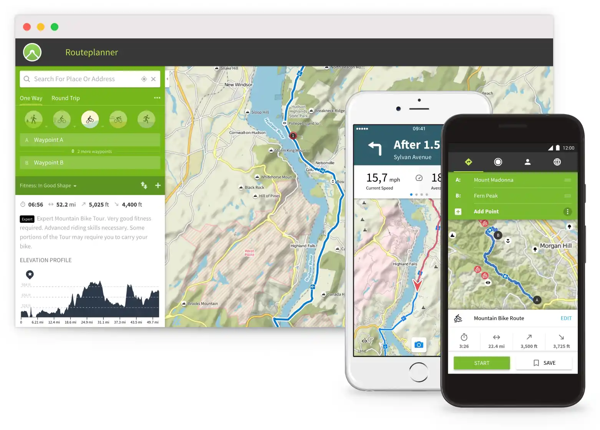
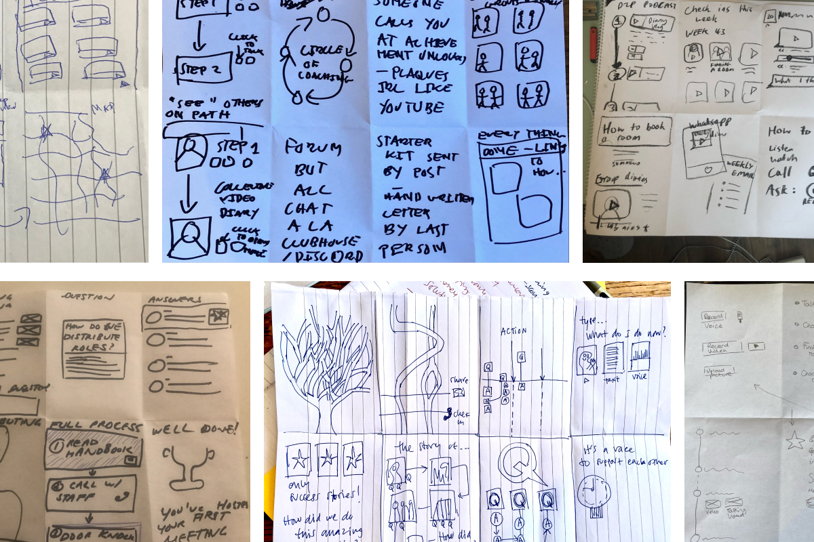
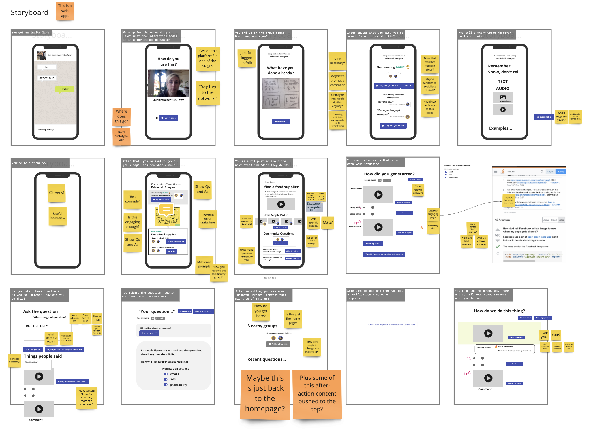
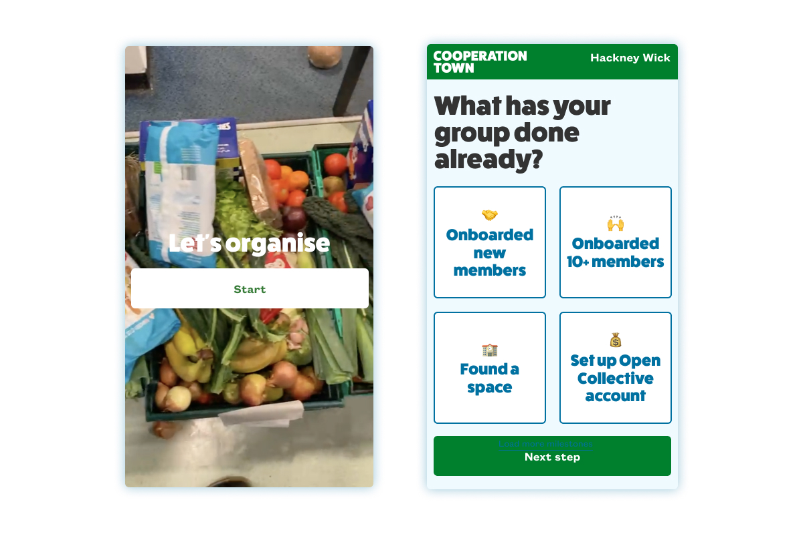
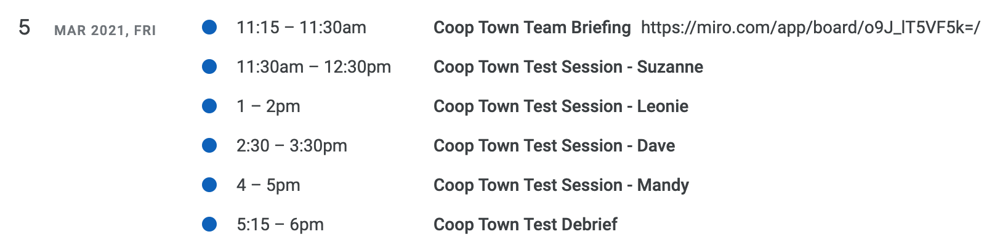
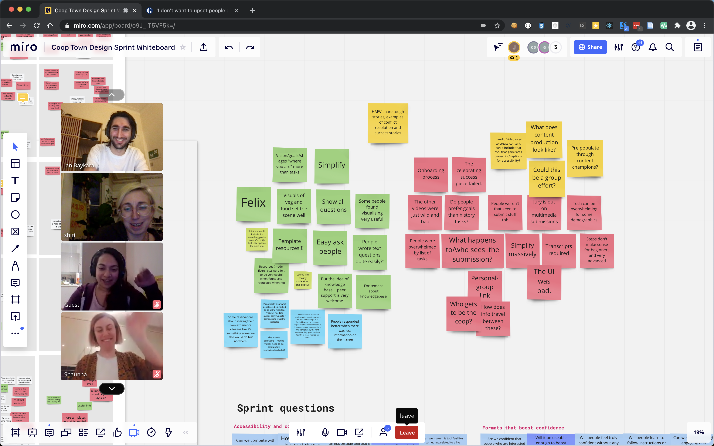

## Sketches of a future

A design sprint works well because it brings people equally into the midst of a complex scenario and then zooms in and out repeatedly in the manner of a [cybernetic "forward-looking search."](https://www.hive.co.uk/Product/Andrew-Pickering/The-Cybernetic-Brain--Sketches-of-Another-Future/14788204) We were impressed that a few of the stages of the process preempted concerns held by the organiser, continually steering attention back to our specific goal and questions for the sprint.

In [part one](https://commonknowledge.coop/writing/cooperation-town-design-sprint-part-1-intro/) and [part two](https://commonknowledge.coop/writing/cooperation-town-design-sprint-part-2/) of this series, we introduced the [Cooperation Town](https://cooperation.town/) project and walked through how we defined the problem. Through this process, we identified our sprint goal: how might we give all co-op members the confidence to see themselves as an organiser within a non-hierarchical network? 

In this post, we'll review how we created a prototype, what we learned from testing it with food co-op organisers from around the UK, and some potential implications for Cooperation Town and other self-organising networks.

## Day two: demoing, sketching and storyboarding

We had previously examined where Co-op Town was currently at, so it was time to widen the net by looking at already existing examples. There was a day's gap between the previous session and this one, so we set some homework for everyone: how has this problem already been solved, why does it work and what does it depend on to succeed?

The team noted a few different realms of solutions, included some that emerged from our collaboration with ****Outlandish on Catalyst's [accessible remote communications project](https://medium.com/wethecatalysts/accessible-remote-communications-weeknotes-week-5-51aca4dfb72d). We picked out a few of these to do Lightning Demos, with one person briefly presenting each solution and everyone else making notes.

### Crowdsourcing platforms

We spent a bit of time looking at particular categories of crowdsourcing ****tools, including:

- **Question & answer platforms:** [stackexchange.com](http://stackexchange.com) and [GitHub discussions](https://github.com/vercel/next.js/discussions);
- **Wikis:** [Are.na](http://are.na), [Wikipedia.org](http://wikipedia.org), [Hithchwiki.org](http://hithchwiki.org), where everyone can add to and connect up over time with multimedia content;
- **Community forums:** [Github Issues](https://github.com/n8n-io/n8n/issues), [discourse.org](http://discourse.org), [loomio.org](http://loomio.org) and Facebook groups, which all facilitate themed or categorised discussion.

### Specific user interface techniques

We also spent time looking at tools that translated content from the system and from users between **different mediums, like  audio, still and video imagery and text**, provided functionality like auto-captioning or gaves users choices in how to reply. This played into our sprint question around content engagement.

We particularly liked [Videoask](http://videoask.com) for its **structured questions** and, similarly, [Tinybeans](http://tinybeans.com/) which helps you to **log your 'journey'** as a parent over time.

We also noted a few **path-based** formats like [Headspace](http://headspace.com), [Duolingo](http://duolingo.com) and [Tessello](http://tessello.com), a learning management system. And related to this was the idea of **crowdsourced pathways,** as seen in [Komoot](http://komoot.com) or [Strava](http://strava.com).

### Social support structures

We also spoke about [Space4](https://space4.tech/)'s co-op strategy group, which Common Knowledge is participating in. This group of co-op representatives meet regularly to discuss and support each other to deal with different themes and issues related to running a co-op. How might we replicate this supportive dynamic for other related projects?

This was related to a ubiquitous pattern we'd observed: people, activists included, organically asking other people (who know people) for advice or support. The stronger the network is, the better this works, especially when accompanied by a culture of solidarity and mutual aid. How might we enable connections and encourage a culture of generous reciprocity between otherwise unrelated people?

### Online systems, offline structures and interdependence

We strongly believe that digital tools can never contain the totality of the network or social relations. To paraphrase Catalyst: [we are not straightforwardly building apps.](https://medium.com/wethecatalysts/were-not-building-apps-1a1be6c09a4b)

With this in mind, we spent a fair bit of time discussing the offline social dynamics of organising. Common Knowledge has had plenty of other discussions with organisers who fill this under-appreciated role of connector, documenter or 'community journalist'. Our goal for future work with Co-op Town will be to look at how we can enable participants in these projects to fulfil differentiated, complementary and interdependent roles that blur the boundary between 'local' and 'central'.

As it turned out, after the design sprint Co-op Town decided to refine their organisational strategy to account for the importance of network coordinators, whilst restating their goal to establish a role for their staff that is less central and commanding, more reflective and bridging.

### Sketching and storyboarding

The lightning demos were a good way to start after a day away, as they got us all thinking about the problem space and injected some new inspiration and ideas. We did a bit of lighthearted sketching to get people warmed up, before moving onto solution sketching and storyboarding.

In a design sprint, you're constantly cycling between individual ideation and collective discussion. Unlike a "brainstorming" session, they're specifically intended to give everyone the time and space to think through their ideas alone before sharing with the group.

Through this process, the group slowly moves towards a more defined outcome, from concept sketch to journey map to storyboard to prototype. Between each phase, there's a chance to discuss and reflect upon each other's work, which can then get integrated into the next iteration. In this way, ideas can cross-pollinate over time, rather than having ideas that are "owned" by a single person.

## Day three and four: prototyping

For prototyping, we'd normally we'd settle on something super simple like Keynote (or Powerpoint). After all, the point is to test the idea, not build an app. However, given all the multimedia content and user interaction we wanted to test, we instead reached for [Framer](https://www.framer.com/). 

This allowed some fun, swish interactions like video, audio, camera and microphones and text input. You could even build your own interactive components by dropping down into Javascript/React coding, which was dangerously tempting. On reflection, we probably should have gone for a simpler prototype as we had some technical difficulties when we tested it. Sometimes the hardest advice to take is your own!

In creating the prototype, we found it quite easy to up-cycle old footage taken by the network coordinators to help illustrate the different stages. One of our Co-op Town collaborators helped us by creating new videos to fill in the bits we were missing, which made the process engaging for all of us.

### Framing the system

A new organiser would access the Co-op Town knowledge base app via a link from one of the network coordinators. The onboarding process includes a quick video of familiar scenes, including boxes of vegetables, delivery trucks, meeting rooms and doors to knock. Our goal was to share the "organiser perspective" and start everyone off on an equal footing.

At this point, we wanted to understand how familiar this footage would be to our organisers. This would help us refine what to include and how to frame it.

### Locating yourself

Next, the organiser is asked where they're currently at with their co-op. Based on their answers, they'd see a roadmap of where to go next and helpful info from other organisers related to each goal.

Our goal here was to test our hypotheses around how to locate someone at a certain moment in the organising process and helping them to navigate from there. This was in response to the feedback that the handbook was somewhat difficult to navigate. We were curious to find out how self-reflection might help organisers to recognise what they'd already done and then nudge them towards the most  information for them.

This bit was quite tricky to prototype. There were lots of different ways of actually cutting up the handbook into steps, sometimes due to context dependency involved in organising like this, sometimes for lack of certainty over how high or low-level to go. One of the main challenges here is that organising is non-linear, so we couldn't just present a straightforward "next step".

### Learning how others did it

We also wanted to test out the hypotheses around providing content in accessible and varied formats, including image, audio and video. We thought about this like a wiki or  knowledge base, with curated content, community submissions and downloadable resources like leaflet templates. Organisers could explore Q&As specific to each step. They could also add a question of their own, all in multiple formats.

We were curious about a few different things here:

- Would discursive questions and answers be helpful for organisers?
- Would candid selfie videos be more engaging and helpful than abstract guidance in text format?
- Could we encourage a good quantity of genuinely helpful content?
- Would organisers actually be able to articulate a question? And would something like [videoask.com](http://videoask.com), with its multiple formats, lower the friction?
- Would people feel compelled to support others in the network by saying "how they did it"?

What really helped this part of the prototype was Framer's live camera feed and text input functionality. Without losing context, we were able to see their reactions and typing and talking live. It was very fun to watch!

## Day five: testing

What we arrived at for the final day of user testing was a combination of hypothetical features and interaction patterns that we wanted to observe in action. In preparation for these testing sessions, we crafted a [discussion guide](https://www.notion.so/Example-User-Testing-Session-463c0cd146584aada4ab6017277d4daf) to remind us of what we wanted to test.

For these feedback sessions, we were joined for Suzanne from Hull, Leonie from Catford, Dave from Tottenham and Mandy from Walthomstow — thanks to everyone for working with us on this! We wired everyone up to a Zoom call, then everyone except the interviewer and test user muted audio and video. The observers on the team left stickies on the Miro for observations and afterwards we did a pattern match exercise before rounding the sprint off.

It was a tiring but very illuminating day. The research with this prototype taught us a lot and, at the end of the sessions, we promptly thanked the prototype for its service and confined it to the dustbin.

## What we learned

So, what did we learn through this process? Firstly, that the concept was a winner! People  understood it and loved the idea of a knowledge exchange with other groups towards a shared goal. Some participants' faces visibly lit up when they watched some of the videos. 

Everyone had a question on the tip of their tongue and were all very quick to type and post it. This seemed very familiar to them and they seemed very keen to hear back from folk.

People also seemed to enjoy the multimedia content. We're a bit uncertain to what extent this is the case, so we have a lot more work to do here.

We were surprised to hear just how helpful it would be to have ready access to templates for leaflets, lists of contact details for food suppliers, or local spaces to use. In the next iteration, we'd like to spend more time on these aspects.

### Uncertainties

People were a bit uncertain about who their questions would go to, who would see them and reply to them.

When prompted to contribute their own stories, people were a lot more hesitant. They were uncertain about sharing without knowing who would see this. We sense that they would have been more candid and less fussed about what to say if it were private and more conversational, rather than public and permanent.

This is a really big challenge, given our focus on de-centring Co-op Town staff as the sole producers of the handbook. We have lots to explore here but feel a Q&A or conversational format is still full of possibility.

### Challenges to our assumptions

Everyone was very confused by the initial 'what have you done' phase and the 'task list.People were a bit uncertain about what they were looking at. Some thought it was a goal picker (a bit like the Couch to 5K running app), and a few seemed a bit put off by how much 'stuff to do' there was. This was a bit surprising to us at first and took a bit of probing in the interviews.

On reflection, we realised that we were combining a subjective 'user progress' format with a more 'objective' knowledge base format in this prototype. The otherwise useful wiki pages were probably being coerced into a checkbox presentation that wasn't helpful for navigation and discovery.

Thinking about the intention to 'orient' an organiser, we could instead approach this from a questionnaire-style onboarding angle. The fundamental question of "how much do you know your neighbourhood?" maps onto the first step in a food co-op organiser's journey and the question of "have you spoken to anyone else about the idea?" is pretty much step two. We're reminded of GDS's ['one thing per page' guideline.](https://designnotes.blog.gov.uk/2015/07/03/one-thing-per-page/)

What we've consistently noted throughout our work at Common Knowledge that atomised 'tasks' can often backfire as a tactic for autonomous self-organisation. One way we could take this is to reorient towards intentions, goals, even shared values and vision (in a sort of movement DNA patterning style) as a better way forward to building an 'organiser perspective'.

Some of the tools that we looked at earlier in the sprint, Komoot and Tinybeans, are interesting references here. They're both about recording your own path towards a pretty open endings: "start somewhere and hike to somewhere else", "have a kid and develop as a parent". 

We're interested in further pursuing some of the sketches we'd explored for creating collective diaries. This could be particularly useful as a way of reducing the amount of 1-to-1 calls that staff make to guide new organisers through the process. These tools could also be used to "build intention" as an emergent effect of self-reflection.

### Strong signals about navigation

Overall, there were strong signals about where to take the navigation and user experience. Admittedly, these were a secondary concern in producing this linear narrative prototype. Regardless the quality of the prototype, we did yield useful insight: organisers were particularly keen to ask questions and find answers from almost all points in the flow — ideally as early as possible.

It validated our intuitive sense that simpler UX would be better. In our next iteration of the prototype, we want to focus on surfacing and clarifying one golden use case: asking questions and finding answers, in different formats, as quickly as possible.

## What next?

- Creating a new prototype that streamlines the entry points to asking questions, getting answers and getting involved no matter what step you're at (from joining a group or starting your own, to getting ahead and asking for help, to telling others about your story)
- Researching other community project patterns where we can apply and extend these learnings, e.g. other community co-op networks and social projects like reading group networks.

Thanks again to The National Lottery Community Fund for their support on this project. We are actively pursuing different ways to fund our ongoing development on this. Please let us know if you're interested to support this work or know someone who is.