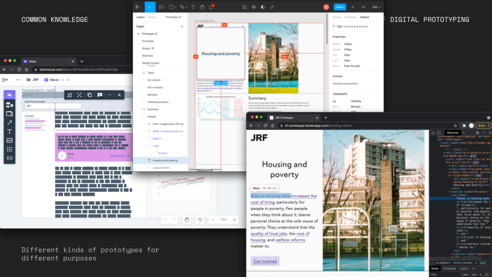
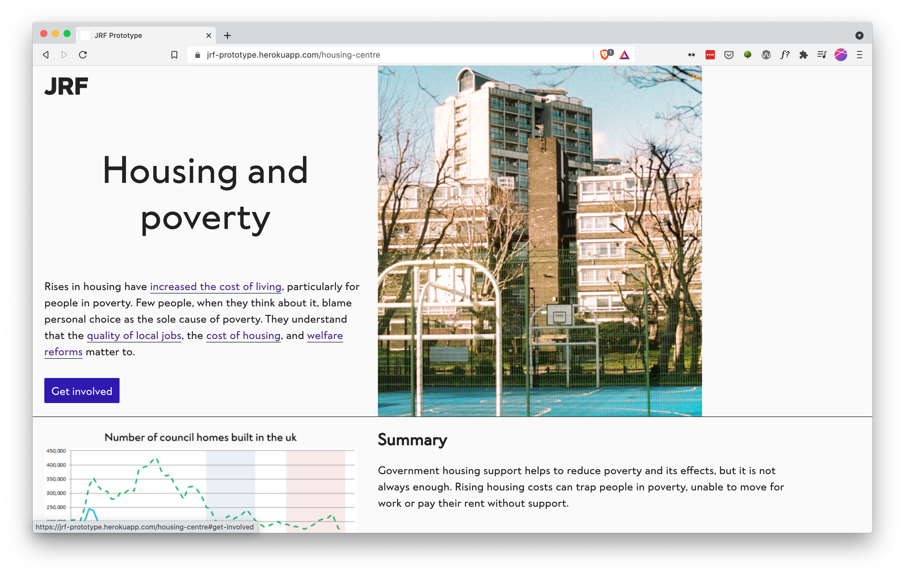
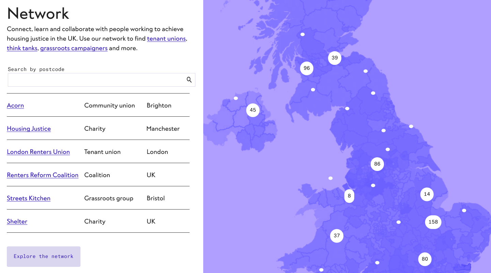
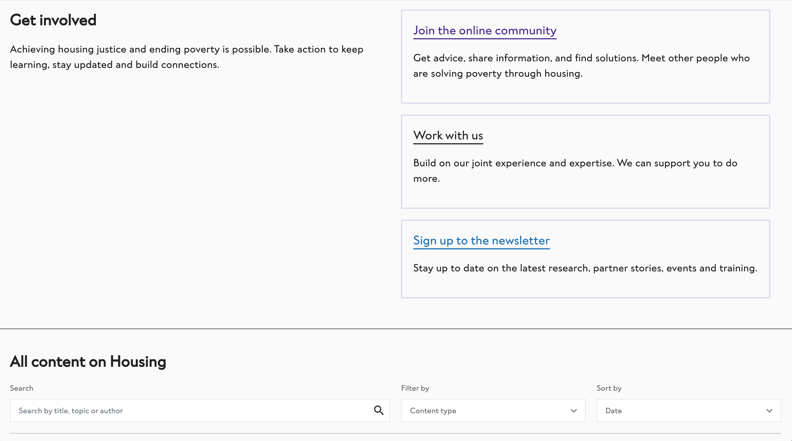
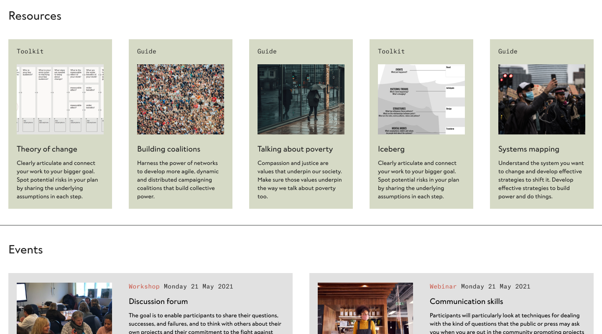
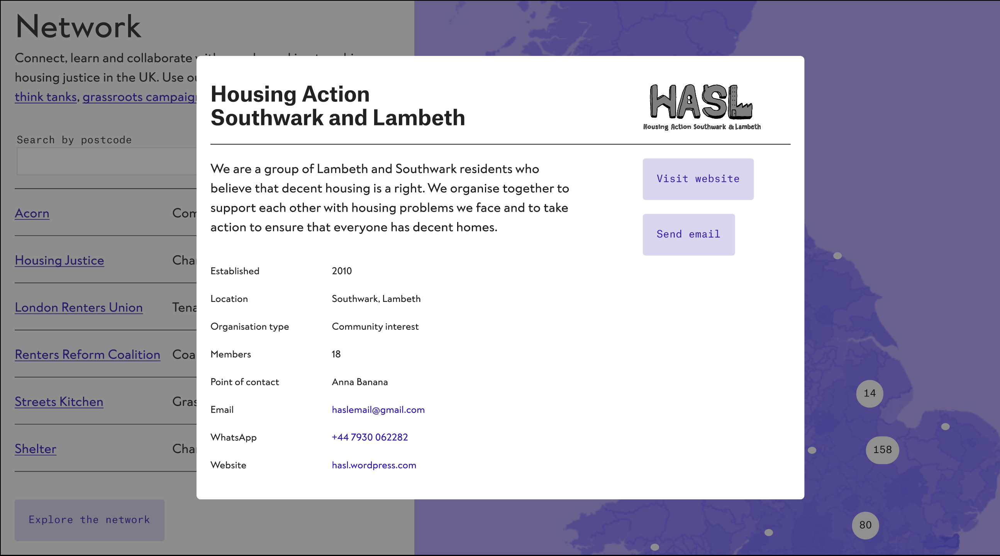

## Context

What does a social change organisation look like online? We recently worked with the [Joseph Rowntree Foundation](https://www.jrf.org.uk/) to explore this question through research and rapid prototyping.

JRF's mission is to *inspire action and change to solve UK poverty*. They do research, make policy recommendations, co-design policies with people with lived experience of poverty, support grassroots organisations, and work in coalition with other charities and foundations. However, only a fraction of this work is currently visible online. While their research is fairly accessible to policy people and journalists, it could be made much more useful to grassroots campaigners.

The organisation is currently in a period of substantial change and growth: they have a new CEO and three new directors, are currently establishing their five year strategy, and are planning to re-platform their digital infrastructure next year. There are lots of open questions around what they could become over the next five years and beyond, so we were asked to create a series of prototypes to answer these questions in a tangible and thought-provoking way. As we worked, we reflected on possible digital approaches for social change organisations in the UK more widely, and we'd like to share what we learned through the process.

## Our approach

We had lots of prior work to build upon: JRF had commissioned another organisation to do discovery work and their User-Centred Design team had already run a number of [design sprints](https://medium.com/inside-jrf). Our focus was to build on this work and move quickly to creating prototypes and opportunities for learning.

Our work was intended to be speculative: broaching what could be just over the horizon beyond the obvious next steps. However, it also needed to be concrete enough for JRF staff to be able to gather real feedback from service users, understand how to get there and to advocate internally for our proposed approach.

### What we did

- Conducted some initial discovery work to familiarise ourselves with the project.
- Ran workshops with their team to reflect upon the work they'd already done and identify challenges, needs and opportunities.
- Conducted research interviews with JRF staff and external stakeholders like organisers and researchers.
- Created a series of prototypes and tested them with members of the general public.
- Ran show and tell sessions with the wider organisation to share what we were learning and gather feedback.

We produced a range of provocations at varying levels of fidelity: rough sketches and wireframes, flat Figma prototypes to suggest look and feel, functional prototypes that explored affordances of code.

Many of the ideas sparked through our research were more deeply organisational than superficially digital. We strongly believe that digital artefacts express the organisational culture, values and methodology that produces them. Our challenge was to keep trying to hone in on things that we could tangibly demonstrate through digital prototypes that, like the tip of the iceberg, would coincide with deeper changes within the organisation.

## Core themes

We begun our design process by asking ourselves: how might we make JRF's extensive research into poverty more accessible to a broad audience? We looked at ways to enable anyone – whether that's campaigners, people with lived experience of poverty, or individuals wanting to take action – to find the most relevant information to them and (crucially) to use it in their organising efforts.

Our initial wireframes explored a broad range of ideas, loosely grouped under the theme "data for action". We explored how to weave other voices – either grassroots campaigners or people with lived experience – into JRF's reports, how to contextualise datasets through postcode search, and how to slice up their research into easily shareable and exportable chunks.

At the same time, we were conducting research interviews with organisers. From this, and the feedback we gathered in our show-and-tell sessions, the idea of relationship-building emerged as the most crucial question. JRF have already built relationships with grassroots organisations and individuals, but there's so much potential to deepen these relationships and form new ones.

Based on this feedback, we refined our focus a little and we started exploring how to enable relational organising through JRF's website. We looked for ways to enable people to build relationships with each other directly, rather than always being mediated through JRF.  For example, JRF could provide an open directory of movement organisations in their network, spotlighting or platforming different groups whenever relevant. They could explore other digital spaces, like Slack, to allow people to meet each other, work together and cross-pollinate between disciplines.

On reflection, our ideas here were somewhat atomised – sketches of minor interventions rather than a more holistic strategy. So we zoomed back out and asked ourselves: how might we create a digital product that is centred around building relationships, coalitions and bridges between different organisations.

We prototyped a new topic overview page full of curated, accessible information and signposts towards opportunities for relationship-building. We envisioned this page to include:

- A top-level explanation of the issue, to surface the most important learnings that JRF make through their research
- Key policy recommendations distilled from a variety of reports
- Contextualised data visualisations
- An open directory and map of other organisations
- Featured projects, to demonstrate how research is being used on the ground
- Staff profiles, linked to an open booking system and accompanied by conversation prompts
- Calls to action for people to get involved, either by working with JRF or by meeting others in the community

## Key findings

We did a series of user interviews to validate our prototype. Our goal was to discover whether a topic page that communicates the breadth of JRF's work in an accessible way would be valuable for a diverse audience and whether it would facilitate them to take action. We were also curious as to what kind of action people would be open to taking: in their local area or in response a specific theme. As usual, we learned a lot from these interviews:

### Summaries can start a conversation

Putting in the effort to create tight, crisp summaries will pay off. People thought the topic overview pages were interesting and educational. They wanted to share them with their friends, family and acquaintances to start a conversation around poverty.

It's important to give an "at a glance" impression of JRF's analysis and recommendations. These can be backed up by links to in-depth research for those who want to dive deeper.

### Data adds credibility

Talking about poverty can be hard, so giving people statistics to back up their arguments can make this easier. Showing data in context can reinforce policy recommendations and help people understand complex issues. Publishing data in reusable formats makes it possible for others to do things with it.

### Everyone wants to get involved, starting from right now

People are curious and want to take action, but with an issue as all-encompassing as poverty, it's hard to know where to start. They want to talk to each other, learn and share knowledge, contribute local stories, offer help and volunteer.

JRF is well-placed to signpost people towards getting involved, whether that's with JRF or in their local community organisations. There should be affordances for different levels of engagement, from subscribing to contributing. 

The people we spoke to liked the fact that they could find resources or relevant organisations where they could take an active role, rather than just read about the issues:

> You’re handing someone the toolkit, not just spoon-feeding them.

### Offer a wide range of opportunities to form relationships and build bridges

Poverty is a huge, complex issue that underpins myriad other social issues. We think the key to JRF's success is in recognising their role as one actor in a diverse movement ecosystem. They could leverage their position and resources to catalyse, grow, support and connect other organisations.

## Looking ahead

We think there are so many opportunities for social change organisations to support grassroots action by leveraging their power. With funding and social capital, they have the opportunity to have outsized impact through the practice of radical transparency, listening to the communities that they speak for and taking on an infrastructural role that others can struggle to prioritise.

Although this project is very much in its early stages, we felt excited by the possibilities that emerged through collaboration and we're looking forward to taking our learnings on to future projects, in the spirit of commoning knowledge.

## Thank you

- [Ella Fitzsimmons](https://ellafitzsimmons.co.uk/) for leading the project and getting us onboard
- JRF's User-Centred Design team for the fruitful collaboration
- [Sonia Turcotte](https://soniaturcotte.com/) for ideating and prototyping with us
- [People for Research](https://www.peopleforresearch.co.uk/) for recruiting our user research participants

## Further reading

We recommend this great article from [MobLab](https://mobilisationlab.org/stories/can-ngos-and-social-movements-be-authentic-allies/) about how NGOs can support movements without being self-serving. They suggest that these kinds of organisations need to ensure that they listen to the needs of organisers, leverage their credibility to amplify grassroots messages and provide logistical, operational and financial support.