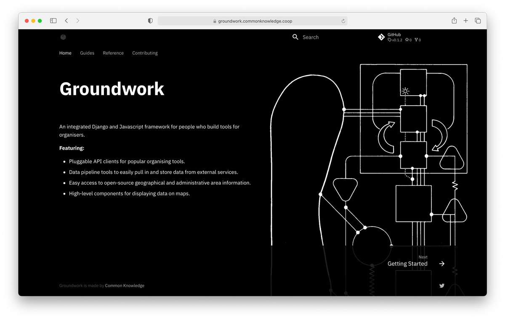

In our [last post](https://commonknowledge.coop/writing/what-tools-should-i-use/), we outlined why we're establishing a living resource to help people choose digital tools for organising, as part of our [Common Tools](https://commonknowledge.coop/writing/common-tools) project funded by the [Rosa Luxemburg Stiftung.](https://www.rosalux.eu/en/topic/1567.rls-office-london.html)

In this post, we'll introduce the second strand of this work: [Groundwork](https://groundwork.commonknowledge.coop/), a Django framework that makes it easy for developers to set up custom digital tools for grassroots organisations, informed by our past three years of working on projects like this full-time.

## Why we're building this

While our guide to digital tools will be intended for a broad audience, this framework is specifically for people who know how to code already.

We've observed that developers who volunteer or work for political organisations often have a lot of demands placed on them. Some of these developers work for a number of different organisations at the same time. Usually their work involves either making websites or building single-purpose tools to support a campaign. 

The most common asks are:

- Plotting events or groups on a map.
- Collecting contact details and writing this to a constituent relationship management system (CRM).
- Looking up information specific to a certain postcode.
- Collecting donations.

Many volunteer developers will start this work from scratch each time. They'll make technical decisions based on their own experience and context. This means that the wheel gets reinvented… again and again and again. We find this state of affairs to be particularly painful because grassroots political groups are usually very under-resourced already. Digital technology should be about saving time, not creating more work for people.

If we could reduce the amount of time spent repeating the same work, then developers and organisers will be able to move more quickly to doing the actually important work of building relationships and communities.

## What we're making

We're generalising and standardising some of the code we've written over the past few years to create a toolkit that developers can use and contribute back to. It will allow them to quickly build usable campaign sites.

Our focus is on ensuring interoperability with a range of existing tools, to make it as flexible as possible. We're writing clear and accessible [documentation](https://groundwork.commonknowledge.coop/) that enables anyone to take the framework and run with it.

We chose to build this with [Django](https://www.djangoproject.com/) because it's widely used and very powerful. It makes it easy to create sophisticated pieces of software quickly and securely.

The first release will focus on location-specific features, including a starter project that's set up and ready to go. It will enable people to:

- Write easily to CRMs like Action Network, Airtable and Nation Builder.
- Display information on a map using sophisticated mapping features (via Mapbox) without having to write frontend javascript code.
- Plug into an up-to-date database of UK electoral constituencies and representatives.
- Pull in and store data from external services.

Something that we've noticed about a lot of existing campaign technology is that it is highly US-centric. We’ve focused on UK geography so far because it was simplest to extract from our previous work, but our intention is to widen this into more areas as we go.

## How to contribute

If you're interested in following our work on this or contributing, please give the repository a star on [GitHub](https://github.com/commonknowledge/groundwork) or [get in touch](mailto:hello@commonknowledge.coop) with feedback.