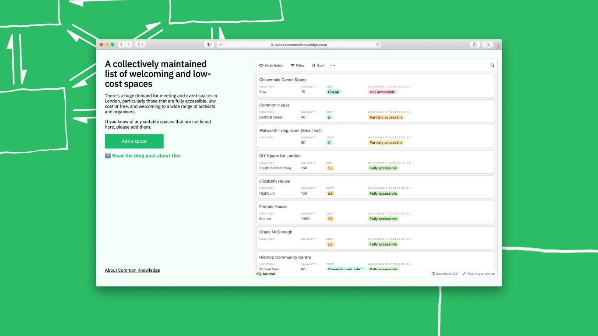
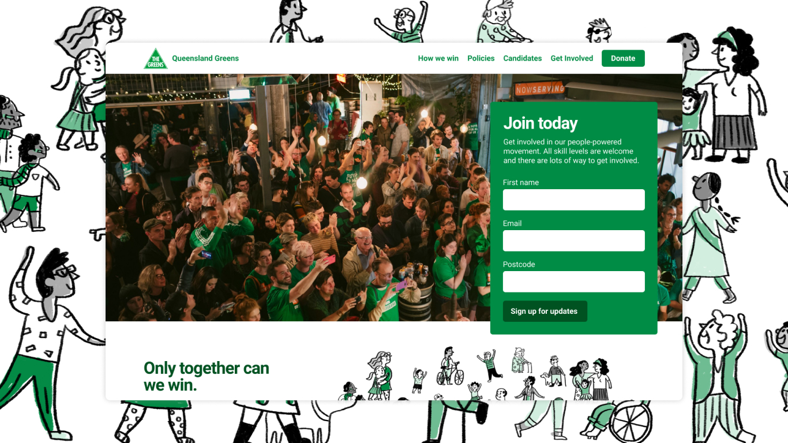
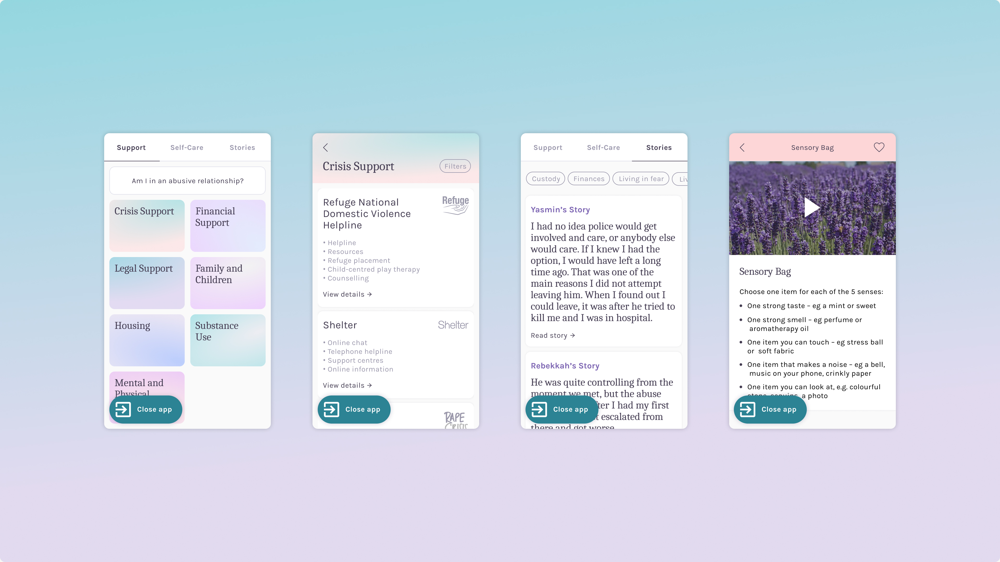
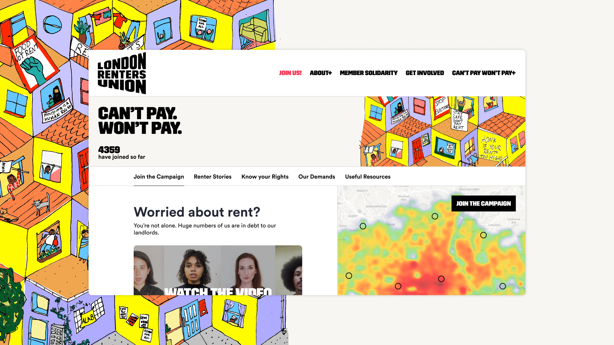
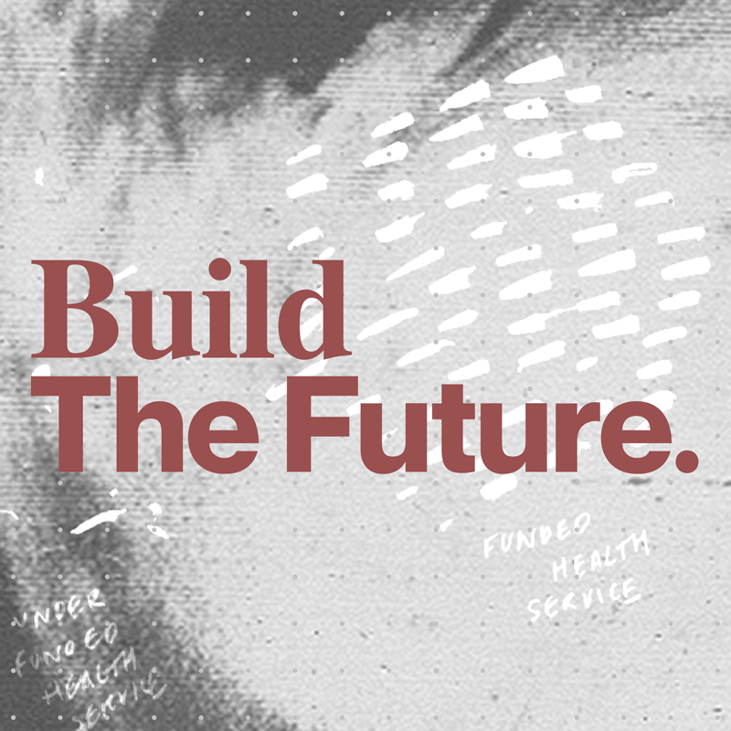
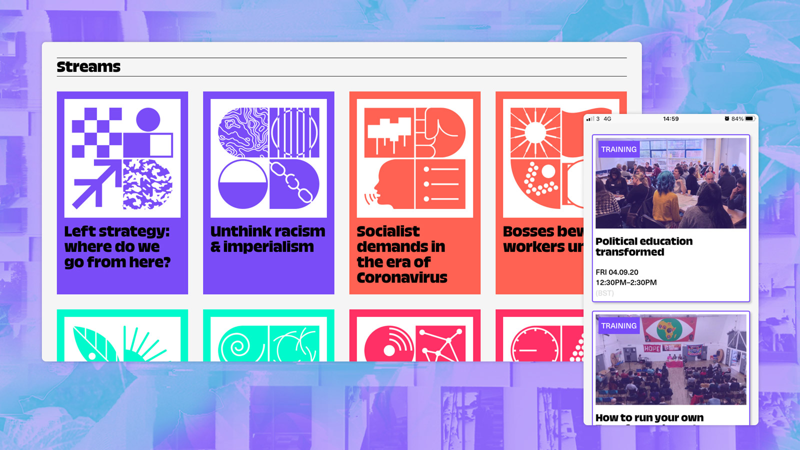
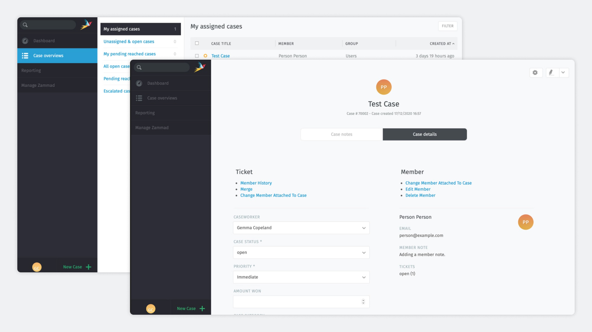
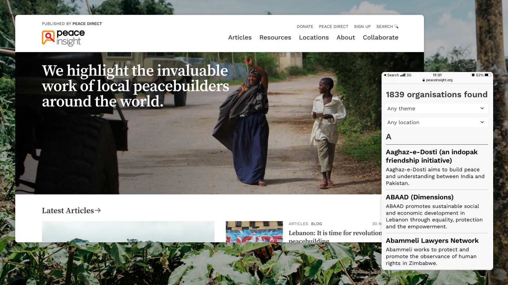

We are starting this year with some exciting new projects. We are not long from launching an community air quality monitoring project, Airsift by [Citizen Sense](https://citizensense.net/). We're collaborating with [Infact Co-op](https://www.infactcoop.com/) on a redesign of the George Padmore Institute website, to make it easier to access information about the Institute and showcase material from the collection. We're also working with [Just Treatment](https://justtreatment.org) on one of their campaigns.

But we wanted to spend some time looking back on everything that happened in 2020 here at Common Knowledge.

## January

We spoke at the Django London meet up about our work and use of Django in the 2019 General Election campaign.

We redesigned and developed our own website.

We ran a two-day digital strategy workshop at [Space4](https://space4.tech/) with our friends at Progressive International.

We launched a simple tool to help organisers to find and book spaces: [spaces.commonknowledge.coop](http://spaces.commonknowledge.coop/). Read more about [how we did it and why](spaces-for-activists/). (We find it very amusing that we chose to research physical space, at the start of a year when everything went fully remote. We were, however, ahead of the curve in talking about mutual aid!)

## February

We published two articles, one for [Jacobin](https://jacobinmag.com/2020/02/shadow-inc-app-iowa-caucus-acronym) and one for [The Guardian](https://www.theguardian.com/commentisfree/2020/feb/09/bernie-sanders-campaign-people-tech-obama-big-data).

We went to Sweden to join [Zetkin Foundation](http://zetk.in/)’s Winter Code Camp.

We redesigned and developed the website of the [Queensland Greens](https://greens.org.au/qld) in the run up to their state elections. They ended up winning another seat, which was a huge success for the party. Brisbane-based illustrator [Sophie Beer](https://www.sophie-beer.com/) created some custom illustrations for the site.

## March

We started a newsletter to share our work. It's still going, [sign up for updates](https://commonknowledge.us19.list-manage.com/subscribe/post?u=7d61a70102ab811e6282bee60&id=b87cfcec60).

We also spoke about our work: Alex chatted on [Another World is Podable](https://podcasts.apple.com/gb/podcast/episode-8-revolution-continues-alex-worrad-andrews/id1497358707?i=1000467874930) with Peter Bloom, Professor of Management at the University of Essex. Gemma gave a talk at Space4 about how designers can contribute to social movements, alongside [Autonomous Design Grou](https://www.weareadg.org/)p, Robbie Blundell and [Autonomy](https://autonomy.work/). Alex also hosted the second meeting of the Notion meet up in London, in collaboration with Haoming Yau.

March is most memorable for when national lockdown hit and we started [working remotely](weeknotes-12). We experiemented a lot about [how to adjust our practices and technologies](weeknotes-12) to make it work. We also published some [advice for organisers moving remote.](organising-online--thinking-about-chat/)

With COVID-19 and the rise of hundreds of new mutual aid groups in response, we built a tool to [sync mutual aid group lists](https://github.com/commonknowledge/covid-19-mutual-aid-list-sync), including [Freedom Press](https://freedomnews.org.uk/covid-19-uk-mutual-aid-groups-a-list/) and [Covid-19 Mutual Aid](https://covidmutualaid.org/).

We also helped set up a multi-disciplinary team to redesign and develop the Covid Mutual Aid UK site and helped kick off an [open-source](https://github.com/Covid-Mutual-Aid/mutual-aid-wiki) international [mutual aid map](https://mutualaid.wiki/map). We encouraged the creation of [Covid Tech Support](https://covidtechsupport.com/) and hung around routing people about in more Slacks and WhatsApp groups than we'd like to mention.

Alongside Cade Diehm from [New Design Congress](https://newdesigncongress.org/en/) and Rose Regina, we hosted a stream on Twitch entitled "Organising Safely Online for Mutual Aid".

This is what mutual aid and self-organisation looks like!

<iframe
  width="580"
  height="326"
  src="https://www.youtube.com/embed/ZItS4fIY4Zo"
  frameborder="0"
  allow="accelerometer; autoplay; clipboard-write; encrypted-media; gyroscope; picture-in-picture"
  allowfullscreen
></iframe>

## April

We gave a talk at the Philosophy and Ethics in Digital Tech Society at Second Home. The topic was _Radically different: How can we create digitally driven organisations from the ground up using philosophy and ethics_

We developed a website for [Forward Momentum](https://www.fwdmomentum.org/), a coalition of Momentum and Labour Party activists whose goal was to empower grassroots activists to have more say in the running of the organisation. We gave them strategic advice and provided the digital infrastructure for them to run open primaries for candidates, an interesting technical problem to solve. Their campaign was very successful – most of their candidates got elected to Momentum's National Coordinating Group.

Mostly, we were very busy in the lead-up to all the launches next month!

## May

This was a bumper month for site launches, with four new websites:

We created the identity and website for [Progressive International](https://progressive.international/), in collaboration with [Robbie Blundell](http://r-b.site/).

The next launch was for [Nurses United](https://www.nursesunited.org.uk/), a grassroots network of nurses supporting nurses in the UK. We designed and developed the identity and website, and set up their digital ecosystem, including tools like Action Network.

We updated [Vent Your Rent](https://ventyour.rent/) to support Generation Rent's campaign to protect renters affected by coronavirus. They wanted a way to hear directly from renters about how their housing situation has been impacted by the crisis.

Also for renters rights, we worked with London Renters Union to launch their [Can't Pay Won't Pay](https://londonrentersunion.org/cantpaywontpay/) campaign. This campaign focussed on building renter power during the pandemic, building a movement of renters to support each other and collectively pressure the Government to introduce greater renter protections.

Finally, we worked with [Infact Co-op](https://www.infactcoop.com/) to design the user interface for an app for Against Violence and Abuse.

Apart from websites, we also spent a lot of time on Zoom editing the Labour Together General Election Review with the commission.

## June

In June, we published our findings from [the Labour Together General Election Review](https://electionreview.labourtogether.uk/). Our work looked into two aspects of the Labour Party's 2019 General Election campaign. First, the ground game – activities at a local level such as canvassing, leafleting, persuasive conversation and the organisation of this. Second, the digital technologies that attempted to assist these activities.

We wrote about our approach to this project [on our blog](labour-together/) and published two supplementary reports: _[In lieu of strategy: ground operations and organisational structure](https://commonknowledge.github.io/labour-together-ge2019-review/in-lieu-of-strategy.html)_ and _[System updates required: ground operations and digital technology](https://commonknowledge.github.io/labour-together-ge2019-review/system-updates-required.html)._

We updated the Can't Pay Won't Pay website to integrate the map more into their overall site and improved the forms for signing up, allowing renters to find out more information about their rental situation and rights in the Covid-19 context.

We also started research with [United Voices of the World](https://www.uvwunion.org.uk/) (UVW) to improve their casework and membership systems, funded by the Rosa-Luxembourg-Stiftung's London office.

## July

We designed and developed the identity and website for [Claim the Future](http://claimthefuture.today/), in collaboration with [Michael Oswell](http://michaeloswell.com/) and [Ilyanna Kerr](https://www.instagram.com/ilyanna____/). Claim the Future is a project initiated by John McDonnell that aims to respond to the economic and political upheaval caused by the pandemic by building a radical and optimistic vision of the future.

We continued work for United Voices of the World, starting to prototype ideas based on our research findings. We decided to use Zammad, an open source customer support tool, and customise it for a casework context.

## August

This month, we took some much needed holiday. Also, one of our members moved to the other side of the country, officially making us a remote co-op.

We did ongoing user research for Progressive International around the question: _how do we engage our members?_

We developed the new website for [The World Transformed](https://theworldtransformed.org/), designed by Robbie Blundell. This involved converting their existing "read-only" website to be more interactive and support a digital-first event. We also ran a security training workshop with them.

## September

This month, we contributed to some events as part of The World Transformed festival as part their [Brave new digital world](https://theworldtransformed.org/twt20/brave-new-digital-world/) stream.

Gemma [talked about co-ops](https://www.instagram.com/p/CFPIfkeh1Q6/) for an online event run by London College of Communication.

We also worked with an organisation on a new version of their sign-up flow and membership system. We built upon this project to prototype an open source membership onboarding system that we can reuse for other organisations.

## October

We wrote an essay on digital sovereignty for the [Weizenbaum Institute](https://www.weizenbaum-institut.de/) – out sometime this year!

Continuing with United Voices of the World, we migrated their membership database to Zetkin, a tool for organizing activism.

We collaborated with [Novara Media](https://novaramedia.com/) to improve their digital systems through fortnightly calls and training sessions.

A lot happened internally as well. We switched to Co-op Bank after being rejected by Monzo, Metro, Starling and others for not being a normal share-limited company! We started a new OKR cycle, trying a 6 month period and setting too. We experiemented with a few different strategy and retrospective workshops and tried out asynchronous research tasks.

We also welcomed a new prospective co-op member, [Sonia Turcotte](http://soniaturcotte.com/)! 👋🏻

## November

We did some more work for Claim the Future, this time [designing a print booklet](https://claimthefuture.today/policies/claim-the-future) for those who like reading in that way.

We began collaborating with [Community Organisers](https://www.corganisers.org.uk) on a series of experiments exploring how to increase member participation in their digital spaces.

We set up a self-hosted, customised version of the casework tool for UVW, so it is tailored to their specific use cases and needs.

We designed a new user interface for [May Day Rooms](https://maydayrooms.org/)' online archive in collaboration with... Robbie Blundell! Keep your eyes peeled for launch, or sign up for our newsletter and we'll tell you :)

Internally, we moved the co-op to "[full agile mode](sprint-notes-1)" and started doing all our work through scrum and sprints as an experiment. So far we like it!

## December

We launched the new version of [Peace Insight website](https://www.peaceinsight.org/), which centred the stories of local peacebuilders. The new website allows for more content discovery and cross-linking between sections.

We worked with a large international organisation on a mapping tool that allows people to discover grassroots peacebuilding organisations.

We did some accessibility work for the Progressive International, which is ongoing.

We also hosted the first public show and tell of our work for United Voices of the World. We're hoping to do more public show and tells in the future. [Sign up to our mailing list](https://commonknowledge.us19.list-manage.com/subscribe/post?u=7d61a70102ab811e6282bee60&id=b87cfcec60) for details.

## Onwards

Looking back on the year, we are really happy to have been involved in so many efforts responding to the the precarity and hardship that the pandemic has intensified. This year has really shown how important it is that we all, collectively, work together to make radical change possible.

[Get in touch](/contact/) if you'd like to collaborate with us in 2021 – we're always up for discussing ideas.
