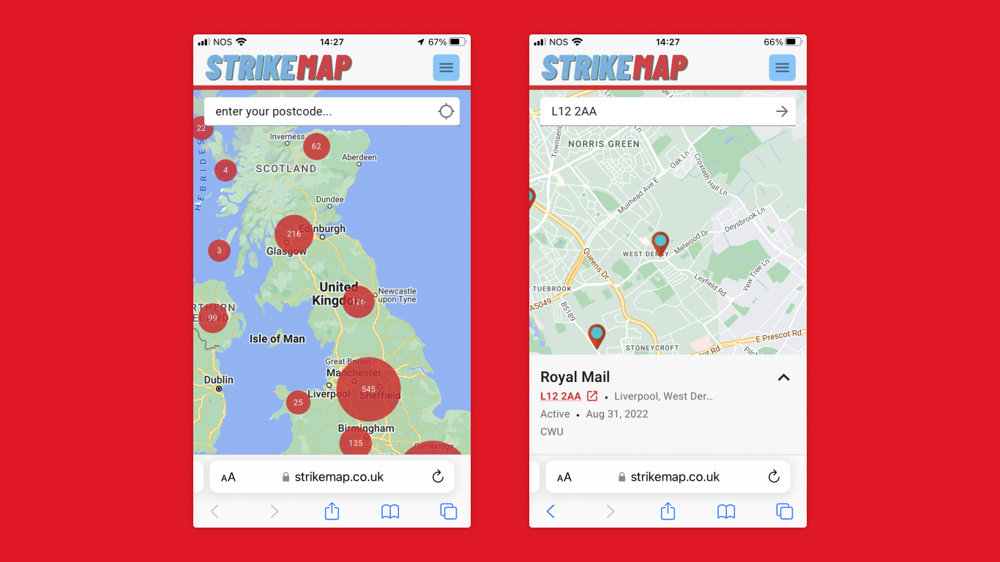

## 💌 Notes from August

It's been another busy month with launches for Enough is Enough, Strike Map, The World Transformed and the Smart Forests Atlas.

### We’re excited to launch our Supporters Network!

We want to ramp up our activity building common infrastructure that can be shared by the movement. We know this work is necessary and urgent, but we need your help to make it happen.

If you’re excited about our work and want to support it… this is how! You can become a regular Supporter or make a once-off donation – every little bit counts.

[Read more](https://commonknowledge.coop/writing/supporters-network) about what we want to do with this funding on our blog.
[Support our mission.](https://opencollective.com/commonknowledge)
 
### Enough is Enough

Earlier this month we helped launched [Enough is Enough](https://wesayenough.co.uk/), a campaign to fight the cost of living crisis. We built the website and [Everett Epstein](https://everettepstein.me/About) provided the absolutely 🔥 design.

It has been more popular than we could ever have imagined, with 500,000+ people signing up and completely packed launch rallies in London and Manchester.

What excites us about the campaign is that it understands [organised people and organising as the counter-power to the power of organised money](https://www.brainyquote.com/quotes/benjamin_todd_jealous_557551). For example, [in several interviews](https://www.theguardian.com/uk-news/2022/aug/23/mick-lynch-rmt-work-dignity-union-power), RMT General Secretary Mick Lynch has observed that:

> People have lost the ability to organise generally, I think, even in communities. Where I grew up, there was a residents’ association, which had some of the most fearsome women you’d ever deal with – working-class women, who could stand up and articulate in front of councillors exactly the services they wanted.

This is one of reasons we founded Common Knowledge: we observed that the skills to build power have been weakened. This is not accidental: these skills have been deliberately suppressed by the power of organised money, which correctly identified them as threatening their interests.

What we want is to make these skills "common knowledge" again: part of everyday life rather than a specialist skill. Though not a silver bullet, we believe that [digital technology can help with this](https://github.com/commonknowledge/vision-mission-values).

### Strike Map

We helped our associate member Everin to improve [Strike Map](https://strikemap.co.uk/), a worker-powered map of the industrial action currently taking place in the UK.

We redesigned the user experience to make it easier for people to find and support local strikes. Everin also improved the overall performance of the map and added clustering to deal with the [sheer number of strikes](https://theweekinwork.substack.com/p/autumn-of-anger-44-pay-rise-for-hospitality) going on at the moment.

### Smart Forests Atlas

Planetary Praxis publicly launched a project we’ve been working on for a while this week, the [Smart Forests Atlas](https://atlas.smartforests.net/). It’s a living archive and virtual field site exploring how digital technologies are transforming forests. For example, how digital technologies effect forest management and how this effects the rights of people who live in them, for better or worse.

The interface is designed to weave together a broad range of research, from interviews to sensor data, soundscapes, and images. Four wayfinding devices — logbooks, map, radio and stories — are linked through a horizontal tagging system visualised on the homepage.

The research team have written a [paper](https://dl.acm.org/doi/10.1145/3537797.3537804) on the design approach, which extends the concept of digital gardening through a more pluralistic, participatory, and more-than-human lens. We’ll be discussing this together with them at [The Forest Multiple](https://smartforests.net/the-forest-multiple-composing-and-digitalizing-wooded-worlds) symposium at Cambridge in late October.

### Humanitarian Open Street Map

Over the last month we’ve been working away at the information architecture and content design for [HOT’s](https://hotosm.org/) new website, which has proved to be an exciting challenge.

The organisation is part of complex ecosystem of actors: HOT staff, a global community of mappers, NGOs, governments, agencies and more. They sit at the intersection of participatory mapping, community-led development, humanitarian response, open data and tech, so there are lots of different needs to consider.

We’ve been getting our heads around this and translating it into a useful content strategy. We’re grateful that [Ella Fitzsimmons](https://ellafitzsimmons.co.uk/) has come onboard to help us with this – it’s been a joy to work with her again.

We’ve nailed down a technical proposal in collaboration with HOT’s internal tech team now, so we’re excited to move forward with building the first iteration of the new website. We’ve made some [contributions](https://github.com/wagtail/wagtail-localize/pull/602) to the Wagtail (an open source CMS) ecosystem as part of this project.

### The World Transformed

The World Transformed launched their [programme](https://theworldtransformed.org/twt-22/programme/) for this year’s festival, which will be in Liverpool from 24-27 September. We completely redid the underlying system to make it easier for TWT to update the interface with each year’s visual identity without having to reinvent the wheel.

[Tickets are available now!](https://www.tickettailor.com/events/theworldtransformed/699525)

### 🐝 What we’re thinking about

- Anna has been scoping her final apprenticeship project. One idea we have is to migrate the backend of a couple of project ([Game Worker Solidarity](https://gameworkersolidarity.com/) and [Crimes of Solidarity](https://www.crimesofsolidarity.org/) ) from Airtable to a shared [Wikibase](https://wikiba.se/) instance, the same platform that underpins Wikidata and by extension Wikipedia. A data commons for direct action history, [that won’t arbitrarily change its API](https://support.airtable.com/hc/en-us/articles/4852449595671-Changes-to-Airtable-attachments?utm_ID=recgrlxyp2ByTWvWR&utm_source=lifecycle_team&utm_medium=email&utm_campaign=it_ss_attachment_auth_deprecation&utm_content=email-blast) , would be welcome and make room for collaborative social movement editor community-building.
- Gemma’s been reading [Ways Of Being](https://www.jamesbridle.com/books/ways-of-being) by James Bridle, a book about AI, non-human intelligence, ecology, biological computing, more-than-human relations and more.
- Our friend James Fox recommended this video on [Sociocracy and Cybernetics](https://www.youtube.com/watch?v=mgROVdVSM0o).
- Cade’s [essay on game-engines, intra-corporate strategy and geopolitics](https://members.newdesigncongress.org/the-coming-game-engine-inflection-point/) makes interesting reading. Video games are the world’s [largest cultural industry](https://www.marketwatch.com/story/videogames-are-a-bigger-industry-than-sports-and-movies-combined-thanks-to-the-pandemic-11608654990), but if you read the press in the UK at least, you wouldn’t know. Of course one solution to the problems outlined there is [more worker power within the game industry](https://gameworkersolidarity.com/)!
- Speaking of which, Jan’s reading [Pedagogy of the Oppressed](https://en.wikipedia.org/wiki/Pedagogy_of_the_Oppressed) along with some [IWGB Game Workers](https://www.gameworkers.co.uk/).

