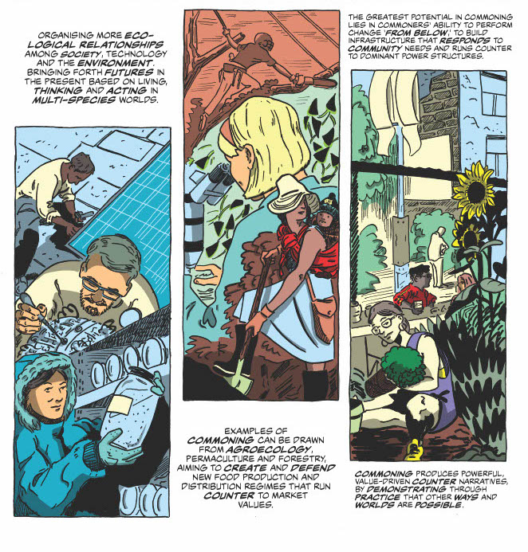
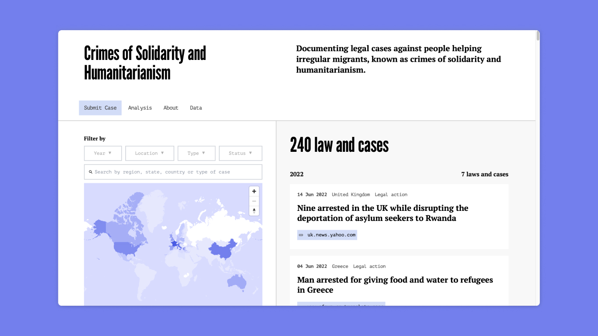
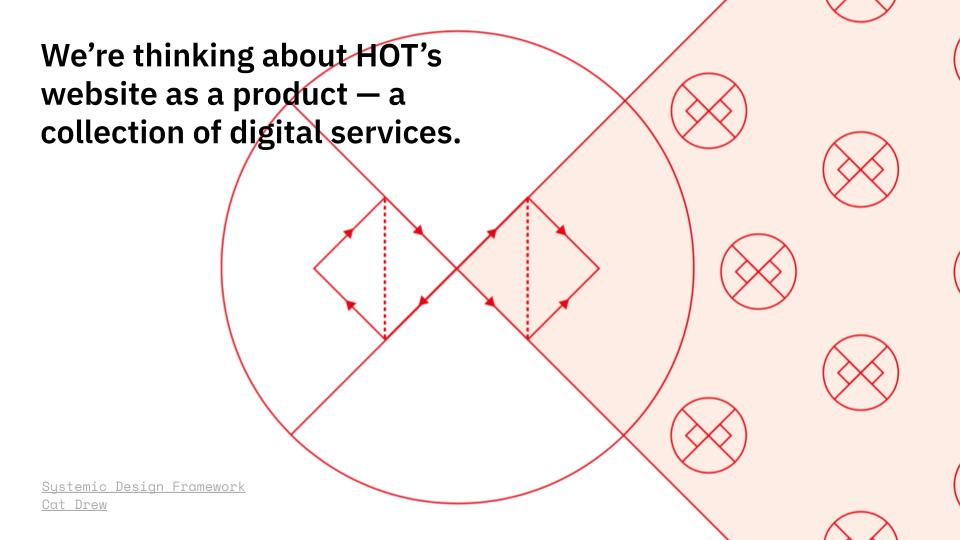

Exploring the ecologies of commoning, documenting crimes of solidarity and researching how to use digital platforms to amplify community stories.

### Future Natures

Earlier this month we launched a new site for [Future Natures](https://futurenatures.org/), a new organisation that explores emergent ecologies of commoning through stories, arts and research.

We’ve been working with the team all year on the visual identity, their online community and this website. They have some ambitious and exciting plans to build a global network of commoners, so we highly recommend joining their [mailing list](https://futurenatures.substack.com/) for updates.

We particularly liked the [incredible comic](https://futurenatures.org/comic-future-natures-a-primer-for-the-curious/) they created that explores the histories of enclosure, the intersecting crises we’re living through, and what commoning is and can be.

### Crimes of Solidarity and Humanitarianism

We also launched a website for [Crimes of Solidarity](https://www.crimesofsolidarity.org/), a project led by [Dr. Lucy Mayblin](https://twitter.com/LucyMayblin) at the University of Sheffield. It is an interactive archive of legal cases where people have been criminalised for helping irregular migrants. The actions people have taken that led to their arrest or imprisonment include leaving water in a desert, saving someone drowning or giving someone a lift to a medical facility.

Part of the intention of the website is to invite people to add cases, particularly for the countries where there isn’t much data yet. The project is still in its early stages so feedback is welcome.

This project is a variation on a previous project of ours, [Game Worker Solidarity](https://gameworkersolidarity.com/). Both required an interlinked timeline and map, powered by an Airtable database, so we saw an opportunity to build upon existing work rather than starting from scratch.

We updated the database and interface to better suit the project and made some functionality improvements. The benefit in working like this is that we can now backport these improvements to the Game Worker Solidarity site. Inter-movement solidarity!

If you’re interested in customising this for your own project, check out the the [GitHub repo](https://github.com/commonknowledge/crimes-of-solidarity). Otherwise, you can get in touch with us about working together.

Big thank you to John Evans from [Code-Operative](https://code-operative.co.uk/) for his help building the site.

### Humanitarian OpenStreetMap Team research

A lot of our time and attention this month has been focused on our research for [Humanitarian OpenStreetMap Team](https://www.hotosm.org/). We wrapped this up with a playback presentation a few weeks ago and we’re very happy with the result.

We listened to a broad range of people from their organisation, looking for ways to translate their needs for connection and data into a collectively managed digital commons, rather than a space for one-way broadcasts.

The team gave us lots of really thoughtful feedback about how they might catalyse organisational change, create quality content as a community and find more uses for their data. Now we’ve moved to the “converge” part of the [design double diamond](https://medium.com/design-council/developing-our-new-systemic-design-framework-e0f74fe118f7), which will be all about roadmapping, prioritising and prototyping.

Shout out to the research platform [Dovetail](https://dovetailapp.com/) — we leant heavily on features like video upload, automated transcripts, tags, insights and highlights. It is such a superpower to be able to work with research interviews like this.

### The co-op

— Anna is currently preparing for end of the end of apprenticeship assessments and scoping her final project. She’s written a [blogpost](https://commonknowledge.coop/writing/common-knowledge-apprenticeship) about her experience as a Founders and Coders apprentice.

— We’re excited to have John Evans and Everin Scott joining our team as Associate Members. We’ve been collaborating both of them on projects for a while now so we’re happy that this will continue.

— We’ve moved some of our digital infrastructure to [Undersco.re](https://undersco.re/), a new joint project with the [New Design Congress](https://newdesigncongress.org/en/). This is currently using NextCloud’s default calendar but we’re hoping to switch to something else soon. Let us know if you have any open source calendar recommendations!

— We went to the [NEON social](https://twitter.com/NEON_UK/status/1551985307544965120), where Anoosh Chakelian, Aditya Chakrabortty and Moya Lothian-McLean gave talks about the changing political landscape as a result of the Conservative Party leadership contest.

It was a really good discussion that took in multiple dimensions of the situation: from the economy, to how social movements might respond to how the candidates are viewed within their only party at different tiers. It was also lovely to see some many people IRL. Some people we have collaborated directly with we haven’t seen since before the pandemic.

## What we’re thinking about

### Doing presentations

We’ve been leaning heavily on Giles Turnbull’s [Doing Presentations](https://www.doingpresentations.com/) and [Agile Comms Handbook](https://agilecommshandbook.com/) to shape our research playback presentations. They are both really useful, practical guides for communicating clearly.

Our collaborator [Ella Fitzsimmons](https://ellafitzsimmons.co.uk/) once told us that you should schedule one hour preparation time for every minute of your presentation. At first, we thought that it couldn’t possibly take this long. Now we’ve realised that it’s actually pretty spot on. 

From one perspective, preparing a presentation is a slow process, because you need to distill all your findings and insights in a way that generates useful knowledge and shared understanding for your audience. From another perspective, generating useful knowledge that can become shared *is the work* that justifies and feeds into the presentation.

### Neighbourhood unions

Thanks to Dark Matter Labs for the shout-out in their latest essay [Neighbourhood Unions: Building collective financial power in the asset economy](https://darkmatter-labs.medium.com/neighbourhood-unions-building-collective-financial-power-in-the-asset-economy-555e1f8e140f). The essay explores how neighbourhood unions might be a way to address the cost of living crisis. The goal would be to build power by connecting people who share the same landlord and enabling them to take collective action. Obviously, we love this idea!

## What’s next

- Designing and prototyping our ideas for Humanitarian OpenStreetMap Team.
- Updating and improving The Architecture Lobby’s digital systems.
- Developing this year’s website for [The World Transformed](https://www.theworldtransformed.org/) festival.
- We’ll be speaking at The New Centre’s [**Means of Organization**](https://twitter.com/the_new_centre/status/1551973068251316224) event on digital tools & political organising, alongside India Burgess from Autonomy and Callum Cant, author of Riding for Deliveroo and co-editor of Notes from Below.
- Our building, Pelican House, will be hosting a [summer fete](https://www.eventbrite.com/e/379233426387) on Sunday 21 August.
- We’re looking for new projects to start from October 2022. We’re interested in all forms of grassroots activism, particularly to do with the cost of living crisis or climate justice. [Get in touch](mailto:hello@commonknowledge.coop) with us if you’re interested in working together!
