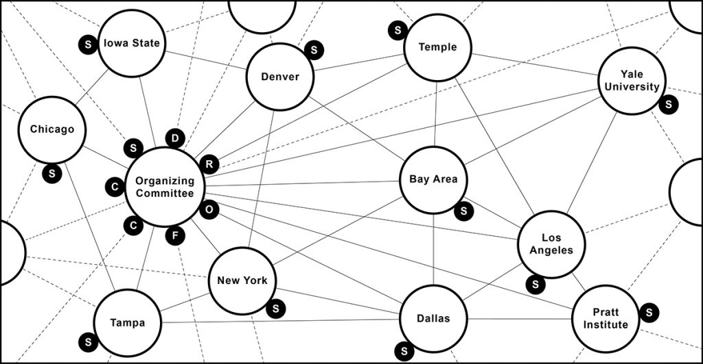
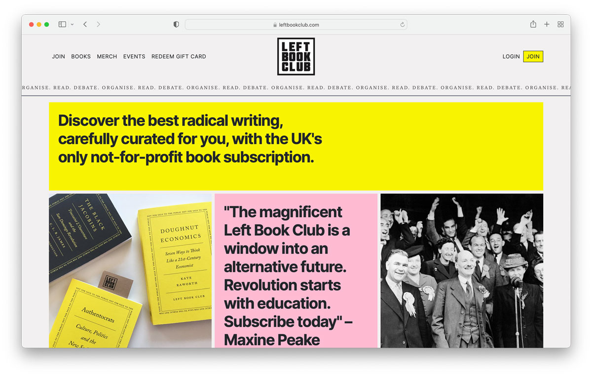
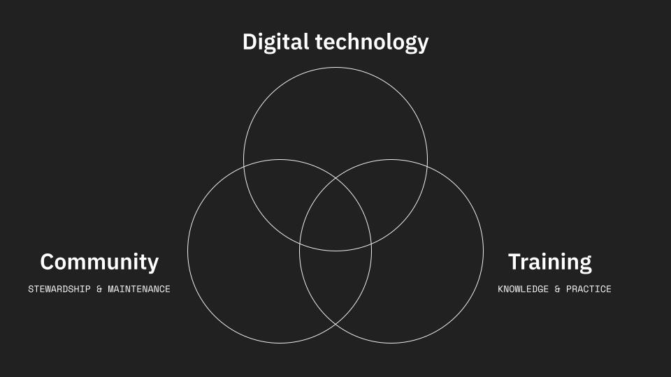

This month we kicked off two exciting new projects, launched a new website for the Left Book Club, continued building distributed, resilient archive software in collaboration with [The New Design Congress](https://newdesigncongress.org/en/) and spoke at the Weizenbaum Conference in Berlin.

### Humanitarian OpenStreetMap Team

We’re working with [**Humanitarian OpenStreetMap Team**](https://hotosm.org/) to redesign their website in line with their new organisational strategy and structure. Over the last month or so we’ve been interviewing people throughout their organisation to build up a nuanced picture of the ecosystem that they’re part of, their role within it and their vision for the future.

### The Architecture Lobby

We’re also working with [**The Architecture Lobby**](http://architecture-lobby.org/), a grassroots organisation of architectural workers campaigning for structural change in the industry. We’re working together to improve their website, as well as improving and automating the rest of their digital infrastructure. As they’re a distributed and member-led organisation, we’ve begun this process by interviewing a cross-section of their organisers to understand where we should focus our efforts.

### Distributed archiving

Over the past six months, we’ve been working in collaboration with our friends at the [**New Design Congress**](https://newdesigncongress.org/en/) on a suite of distributed, offline-first tools for people and organisations who want first-class software for research and knowledge management without cloud infrastructure.

The first iteration is a desktop application designed to support resilient curation and storage of cultural archives. We’re extremely excited to see it nearing its first release.

### Left Book Club

Last month, we launched a whole new website for the [**Left Book Club**](https://leftbookclub.com/). We really enjoyed contributing to such an iconic institution. We [replatformed the website](https://github.com/commonknowledge/leftbookclub/) to a modern framework (Shopify + Django) that makes it super easy for them to create pages using modular components and to manage their ecommerce needs. We set up Posthog for analytics and trained them on how to glean insights from it. Finally, we helped them set up Circle as a vibrant new space for book club members.

We’re really excited about this project, particularly the community experimentation angle. This is the kind of project that we’d like to see more of. If you’re in Glasgow, Jan is keen to set up a Left Book Club reading group – [get in touch](mailto:jan@commonknowledge.coop) with him.

### Weizenbaum Conference

Alex and Gemma went to Berlin at the start of June to give a talk at the [Weizenbaum Conference](https://www.weizenbaum-conference.de/). We shared our thoughts on the theme of digital sovereignty—traditionally quite an individualist concept—and how we much rather working towards *collective* sovereignty or, better yet, collective power.

We spoke about a few of our recent projects as a means of reflecting upon the different strands of building collective power using digital technology. These projects (Act Build Change digital organising co-training, Breathe, Groundwork and Zetkin) demonstrated the different strands of our work: from public training sessions to community stewardship to designing and building bespoke software for organisers.

### Co-op iterations

Almost all our projects are now done on a [capped time and materials basis](https://en.wikipedia.org/wiki/Agile_contracts#Capped_Time_and_materials_Contracts), where we bill for hours worked each month rather than on deliverables or phases. There are a few reasons for this: to improve the co-op’s financial stability by billing little and often; and to reduce the pressure to begin new projects for cashflow reasons and focus more on process instead. This was influenced by Torchbox's [helpful blogpost on the issue](https://torchbox.com/blog/agile-contracts-vs-fixed-price-contracts/).

We moved over to using GitHub for project management, rather than Notion. We’re really enjoying this so far – it’s great for all our work to be integrated with our development issues. There’s something about closing GitHub issues that is so much more satisfying than moving a card across a board.

## What we’re thinking about

### Founders and Coders assessment time

Anna, our [Founders and Coders](https://www.foundersandcoders.com/) apprentice, has been with us for six months already! She’s been learning about WordPress, Django, CSS frameworks, Git, sprint rituals and helping us with a range of our projects. Her apprenticeship assessments are coming up soon so next month will be partially spent on preparing for that.

### Peer feedback

We’ve set an internal goal to get better at giving each other feedback. This can be quite difficult in a horizontal team, so we’re curious about whether there are any resources out there that could help us with this. [Get in touch](mailto:hello@commonknowledge.coop) if you know of any!

### Full Site Editing

We’ve made a few WordPress Gutenberg websites lately and have been very impressed with its powerful new [Full Site Editing](https://developer.wordpress.org/block-editor/getting-started/full-site-editing/) feature. Working with this more has got us wondering about the right balance between editor autonomy (allowing them to create and change any part of the site), communication strategy (guiding people towards editorial and design best practices) and developer agency (CMS choices, optimising for efficiency).

### Coaching syllabus

Lately we’ve been doing more organisational consultancy projects, for groups like [Novara Media](https://novaramedia.com/) and Breathe, as well as running more training sessions for [UnFound Accelerator](https://www.uk.coop/start-new-co-op/support/start-platform-co-op/unfound-accelerator) and with [Act Build Change](https://actbuildchange.com/). One of our medium-term goals is to develop a bit of a syllabus around this work, which would cover:

- Establishing vision, strategy, theories of change, roadmaps and campaign canvases
- Strategic co-design methods and design sprints
- Facilitation styles, sociocracy, agile
- Stewarding a healthy, mission-driven, cross-functional team
- Prototyping, feedback and reflection
- Cooperative approaches to organising
- And more!

We’re inspired by Rosa Luxembourg Stiftung’s [Feminise Politics Now](https://www.rosalux.eu/en/article/1586.feminise-politics-now.html) programme and its offshoot [RadHR](https://radhr.org/), the [London Learning Co-op](https://www.londonlearningcoop.com/)’s approach to pedagogy and [Pete Burden](https://twitter.com/peteburden)’s compassionate approach to coaching. We think that regular one-to-one coaching sessions are more impactful than toolkits or drop-in training sessions, although we’d be open to trying this out with a small cohort.

### Cost of living crisis

We’ve been thinking a lot about the emerging inflation crisis, which is looking extremely bleak both globally and in the UK. Like Covid-19, it is an almost universal condition that penetrates into the politics of everyday life, while relating to huge structural issues like class, climate change and geopolitics that often feel remote and abstract. We wonder what a meaningful response to it looks like. The upsurge in demands from workers, alongside the emerging    energy bill non-payment movement offers some hope.

## What’s next

- Next month, we’ll be sharing our research insights and recommendations with Humanitarian OpenStreetMap Team and then running a design sprint to work through some of the more complex challenges.
- We’ll start designing our proposed updates to The Architecture Lobby’s website and infrastructure.
- We’re going to be on a panel discussion with our friends at [Autonomy](https://autonomy.work/) and [The Social Practice](https://www.thesocialpractice.org/), run by [The New Centre](https://thenewcentre.org/). More details soon.
- This year’s UnFound cohort will be sharing their platform co-ops in a [live pitch event](https://www.uk.coop/events-and-training/events-calendar/unfound-accelerator-2022-live-pitch-event) on 7 July.
