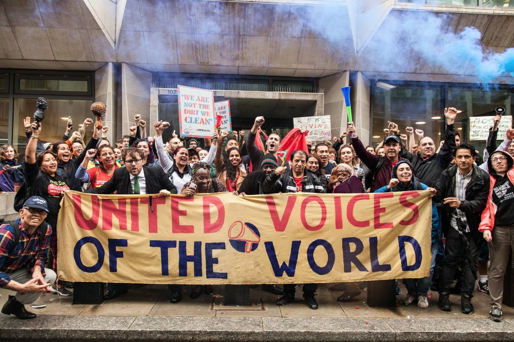
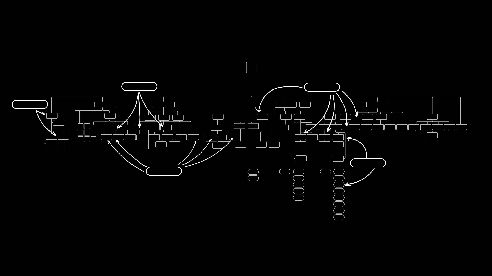
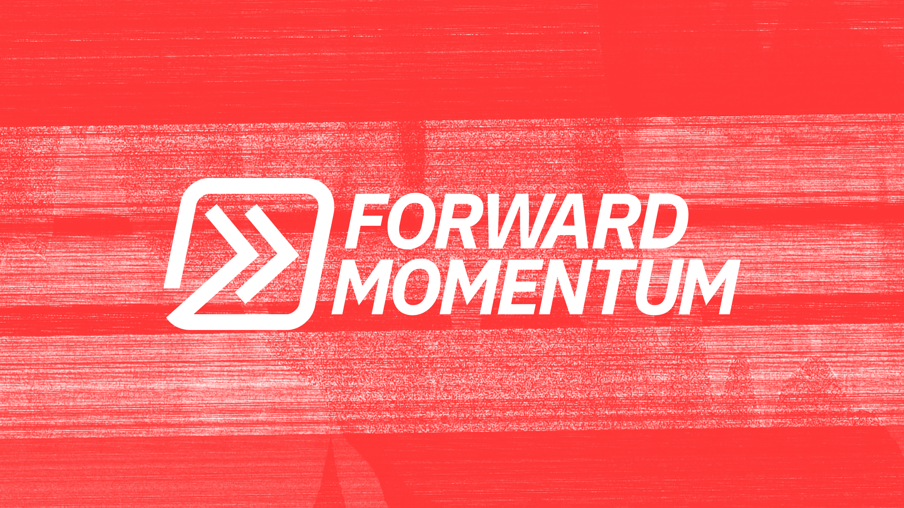

## What we've been up to

In June, we worked on a new casework system for United Voices of the World, launched a new version of the Can't Pay Won't Pay website for London Renters Union, published our research into the Labour Party's General Election campaign and supported Forward Momentum during their campaign for the Momentum National Coordinating Group (NCG).

### United Voices of the World

We continued our ongoing work with United Voices of the World (UVW) to improve their casework and membership systems. 

Our goal is to improve the effectiveness of the union without bureaucratising it. We're aware that technical inventions won't solve any problems if they don't fit with the organisational culture of the union and the people within it. We're trying to address this risk by having regular contact with UVW staff and caseworkers, ensuring that they're part of the design process.

This began in May with a series of interviews with staff and organisers. Through these interviews, we mapped out their current systems and processes from a number of different viewpoints. We used this to identify where we could improve things and prioritise features for a new system.

We realised from our interviews that we need to make casework easier to approach as a team. At the moment, caseworkers don't have great visibility over who is doing what, and where opportunities might exist for collective action.

After some research, we found an open source user support system called [Zammad](https://zammad.org/). We always prefer building upon open source tools if they already exist, rather than starting from scratch with every project. Contributing to an existing project means we can achieve more impact, more quickly, and that our work will benefit others, beyond our direct collaborators. 

Compared to off-the-shelf commercial tools, we can adapt it to the organisational needs of a grassroots trade union, where a commercial tool re-purposed may have rough edges or not be useful.

We realised during our interviews that we needed to make it easy for staff to check someone's membership and payment status quickly. We've configured Zammad to sync with UVW's payment and membership systems, as well as their casework processes, so that caseworkers can quickly query all this information from one place.

Zammad syncs with a number of channels, such as SMS and email, which means that it makes it effortless to log and share case communication histories between caseworkers. They can quickly get a sense of who is assigned to which case and what the current status is. 

We are looking into integrating it with WhatsApp also. Technically we know how we'd approach this, but needed to get access to the WhatsApp API before doing this.

We're currently collecting their feedback as they use this prototype, so that we can update and improve this tool in a few weeks time.

We're planning to do a public presentation on this project at the end of this month. If this sounds interesting to you, let us know by emailing hello@commonknowledge.coop.

### Can't Pay Won't Pay

We also continued our work with London Renters Union, launching an updated version for the [Can't Pay Won't Pay](https://londonrentersunion.org/cantpaywontpay/) site.

This phase of work focused on integrating this campaign with their main website, engaging renters who were less active in the union or hadn't yet joined the campaign, and providing support to those facing imminent eviction.

Visitors were prompted to enter the details of their current situation, in order to get an overview of their legal rights and what they could do to address their problems. We spent a long time on getting the user experience of this form right: we wanted to make sure that it was useful for visitors and effective at getting people involved. As we often do, we based our work on the Government Digital Service (GDS) form [design patterns](https://design-system.service.gov.uk/patterns/). 

The key to these patterns is the somewhat [counter-intuitive finding](https://www.gov.uk/service-manual/design/form-structure#start-with-one-thing-per-page) that, rather than presenting the user with a single long form, it is better to present them with focused questions, one at a time. Even though the form is the same length and you are going through multiple screens, it will actually seems less involved or overwhelming,.

We added a heatmap to show that other renters in London supported the campaign and were in similar situations. This was overlaid with personal stories from different union members. In order to reflect levels of local support whilst protecting the privacy of campaign participants from targeted retaliation by landlords, we randomly adjusted each signup location to anonymise them.

We also made it easier for visitors to access resources and discover ways to get involved in the campaign. The goal of this site was to reassure renters that they weren't alone during this time of crisis, and to give them the resources and support to collectively address their problems.

### Labour Together

The [Labour Together General Election](https://electionreview.labourtogether.uk/) review was published towards the end of June. We contributed to the report by researching:

- Labour's ground game: the organisation of local activities, such as canvassing, leafleting, and persuasive conversations; and
- The digital technologies that attempted to assist these activities.

We've published an [in-depth reflection](https://commonknowledge.coop/writing/labour-together) on this review and our involvement with it. 

We've also published the two subsidiary reports that we contributed to the main review:

- [In lieu of strategy: ground operations and organisational structure](https://commonknowledge.github.io/labour-together-ge2019-review/in-lieu-of-strategy.html)
- [System updates required: ground operations and digital technology](https://commonknowledge.github.io/labour-together-ge2019-review/system-updates-required.html)

There's a lot of discussion around these reports in [this Facebook group](https://www.facebook.com/groups/LabourTogetherGEReviewTakingItForward/) which we've enjoyed to see.

We were glad to have participated in this research and would be happy to discuss our findings in more detail – if you'd like to [you can book a meeting with us](https://commonknowledge.youcanbook.me/).

### Forward Momentum

Our congratulations go to Forward Momentum for [their decisive victory in Momentum's](https://labourlist.org/2020/07/victory-for-forward-momentum-candidates-as-lansman-steps-down/) National Coordinating Group (NCG) elections!

We helped the campaign in a few ways: we set up built their website alongside their in-house designer, configured their [mass emailing system](actionnetwork.org/), ran their electronic primaries using data analysis and low-code tools and provided strategic counsel for their distributed organising and general campaign strategy.

We're in the process of writing a more in-depth post on the strategy aspect of this at the moment. More on this soon!

### Quarterly Objectives and Key Results

This week, we also renewed our quarterly OKR cycle. We reflected on how we did against the three objectives we set ourselves last time round and set ourselves three new ones:

1. Regularly communicate our work, processes and learnings with a wider audience.
2. Focus on efficiency and reusability in our design and development work, to lay the foundations for future product development.
3. Achieve financial viability by carefully choosing work that fits this goal.

We like setting objectives each quarter because they help to clarify and focus our intentions. Some of our most enjoyable objectives have been ones that challenge us to adapt our basic working practices. 

Not only do we get better and more coherent as a team, but we also prove to ourselves one of the core aspects of adrienne marie brown's [Emergent Strategy](https://www.akpress.org/emergentstrategy.html):

> What we pay attention to grows.

## What we're learning

Through our consultancy work and research, we're learning a lot (and confirming many of our hypotheses) about distributed political organisation, particularly in relation to digital technology. 

It's very interesting to look at this from two perspectives: electoral politics and grassroots, members-led organisations – the same needs and patterns can be observed across quite a diverse range of organisations.

## What we're reading

- Verso's [Abolition and Black Struggle](https://www.versobooks.com/lists/4732-abolition-and-black-struggle) reading list
- [Don't Hold your Breath](https://www.generationc.xyz/ingrid-burrington) by Ingrid Burrington:

> Thinking of a crisis as something that ends or that can be fixed is itself part of the problem. Framing it even as a *problem* might be part of the problem. The word "crisis" has largely come to be synonymous with chaos, but its etymological roots trace back to something far more pointed: choice. Typically the choice was implicitly a decisive or significant one, a turning point of sorts. Still, a choice.

- [​Defund the Police, but Don’t Replace It With Surveillance Tech](https://onezero.medium.com/defund-the-police-but-dont-replace-it-with-surveillance-tech-64f911fc6d6e) by Tim Maughan
- [Feminist Data Set](https://carolinesinders.com/feminist-data-set/) by Caroline Sinders
- [What's wrong with WhatsApp](https://www.theguardian.com/technology/2020/jul/02/whatsapp-groups-conspiracy-theories-disinformation-democracy) by William Davies
- [Free tools blur protesters’ faces and remove photo metadata](https://techcrunch.com/2020/06/06/protesters-blur-faces-anonymize-photos/):

> Just this week, end-to-end encrypted messaging app **Signal included its own photo blurring feature**, one that couldn’t come soon enough as its user base spiked thanks to the massive adoption since the protests started.

- [Hyperfocus](https://alifeofproductivity.com/hyperfocus/) by Chris Bailey
