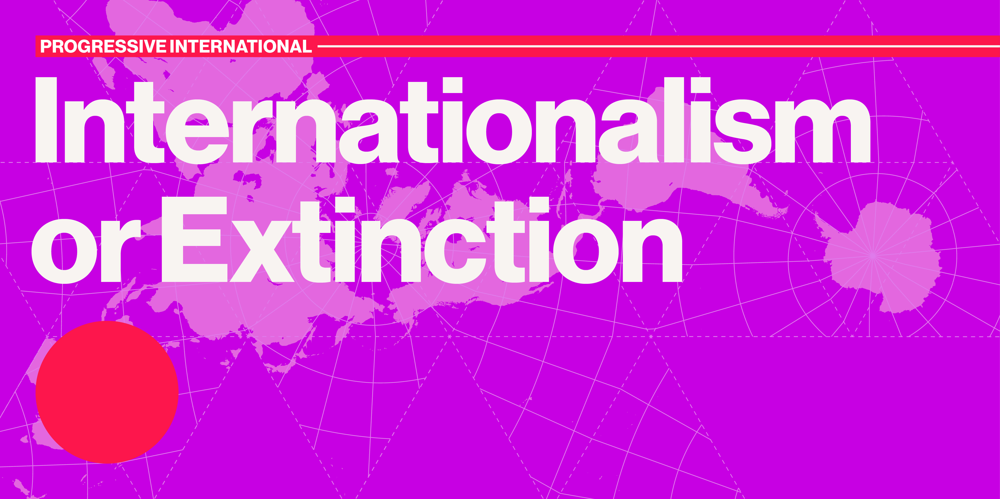
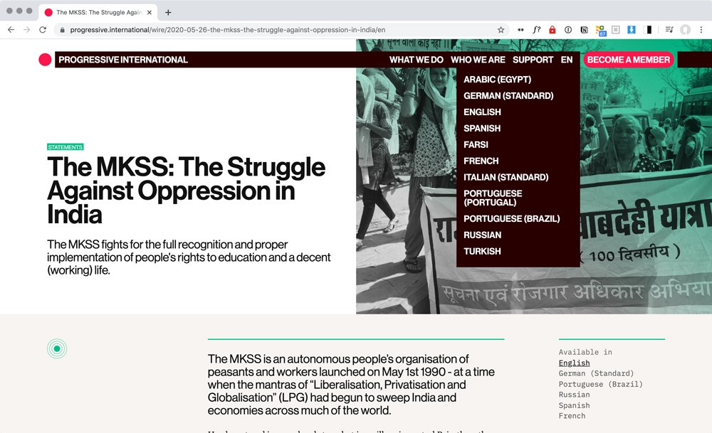
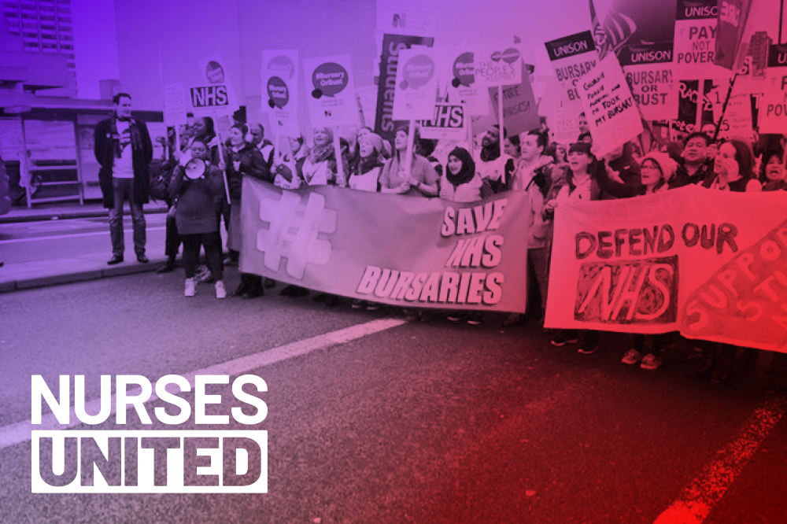
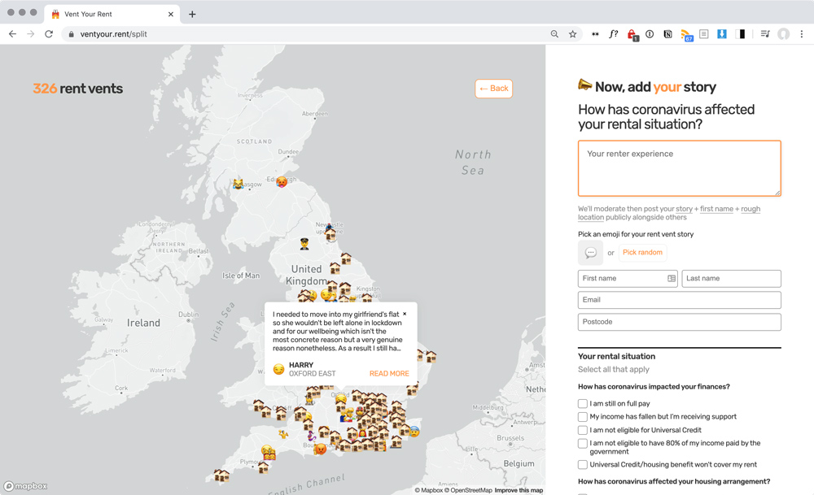
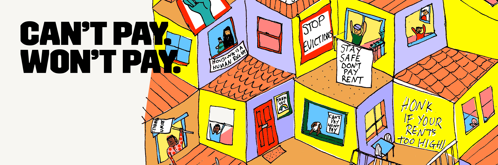

# What we've been up to

We're starting to think we should be a bit less ambitious and just call these Month Notes instead.

We had a very busy start to May, launching four websites in a week:

## Progressive International

[Progressive International](https://progressive.international/) unites, organises, and mobilises progressive forces around the world. We've been working with them since late 2019, helping them shape their strategic vision, identity and online presence.

The organisers have spent a lot of energy in ensuring that the project represents and amplifies a truly international set of voices. We wanted to reflect this focus in both the visual identity and website.

The identity features a [Dymaxion map](https://en.wikipedia.org/wiki/Dymaxion_map) projection, designed by Buckminster Fuller. In comparison to the usual Mercator projection, the relative sizes of land masses are less distorted and there is no "right way up" to the map.

We're particularly proud of the work we did towards making the website available in as many languages as possible. We built an intuitive system where editors can add new translations on the fly. Available languages are listed in both the menu dropdown and on each page.

The site detects the user's location to allocate which language it should display in at first. Not all pages are available in every language. If an article isn't available in the user's language, the site will display the content in the next closest available language.

Shout out to [Robbie Blundell](http://r-b.site/) for working with us on the visual identity, and [Blake House](http://blake.house/) for making such an amazing launch video.

## Nurses United

The next launch was for [Nurses United](https://www.nursesunited.org.uk/), a grassroots network of nurses supporting nurses in the UK.

As a completely new organisation, we helped them set up their digital organising ecosystem as well as designing and developing their visual identity and website. We used Action Network to handle events, member data, signups and donations, and integrated this with their WordPress site.

## Vent Your Rent

We originally worked with [Generation Rent](https://www.generationrent.org/) in November 2019, to support their National Renters Manifesto campaign.

They approached us about updating the [Vent Your Rent](http://ventyour.rent/) site in response to coronavirus. They wanted a way to hear directly from renters about how their housing situation has been impacted by the crisis.

We decided to plot these stories on a map, to assure renters that they were not alone and that others near them were also struggling.

## Can't Pay Won't Pay

Finally, we helped [London Renters Union](https://londonrentersunion.org/) launch their [Can't Pay Won't Pay](http://www.cantpaywontpay.uk/) campaign. The campaign is focused on building a movement of renters to support each other and collectively pressure the Government to introduce greater renter protections.

## United Voices of the World

Since then, we've been doing user research for our Union Systems project with [United Voices of the World](https://www.uvwunion.org.uk/).

This has been funded by the [Rosa-Luxemburg-Stiftung](https://www.rosalux.de/en/) (thank you!) and is a very exciting project for us.

It's the kind of work we've been wanting to do for a while, as it's about providing guidance on how to transform their digital systems. Our goal with this work is to increase their operating capacity and ability to organise and assist their members.

They've identified casework management as an area that is in dire need of improvement. We're currently talking to as many different people as possible – organisers, staff, members – in order to understand and map out their needs. We're learning a lot about how different people depend on one another in the union.

## Cooperation between co-ops

We've also been working with [InFact Coop](https://www.infactcoop.com/) on the UI design for one of their projects. It was a really lovely experience to work directly with another co-op and we hope to do more of this in the future.

Aside from this, we've been working on improving our internal systems and redesigning our membership onboarding process. Thanks to fellow co-ops [Animorph](http://animorph.coop/), [InFact](https://www.infactcoop.com/), [Calverts](https://www.calverts.coop/) and [Blake House](http://blake.house/) for their advice and guidance on this.

Loomio's [Co-op Handbook](https://loomio.coop/) is another great resource we've been using.

## Project retros

One of our objectives this quarter is to make sure that all projects have clear planning meetings at the beginning and retrospectives at the end.

We've now started having project retrospectives at least once a week (we have a lot of projects to get through), and they've quickly begun to feel entirely necessary to our work.

# What we're reading

-  [A Guide to On/Offline Protester Privacy](https://docs.google.com/document/d/12On3cg4figX2arDOl3ymDGOyBqbtpB1bNVh7maCurRU/edit) by the Open Source Researchers of Color (via [Piper Haywood](https://piperhaywood.com/have-to-do-better/))

- [Being anti-racist is an active pursuit](https://www.projectsbyif.com/blog/being-anti-racist-is-an-active-pursuit/) by Projects by If
