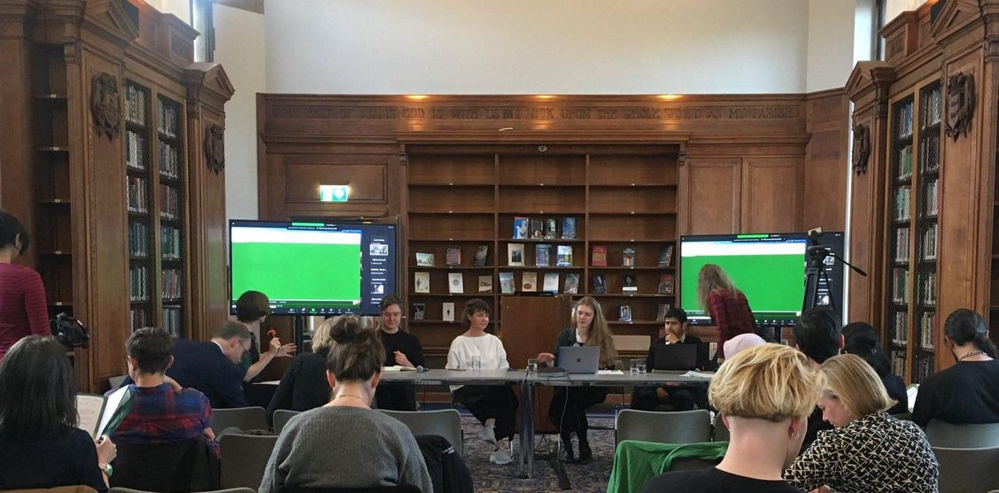
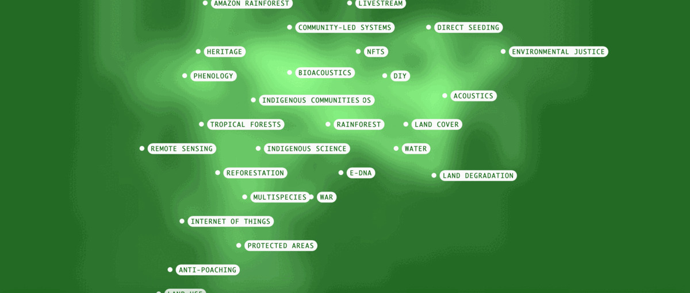
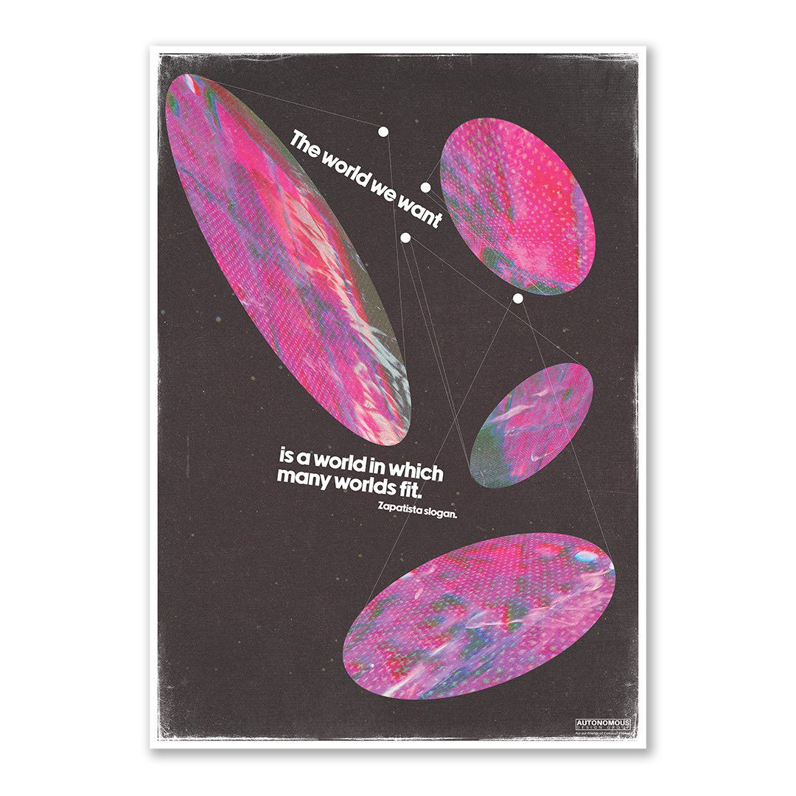

## 💌 Notes from October

Two new people in the co-op, a new collaboration with Platform, launching the Smart Forests Atlas and some downloadable posters from Autonomous Design Group.

We welcomed two new people into the co-op this month: [Anna Tokareva](https://www.annatokareva.net/) and Jamie Young! Anna will be helping us manage our projects and the co-op in general, under the general heading of operations. Jamie will be working with us for a year on a design placement from Kingston School of Art.

We also celebrated our fourth birthday (!!!) in early October. We feel so grateful to all the people and organisations who have worked with us or supported us over this time. Thank you!

If you want to help us celebrate, why not join our [Supporters Network](https://opencollective.com/commonknowledge/contribute) ? We'll use your contributions to build the digital tools that the movement needs most.
[Support our mission](https://opencollective.com/commonknowledge/contribute)

### ⛵️ Platform

We just kicked off a new collaboration with [Platform](https://platformlondon.org/) , an organisation that combines art, activism, education and research. They work on a broad range of projects centred in eco-social justice – we previously worked with them on [Offshore Voices](https://offshorevoices.org/), a just transition campaign for oil and gas workers, for example.

We’ll be creating a whole new website for their work. This month, we’ve started running interviews with different people in the organisation as part of a discovery phase. We are very excited to be working with Platform, an organisation who have been doing work in a similar space to our own, but have been doing it non-hierarchically for 40 years.

### 🌳 The Forest Multiple

Last week we went to Cambridge to launch the [Smart Forests Atlas](https://atlas.smartforests.net/en-gb/) at [The Forest Multiple](https://smartforests.net/the-forest-multiple-program/). We worked on the Smart Forests Atlas for a good part of last year, so it was great to publicly launch it.

The Smart Forests Atlas is a living archive and virtual field site exploring how digital technologies are transforming forests. It provides tools for researchers and other stakeholders to explore, analyse and reflect upon smart forest knowledges and technologies.

The Atlas is designed to allow for multiple entrypoints into the research content. Visitors are encouraged to wander through the site according to their own interests, guided by the four wayfinding devices (Map, Radio, Stories and Logbooks).

The content is connected through a tagging system, visualised as a tag cloud on the homepage and throughout the site. The tag cloud represents the Atlas in a visual and abstract way, making space for emergent themes and unexpected connections.

In many ways, the project is just getting started. The research team is onboarding new contributors to the platform at the moment, and we’re about to start a new cycle of work with them. We’re curious to see where it goes.

The second day of the symposium was very stimulating as well. It was interesting to hear how mapping technologies form a crucial element of UN climate change mitigation policies, but also contain their own biases and flaws. Hearing about a forest [dérive](https://en.wikipedia.org/wiki/D%C3%A9rive) was also fascinating.

Thinking this over against the background of the most recent round of reports on the state of play for 1.5 degrees was sobering, however. [The Guardian reporting](https://www.theguardian.com/environment/2022/oct/27/world-close-to-irreversible-climate-breakdown-warn-major-studies) really gets the heart of it: "World close to ‘irreversible’ climate breakdown, warn major studies”.

### 😍 Autonomous Design Group posters

Our friends at [Autonomous Design Group](https://www.weareadg.org/) have made us three amazing posters with some of our favourite quotes. Here are the [high resolution versions](https://drive.google.com/open?id=1KDJhiQC7mB8NoVXAKanSAi5QMNtdL7br&authuser=hello%40commonknowledge.coop&usp=drive_fs) to download and print.

### 🐝 What we’re thinking about

We’re looking for freelancer developers who are WordPress experts. Does this sound like you?
[Get in touch](mailto:work@commonknowledge.coop)
- Today is the last day to apply for Power to Change’s [Community Tech grants](https://www.powertochange.org.uk/our-work/our-programmes/community-tech/) . It’s great to see funding focused on maintenance, care and repair, rather than innovation.
- The [IWGB is hiring for Systems & Office Coordinator](https://iwgb.org.uk/en/post/database-office-administrator), if you’re interested in facilitating union organisers with data infrastructure!
- Interesting article from [TUC Digital Lab](https://digital.tuc.org.uk/running-crm-projects-in-unions/) on what it takes to transfer CRM for a union.
- We love Geeks for Social Change. They’ve published some great content lately, including this post about [creating a national network of Community Technology Partnerships](https://gfsc.studio/2022/10/11/national-network-community-technology-partnerships.html) and this podcast on the [rise and fall of Facebook events](https://gfsc.studio/2022/10/04/rise-fall-facebook-events.html).
- Autonomy have just published a new report on the [emissions gap](https://autonomy.work/portfolio/climate-fund-climate-action/) between the elite and everyone else. Taxing the super-rich high emitters could raise substantial funds that could be put towards insulating homes and bringing down energy bills. Feels like a no-brainer really!

> The top 1% of earners by income have generated roughly the same carbon emissions in a single year than the bottom 10% has emitted in more than two decades. In other words, it would take 26 years for a low earner in the UK to consume as much carbon as the very richest do in a single year.

### 📅 What’s next
- We’ve finished migrating [HOT’s](https://hotosm.org/) content to their new CMS, [Wagtail](https://wagtail.org/), and will be building out the site over the next few months.
- We’re halfway through building [The Architecture Lobby’s](http://architecture-lobby.org/) new site!
- We’re working on a knowledge-base wiki with [Elrha](https://www.elrha.org/), an organisation that works on research and innovation to address complex humanitarian problems.
- We will hopefully have some exciting news to share about a new strand of our work.