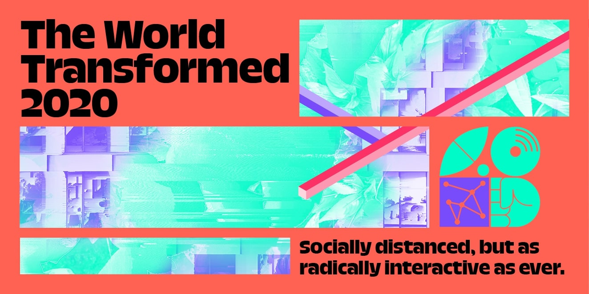

How is it the end of September already!

This month, we contributed to some events as part of [The World Transformed](http://theworldtransformed.org/) festival, continued our partnership with [Progressive International](http://progressive.international/), started working with [Peace Insight](https://www.peaceinsight.org/), and adjusted some internal practices to be more intentional about our work.

### The World Transformed

[The World Transformed](https://theworldtransformed.org/) ran their 2020 festival entirely online this year. We supported them by converting their existing "read-only" website to be more interactive. This included building new functionality to enable visitors to log in and RSVP to events. We also helped them set up a forum and generally advised them on how to make the shift to a digital-first event.

We were also involved in a few events as part their [Brave new digital world](https://theworldtransformed.org/twt20/brave-new-digital-world/) stream:

- We facilitated **Fake friends? Online culture and the left** with Paolo Gerbaudo and Shannon Strucci, who discussed the effects of online culture and parasocial relationships on social movements.
- We joined a panel discussion with Ed Saperia from [Newspeak House](http://newspeak.house/), **The left and the anti-digital movement**, where we talked about how activists can use digital technology to organise and why they might not be doing so already.
- We helped facilitate **Staying safe online,** a workshop with Cade Diehm of [New Design Congress](https://newdesigncongress.org/) that offered practical advice for both individuals and organisations to keep safe from harassment, having personal information leaked, or private conversations de-contextualised and amplified.

### Progressive International

We continued our collaboration with [Progressive International](https://progressive.international/), this time shifting our focus towards member engagement and participation.

We did desk research, consulted with some experts, sent out a survey to individual members and interviewed representatives from a few member organisations.

We used the results of this discovery work to identify where we need to focus our attention over the coming months.

We highly recommend checking out the videos from their inaugural summit: [Internationalism or Extinction.](https://www.youtube.com/watch?v=h7YiBIj2k0M&list=PLsR05wo5NygpEt1ZKki-4qGI20SMlQ4Gt&ab_channel=ProgressiveInternational)

### Peace Insight

We began an exciting new project for [Peace Insight](https://www.peaceinsight.org/), an initiative run by the charity Peace Direct, which highlights the invaluable work of local peacebuilders around the world.

Peace Insight focus on sharing and amplifying grassroots perspectives – an approach that really resonates with us. We're going to be working with them over the next month to build a new website fits with this strategy.

### Internal work

We've begun a new practice of keeping one day a week free for internal work. So far this is going really well – it gives us more space to focus on the co-op in a more sustained way, and gives us a more realistic picture of the amount of time we actually have to spend on consultancy work each week.

### Playbook

We've been working on our public-facing [playbook](https://www.notion.so/commonknowledge/About-Us-5a87e811ea9d4923841f5b409ffae776) and have begun sharing this with prospective collaborators.

Some of this has been based upon the one that [dxw](https://playbook.dxw.com/) put together, which we admire and reference a lot. Theirs, in turn, was based upon [thoughtbot's playbook.](https://thoughtbot.com/playbook) We particularly liked their post on [Time](https://thoughtbot.com/playbook/our-company/time):

> We maintain a sustainable pace of productivity. When a team become tired and demoralized, they get less work done. We achieve a higher pace over the long-term by ensuring that we maintain an even productivity level over time.

> Working a sustainable pace doesn't mean that you never work longer hours. Instead, a sustainable pace means that you have the energy to surge when it actually matters. In our work, there will certainly be times when it is important that we do this, and we have the energy and flexibility to rise to the challenge.

### Hyperfocus

We've also been trying to apply the principles of [Hyperfocus](https://www.waterstones.com/book/hyperfocus/chris-bailey/9781509866137) to our work, for example:

- Setting clear intentions for each day
- Being more deliberate about where we put our attention
- Blocking out dedicated, distraction-free time for complex tasks
- Observing if our attention wanders from the task at hand (a classic mindfulness technique!)
- Having regular breaks
- Recharging with sessions of "scatterfocus", letting your mind wander

### Collective Intentions

We've also started setting collective intentions for each week, based on our [Vision, Mission and Values](https://github.com/commonknowledge/vision-mission-values).

We're currently cycling through the cooperative values of **self-help, self-responsibility, democracy, equality, equity and solidarity.**

This has been a really good opportunity for us the think about these more deeply – each week we discuss one of the values, and try to redefine it to better suit our work. Some of these are pretty complex ideas, so it's been an interesting challenge to distill what they mean to us.

We've discovered the key to success in remembering these is… wallpapers!

## What we're reading, watching and listening to

- [Design Justice](https://mitpress.mit.edu/books/design-justice) by Sasha Costanza-Chock
- [A World to Win: Remembering David Graeber with Astra Taylor, Jerome Roos, and James Schneider](https://blubrry.com/jacobin/67220008/a-world-to-win-remembering-david-graeber-with-astra-taylor-jerome-roos-and-james-schneider/)
- [The seven Climate Visuals principles](https://climatevisuals.org/evidence-behind-climate-visuals)
- [The Social Dilemma](https://www.youtube.com/watch?v=uaaC57tcci0&ab_channel=Netflix)
- [Baron Noir](https://en.wikipedia.org/wiki/Baron_Noir)
- [Squad Wealth](https://otherinter.net/squad-wealth/) by Sam Hart, Toby Shorin and Laura Lotti
