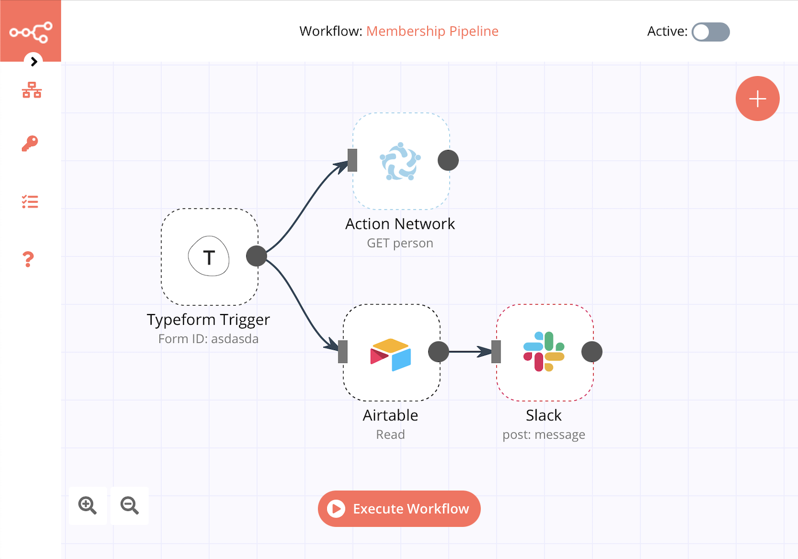

We’ve seen a lot of [‘digital duct-taping’](https://responsibledesign.tech/human-element.html) whilst working with activists, organisers, campaigners and charity sector workers: smoothing over the cracks between various off-the-shelf tools like Google Sheets, surveys, calendars and whatnot. Automations tooling is basic movement infrastructure!

Over time, Zapier has come to dominate the ‘automations’ or ‘integrations’ scene, but like many Venture Capital-funded platforms, it has morphed into something unholy. The upshot is that lots of progressive developers are independently working to get around these issues. The [Parsons python library](https://github.com/move-coop/parsons) is an attempt to converge these efforts, but it doesn’t match the user-friendliness of a product like Zapier.

We think we’ve found a viable alternative for many activist organisations that might allow us to build on top of each others’ work — adding new integrations and skillfully using the tooling while building awareness of this option.

It’s called [n8n.io](http://n8n.io) and it’s an alternative to Zapier that’s robust, flexible, [code-available on Github](https://github.com/n8n-io/), free to self-host, fairly user-friendly.



You might want to consider it if you identify with any of these scenarios:

### Scenario 1: Zapier costs loads

You’re considering an automation tool like Zapier, Integromat, Tray — or you’re already using one — but **you don’t have any more budget.** Maybe your group doesn’t have consistent income or there’s a campaign coming down the road which is going to push you into the next pricing tier, like a flood of signups. You can’t afford tools like Zapier, but it doesn’t feel like there’s any decent alternatives.

### Scenario 2: Zapier doesn’t connect with your tools

Existing automation tools like Zapier are **missing integrations** to the tools your organisation uses. Maybe you’ve written code to get around this problem — or thought about doing it — using something like serverless functions or Google Scripts. Perhaps you’re the gatekeeper in your organisation for these automations, because no one else knows they exist or how to edit them when things change or break?

## Considering n8n as an alternative

If you fit into either of the scenarios above, or there’s something else that’s got you burned about Zapier or other subscription tools like it ([let us know](/contact), we’re curious), then here’s why we think n8n _might_ work for you.

### Fair p**ricing and flexible hosting**

- You can self-host it for cheap or free (no fees to n8n) on your choice of Virtual Private Server (VPS), Heroku, your own server or even your personal computer.
- Self-hosting also means can keep your data private instead of letting Zapier have a free pass at it, which means you could simplify GDPR compliance or avoid surveillance for any politically or personally sensitive organising work.
- They also have a [SaaS option](https://www.n8n.cloud/) which is very competitively priced against [Zapier](https://zapier.com/pricing). It’s always cheaper, doesn’t restrict the features that makes an automation/integration tool useful, like logic or multi-step workflows. Crucially, at the top end it’s **several hundred pounds cheaper per month**, or thousands of pounds cheaper per year.

### Configuration and customisation

With Zapier, what you see is what you get. If they haven’t built it, you’re stuck.

- Firstly, if you you don’t find the integrations you need, that’s fine: you can send **HTTP requests** or even write your own **Javascript code** inside a workflow to do pretty much anything.
- You can also code your own first-class integrations, or even radically change the system or its UI to better suit your organisation. The code for n8n is available on Github and they’re always keen to accept new contributions from the community. We think that’s great!

### **Reliability and digital sovereignty**

Massive campaigns and organisations rely on tooling like Zapier and it’s a real liability!

- n8n, like Zapier, is VC-funded, which is a shame – we’d prefer a co-op or a charitable trust. But, it does mean they have a fully funded product team to maintain and improve the system and they have no way of charging you for using their code.
- How ever you run n8n, you can export and import workflows (the equivalent of a ‘zap’) via JSON. If the cloud version goes down, you can temporarily spin it up on your own machinery and vice versa. Zapier will inevitably fail one day, [or they could just decide to arbitrarily block you, perhaps at the whim of the authorities](https://news.ycombinator.com/item?id=25644056). Good luck trying to work around that.
- It’s worth mentioning n8n also has some really good features. It has error handling for workflows and even CLI (command line interface) commands for JSON workflow management and backups, if you’re into that kind of thing!
- If you are still uncertain, quite a few startups and also some larger orgs like [Honest Burger](https://n8n.io/blog/how-honest-burgers-use-automation-to-save-100k-per-year/) use n8n for their live ops.

### Plus it’s really good!

Overall, we reckon that the funded team plus open source combination makes n8n a good candidate for progressive activists to assemble around. The integrations and tooling built for one campaign can be easily reused by another organisation also running n8n. As an example, [we recently built an Action Network CRM integration for n8n](https://github.com/n8n-io/n8n/pull/1437)!

Besides, the tool is actually quite good! You can build in fairly complex but understandable workflows. And did we mention the HTTP node?

The visual editor is also nice and comprehensible, and we reckon that with a bit more work on the diagram system it will be able to make your integrations and automations more transparent to your org’s members. These things are organisational business, after all, so anything that builds transparency and accessibility into the machinery is a win for the democracy of your organisation.

## How to run n8n for your org

We’ve had a look at how you can get Zapier-style automations running for a fraction of the cost and much more predictability. We’re happy enough to share this publicly, but please keep in touch so we can improve our recommendations.

### Option 0: Quickly try it locally

You can have it up and running on your local machine in about 10 seconds, using one of these commands:

```bash
npx n8n
```

```bash
npm install n8n -g & n8n
```

```bash
docker run -it --rm --name n8n -p 5678:5678 -v ~/.n8n:/home/node/.n8n n8nio/n8n
```

Something dorky and fun here: you can actually run CLI commands against your local machine (or server, for example) — try running an applescript command to create a text alert? Wild! Try doing that with Zapier.

```jsx
osascript -e 'tell app "System Events" to display dialog "Imperialism wants to suppress our struggle for better living conditions with guns and knives and we must answer with more vigorous and larger-scale unified struggle."'
```

### Option 1: Virtual Private Server (VPS) + Docker

We recommend a VPS that isn’t Amazon’s web empire. We are using Digital Ocean, but we’re writing this via Notion which itself relies on AWS, so we’re not exactly heroes.

Overall, n8n has fairly miniscule operating requirements. You won’t need any beefy CPU or RAM, hard drive space or even a database running — n8n will by default set itself up with a file-based SQLite database. Our colleagues at [newdesigncongress.com](http://newdesigncongress.com) recommend [Hetzner](https://www.hetzner.com/cloud#pricing) running something as cheap as CX11 option (2GB RAM) for only **€2.96/month.** You could also take a look at [Scaleway](https://www.scaleway.com/en/).

Just remember to pick a UK/EU server for speed and data privacy reasons.

You can simply follow [this docker-compose guide](https://docs.n8n.io/reference/server-setup.html#_5-create-docker-compose-file) to get going in a few minutes.

Quick note that we at Common Knowledge using Digital Ocean / Debian had to edit the `image: n8nio/n8n` bit with `image: n8nio/n8n:latest-debian` in order to get SSL-enabled email sending to work properly.


We did a bit of thinking about how to keep things reliable running on your own machinery, but thankfully n8n already has a lot of stuff built in here so it’s really just about good, simple server management:

#### Error handling

- At the server level: ensure the docker automatically restarts itself after server restarts:

  ```jsx
  systemctl enable docker.service
  ```

- Also consider HTTP logging at the server-level so that application-level failures, however unlikely, don’t lose you data. [`httpflow`](https://github.com/six-ddc/httpflow)) does this well.

  Does `systemctl enable httpflow` work? I don’t know, but you could try that.

- At the application level: you can set up error workflows within n8n that catch failures, which is great:

  - Best practice here might be to [set up general alert email and include the execution ID in the mail](https://community.n8n.io/t/production-experience-staging-filter-failed-long-lists/848). This way you can inspect the execution, the state of the nodes etc. in the tool and see what happened.
  - [A good overview of error workflows in n8n](https://medium.com/n8n-io/creating-error-workflows-in-n8n-6e03c9ecbc0f).
  - [Reference docs on error workflows.](https://docs.n8n.io/reference/workflow.html#data-flow)

#### Handling high throughput

There are a number of features including a workflow queue, load-balancing and workflow workers that you can opt in to. Here’s a [quick article explaining how to enable scaling features](https://docs.n8n.io/reference/scaling-n8n.html). We’d advise adding `redis` image to your `docker-compose.yml` file.

We’ve seen [forum threads](https://community.n8n.io) where people talk about tens of thousands of requests and some absolutely whacky long workflows to boot, and that was before there was any of this scale-up infrastructure. So we think it’s probably reliable enough!

#### Upgrading n8n

Upgrading should be as simple as pulling down the latest image from the docker-compose file. You can specify the version or clean reinstall etc.

For peace of mind, check out:

- [Breaking changes log](https://github.com/n8n-io/n8n/blob/master/packages/cli/BREAKING-CHANGES.md) to see if upgrading will blow something up
- [The changelog to see if it’s worth upgrading](https://docs.n8n.io/reference/changelog.html) (it usually is?)

It might be worth looking into auto-upgraded dockers... [this guy at HubSpot actually uses n8n to upgrade n8n once a week!?](https://medium.com/n8n-io/hubspots-hugh-durkin-talks-about-the-importance-of-automation-2eba0e6b2643)

### Option 2: Managed hosting at [n8n.cloud](http://n8n.cloud)

Guaranteed latest version, no headaches about performance, etc. Some light performance-based pricing but nothing quite as ridiculous as Zapier and certainly simpler than the self-hosting.

Not a bad option.

### Option 3: Heroku

Check out this repo: [sarveshpro/n8n-heroku](https://github.com/sarveshpro/n8n-heroku)

The downside is you might start coming across storage issues with something like the free postgres. Also, Heroku’s pricing is whacky.

On the other hand it has nice addons for logging, auto-restarting, auto-scaling and all that jazz. Plenty of options if you want to take it really far, though costs may vary.

[This StackOverflow answer](https://stackoverflow.com/questions/61228036/deploying-n8n-to-heroku) might also be helpful if you want to explore Heroku deployments.

## Things we wish we knew at the beginning

- The devs are very open, so you’ll get farily quick responses (often same day) in the [n8n’s community forum](https://community.n8n.io/)
- n8n uses a concept of data flowing from start to finish. You can add variables, add "items" and access previous items and data from previous nodes. Check out the [docs](https://docs.n8n.io/).
- Look at [_Split In Batches_](https://docs.n8n.io/nodes/n8n-nodes-base.splitInBatches/#node-reference) for if you need to loop over multiple items
- Also check out the _[Merge](https://docs.n8n.io/nodes/n8n-nodes-base.merge)_ node which you can use to "pull" data from an upstream node even if it’s not part of the flow.
- The _[HTTP](https://docs.n8n.io/nodes/n8n-nodes-base.httpRequest/#example-usage)_ node always has your back
- The _[Function](https://docs.n8n.io/nodes/n8n-nodes-base.function/)_ node also has your back, if you just want to code your way out of a problem

See also:

- [n8n tutorials on YouTube](https://www.youtube.com/playlist?list=PLlET0GsrLUL5HKJk1rb7t32sAs_iAlpZe)
- [n8n tutorials on Medium](https://medium.com/n8n-io/tagged/tutorial)
- [The n8n website](https://docs.n8n.io/getting-started/tutorials.html)

### Adding new integrations

- First, consider using the `HTTP` node for API requests
- Here's a [guide to building and running a custom integration](https://docs.n8n.io/reference/configuration.html#custom-nodes-location). If you're stuck, message us, [we've built one for Action Network](https://github.com/n8n-io/n8n/pull/1437) and give you a hand.
- If you build any new integrations, please consider submitting them back to the community for other activists to use. If you don’t have time, email [hello@commonknowledge.coop](mailto:hello@commonknowledge.coop) and we will gladly prepare a pull request on your behalf so that other activist organisations can benefit. We’ll also try our best to broadcast it to anyone we know who needs it.

### Migrating from Zapier to n8n

We don’t know a way to automatically do this yet. One strategy that’s served us well is to create a mirror of the workflows in n8n, test them, turn them live and then switch over the integrations one by one for zero down time.

### Still curious?

[Get in touch](/contact) with us and we’re more than happy to talk this through some more or talk about broader technical and organisational campaigning, if you are an activist, organiser, campaigner or work in progressive political/charitable organisations.

_We're able to do this work thanks to the generous funding of the [National Lottery Community Fund](https://www.tnlcommunityfund.org.uk/funding/covid-19)._
