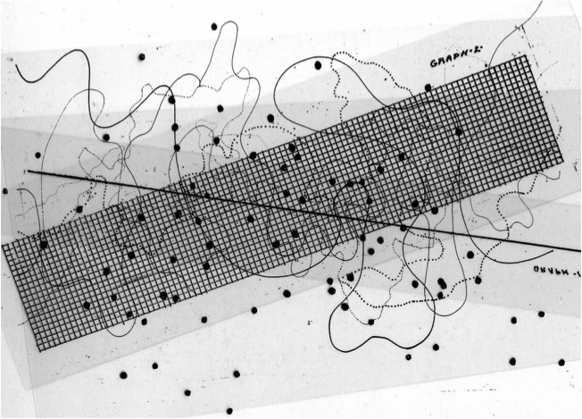
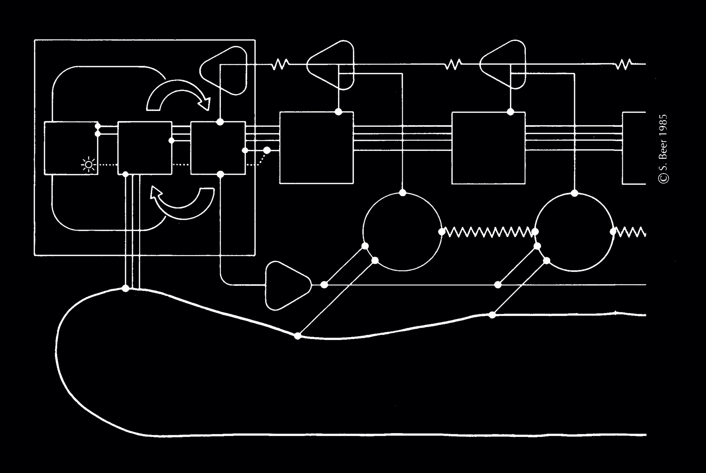

We're a worker cooperative, which means that each of our members has equal control and ownership of the collective. We make decisions and govern the cooperative in a democratic, non-hierarchical and collaborative way. We support each other and contribute our own particular skills and experience for our mutual benefit and for the cooperative as a whole.

Being part of a worker cooperative is about having agency over one’s own labour and time. We formed Common Knowledge as a worker cooperative because we think that _how_ we work, support ourselves and collaborate with each other hugely impacts _what_ we make. If our goal is to enable radical change, we need to begin by questioning the entire structure of our work. We see worker cooperatives as one way of prefiguring an alternative future, in which solidarity, interdependence and self-determination is at the centre.

Lizzie O'Shea writes about worker cooperatives in her book [Future Histories](https://www.versobooks.com/books/2960-future-histories). We particularly love this quote, as it gets to the heart of what makes a co-op different from a regular business:

> The driving force behind these enterprises is active participation in management decisions by workers. This results in not just a broader set of ideas about how to organize labor; critically, it generates knowledge-sharing about work—something that is highly valued but difficult to cultivate in more orthodox business structures. Structuring organizations in this way creates the strongest incentive among workers to be creative, take responsibility, avoid unnecessary conflict, and monitor and improve performance. In other words, to educate themselves and each other on how best to work with technology. Worker cooperatives are places where workers can play with new skills. They can learn, practice and experiment with new ways of doing things. They can share knowledge and feedback, confident that they will also share in the benefits of any higher productivity that may come about as a result.

We use two practical frameworks to help us collaborate in a non-hierarchical way: sociocracy and Scrum. Both frameworks are integral to how we work – they provide a solid basis for building a highly collaborative and non-hierarchical environment.

## Sociocracy

The goal of sociocracy is to optimise organisation efficiency, while ensuring that everyone’s voice is heard. [A very brief introduction to sociocracy](https://medium.com/@Harri_Kaloudis/a-brief-introduction-to-sociocracy-a0770f220937) by Ted Rau and Harris Kaloudis gives a great overview of what sociocracy is and how you can use it.

### Circles

Sociocractic organisations are usually structured as a series of nested, interconnected "circles" that cover the different functions of the organisation. Members of each circle are responsible for that function, and have the agency to independently make decisions about that area of expertise. They feed decisions and questions back into the wider group through a system of double-linking between sub-circles and the general circle.

Common Knowledge is too small to be structured in this way – we'd all need to be in every circle.

However, we have been experimenting with allocating responsibility areas to each co-op member. As with sociocratic circles, if a member is responsible for a certain area, they do need to lead and make decisions. However, they don't need to do everything themselves – part of their role is about distributing tasks to the rest of the co-op.

### Decision-making

One crucial aspect of sociocracy is that decisions are made by consent, not consensus. We use this method of making decisions almost on a daily basis. Any member can propose something to the rest of the group. Other members can ask for clarifications or amendments to the proposal. From there, they can decide to either give their consent or block the proposal. The criteria for consenting to a proposal is that it’s “good enough for now and safe enough to try”.

This method recognises that most decisions aren’t permanent, and optimises for efficiency and iteration over consensus. It is about trusting the people you work with to make decisions that impact the collective as a whole. It removes the expectation that everyone must be deeply involved in, and supportive of, every decision that needs to be made. Although an individual member may give up a little of their personal agency, overall it increases the collective’s ability to act, learn and grow rapidly.

It also encourages each member to take ownership of a proposal and then follow through with it. Moving from a freeform discussion towards a concrete proposal requires one to formulate an idea in a clear and structured way. Responding to clarifications often highlights aspects of a proposal that might have gone unnoticed by just one person. The end result of this process is usually clarity around what needs to be done next and who is responsible for it.

### Meeting facilitation

Aside from decision-making, sociocracy offers a framework for facilitating meetings. We've written a little about a few of these methods in these previous posts:

- [Talking in Rounds](https://commonknowledge.coop/writing/talking-in-rounds/)
- [Starting Meetings Well with a Check-in](https://commonknowledge.coop/writing/checking-in/)

As well as starting with a check-in, we try to always end meetings with a check-out. This provides space for everyone to say how they're feeling as a result of the meeting, reflect on how it was run and identify how to improve the process in future. In our experience, these cycles of evaluation and iteration enable us to continuously improve how we collaborate.

[Sociocracy for All](https://www.sociocracyforall.org/facilitation/) has some more practical tips on how to facilitate meetings.

## Scrum

The second framework we use is called Scrum, which is ubiquitous in the world of software development. Scrum prioritises horizontal collaboration and iteration over formal processes and structures. However, in most tech companies, this distributed and adaptive method of working takes place within a more rigid and hierarchical organisation.

Following this framework means working in sprints: two week cycles of focused activity, with a number of rituals throughout. These include a planning session at the start, weekly backlog refinements, and a showcase and retrospective at the end. These events ensure that everyone on the team understands to work to be done, and can easily share work between each other. They also enable the team to work in an iterative way, with everyone adjusting their behaviour as they go. The retrospective at the end allows the team to reflect on the successes and challenges of the sprint, so that they can improve in the next one.

Rituals like these are an important part of both sociocracy and Scrum. They provide a regular cadence for the team to follow, and allow for continuous reflection, iteration and renewal.

---

Image credits:

1. John Cage
2. The Internet
3. Stafford Beer
