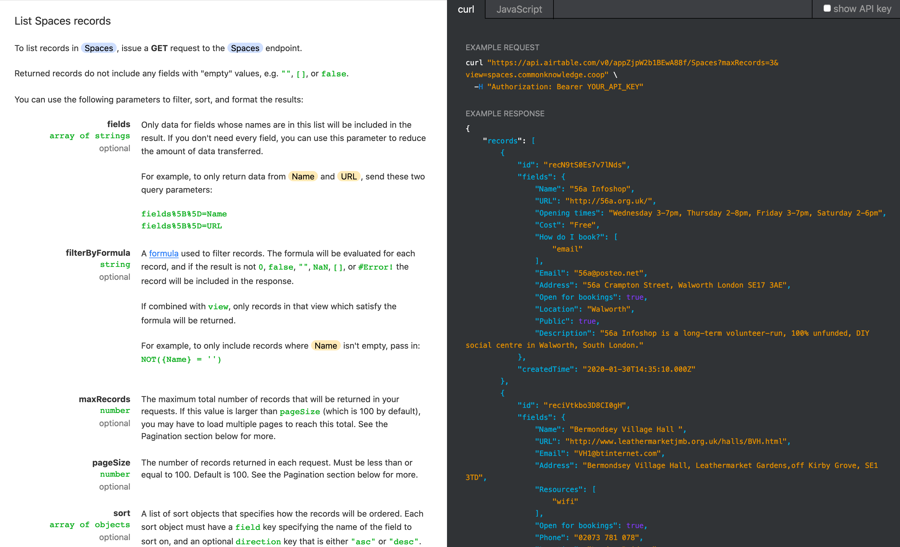

> When social movements share infrastructure that they own, it’s easier to support each other. When we share space, we can begin to build the type of world we’re striving towards.

— [Another Network is Possible](https://logicmag.io/bodies/another-network-is-possible/) by April Glaser

We've just launched a simple tool to help organisers to find and book spaces: [spaces.commonknowledge.coop](http://spaces.commonknowledge.coop/)

Our goal is to make it easier for anyone to arrange meetings and events, for the community not for profit.

## Process

Late last year we went to a meet-up of the [Mutual Aid Working Group](https://www.mutual-aid.uk/) in London, which brings activists together to discuss common issues and share resources. Many of their puzzles aligned with our own observations, particularly around lack of appropriate spaces for meetings and events. This got us thinking about how we might provide digital infrastructure to facilitate mutual aid.

We think that there are something like three core ingredients needed to set up and run an activist group: **people**, **resources** and **reason**. This project focuses on resources: it's easier to organise events and meetings if you can refer to a list of appropriate spaces.

We began a public survey to get a sense of how organisers currently find and book spaces - please [contribute](https://commonknowledge.typeform.com/to/P4QEeE) if that's you! We've also interviewed [MayDay Rooms](http://maydayrooms.org/), [ReSpace Projects](http://uk.respaceprojects.org/) and two organisers, to dive a bit deeper.

The results were wide-ranging and we've identified a need for change in various systems. But most substantially we've been able to add evidence to anecdote about the huge demand for meeting and event spaces — particularly **accessible** and **cheap** ones.

Knowledge of spaces spreads through word of mouth and it's not uncommon for organisers to keep personal spreadsheets that get passed around between organisers. It makes sense to facilitate and collectivise this work and to take advantage of digital technology to spread it.

## Prototype

In making this prototype, one of our core realisations was that this doesn't need to be an exhaustive list of all spaces in London. OpenStreetMaps, Google Maps and various other sources can be used to find churches, community centres and the like with various pieces of information attached.

What we feel is valuable and missing for many organisers is curation – organisers aren't just looking for any space, they're looking for the *right kind* of space.

We've made a submission form for now and will be looking at how to build in collaborative editing in a sustainable way. Thoughtfully maintaining a list like this requires care, as we've found out from our own experience and from other organisers.

We want to ensure that listings are safe and welcoming to all and make sure there is an emphasis on accessible, low-cost spaces.

We also want to respect and reflect the culture and history of these spaces, which means ensuring that the digital footprint we ascribe to them is one they want. Some centres told us they specifically didn't want to have much online presence, to enable a more organic relationship between space users.

### The tech

For the short term we're prototyping the database in [Airtable](https://airtable.com/), an off-the-shelf spreadsheet-like tool that doesn't require much investment of time or money. One really nice benefit of this is that it provides an API 'for free'.

This is just the first foray into this so we want to collect observations of how people actually use the website, so we're using [Matomo](https://matomo.org/) for user analytics.

Matomo is a great privacy-oriented alternative to Google Analytics because you retain ownership over the data it collects: it won't be shared with any third parties or used for advertising.

We're using the privacy consent tool from our friends at [Metomic](https://metomic.io/) so that people can maintain control over how this works.

## Next steps

More than anything, we'd love to add more spaces to this list!

There’s a huge demand for accessible, low cost and welcoming spaces. We're very aware that this is London-centric and in the long term we want this to become a nationwide database of reliable meeting spaces.

If you know of any spaces not listed already, please add them at [spaces.commonknowledge.coop](https://spaces.commonknowledge.coop).

We're focused now on how people search and use the list. In the future, we want to tackle:

- Postcode search functionality
- Accessibility via an API, so you can integrate this into organiser facilitation tools. Here we want to apply open data standards
- A better way to edit, verify and leave comments on spaces
- Booking system integration

Thank you to all the people who responded to our survey, spoke to us and sent us their lists of spaces.

We're still interested in talking to more spaces and organisers, so send us an email if you're interested in the project. We'd also love to hear from you if you have any feedback or would like to edit a listing: [spaces@commonknowledge.coop](mailto:spaces@commonknowledge.coop)
