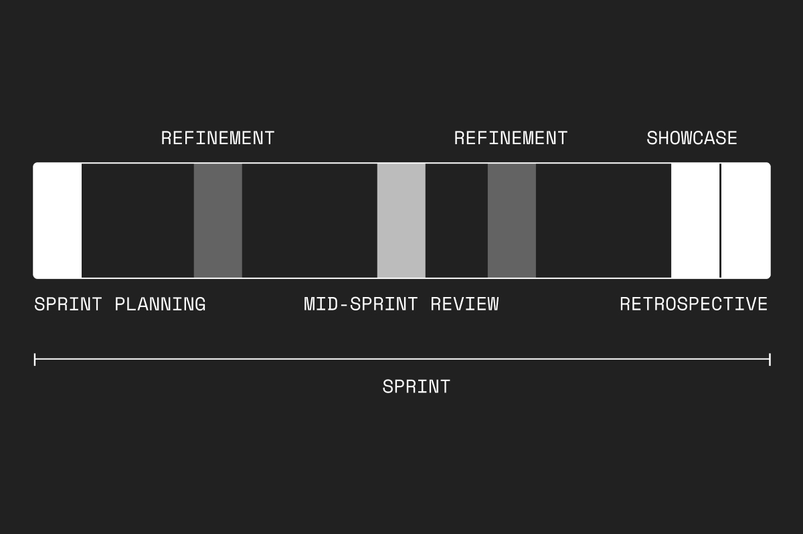
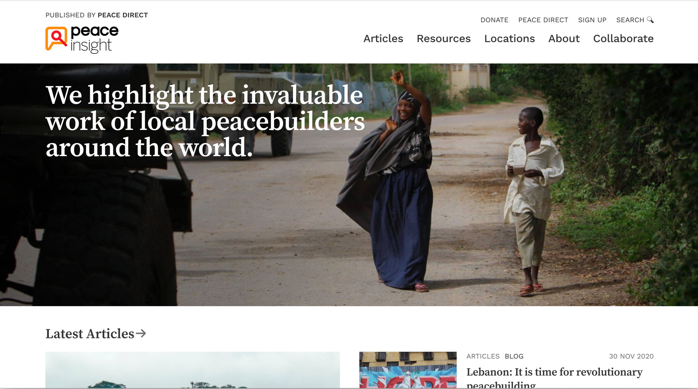
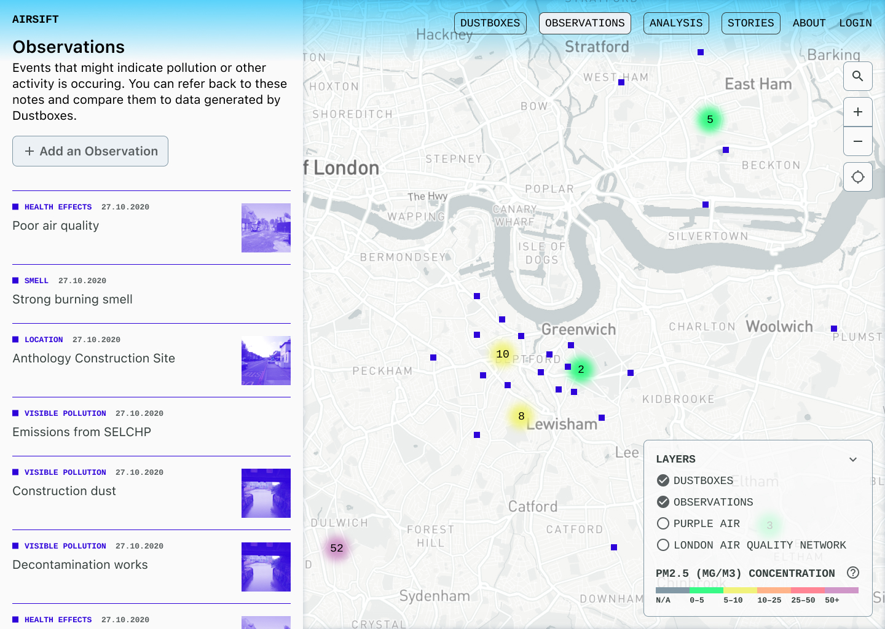
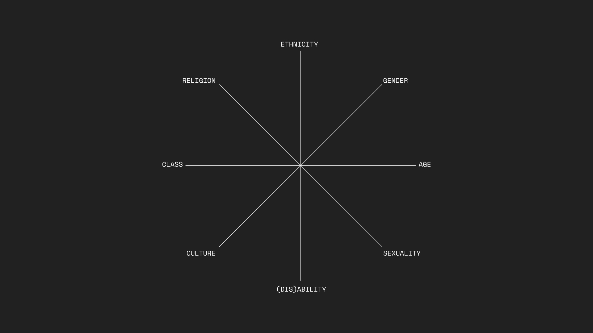
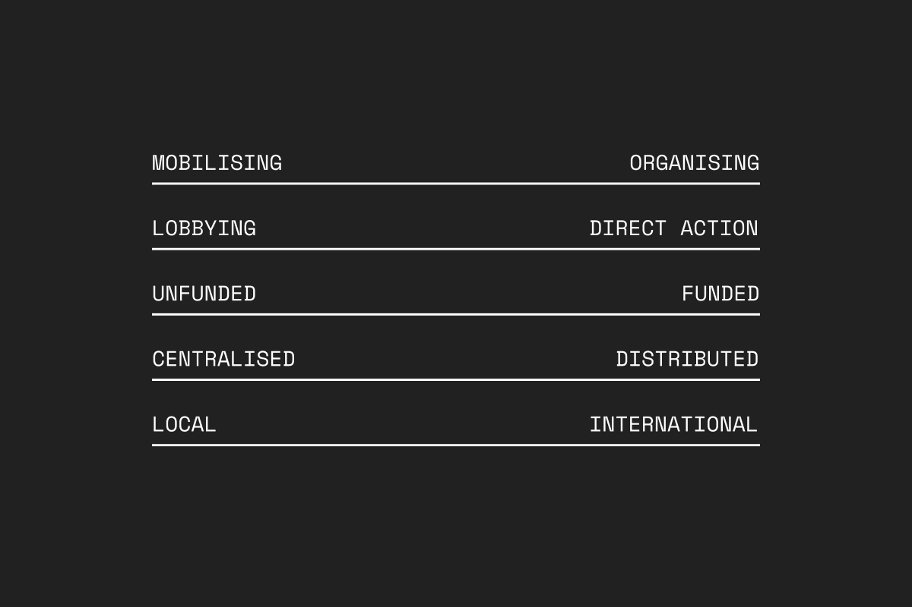

## Moving to Scrum

We've recently moved the co-op to "full agile mode".

Agile sprints have always been our preferred way of working, but the nature of our work means that sometimes we haven't been able to work like this. We primarily ran sprints when working on bigger projects with tight deadlines, where we were able to carve out at least two weeks of the full team's time to completely focus on one thing. 

We recently decided to switch to this way of working for all of our projects, by combining all our active projects into one sprint. We've now done two of these sprints, and the consensus is that we should have done this much earlier.

Sprints work in two week cycles with a number of rituals throughout. These include a sprint planning session at the start, weekly backlog refinements, and a showcase and retrospective at the end. 

The full [Scrum guide](https://www.scrumguides.org/scrum-guide.html) is available online and quite short to read.

We also like to add a lightweight review at the halfway point of the sprint, for what [Giovanni Ferron](https://gvnn.it) has called "horse trading". This means exchanging items that are in the sprint, where individual capacity is more or less, so the whole team can complete the sprint scope. You might say "I'm in the reeds here, so won't get round to this" or "some things were easier, so I can pick that up for you".

Scrum teams sometimes forget that it is the whole team that finishes the sprint, not an aggregate of parallel individuals working on tasks they have been assigned. This sort of swapping around is a vital part of delivering an iteration. It should be encouraged in daily scrum meetings too! The team, not individuals, own the sprint backlog and its delivery. Individual people don't even have to necessarily own single sprint backlog items, which is something that's often forgotten also.

For now, we're going to experiment with publishing the content of our internal "Showcase" event. We might also make these events public in future, in the spirit of working in the open.

## Peace Insight 🚀

Over the last few months, we've been working with [Peace Insight](https://peaceinsight.org/) on a new version of their website. They launched this yesterday, which was very exciting indeed.

We're planning to publish a full case study to explain our process soon. In the meantime, here's what we wrote for their press release:

> We were excited to work on this project because of Peace Insight’s focus on amplifying local voices. We strongly believe in empowering local communities to affect change in their own lives, and helping them share their experiences to inspire others.

We redesigned the site to ensure that the peacebuilders and their stories were front and centre. The new website allows for more content discovery and cross-linking between sections. We wanted visitors to build a familiarity with the theoretical techniques of peacebuilding, through the Resources section, but also to learn about these techniques in action.

## Peacebuilding in Sahel Map

We're now continuing our collaboration with [Peace Direct](https://www.peacedirect.org/). This time, we're working with them on a new mapping tool for a large international organisation.

The goals of this project are to:

- Create a user-friendly interface for exploring the research that Peace Direct has done
- Allow people to discover peacebuilding organisations in the Sahel region of North Africa
- Help people understand the scale and number of organisations in a given region
- Help staff understand what *type* of peacebuilding work is currently happening, and what their needs each organisation has

Over the past two weeks, we conducted a brief Discovery phase and then jumped into the Design phase.

### Research and Discovery

- Conducted research interviews with key stakeholders
- Mapped out their grant-giving process
- Analysed the research database
- Identified key [user personas](https://www.usability.gov/how-to-and-tools/methods/personas.html)
- Wrote [job stories](https://contentdesign.london/content-design/user-stories-and-job-stories/)
- Did desk research into similar tools

### Design and Build

- Wireframed key functionality
- Designed the user interface for desktop and mobile
- Created a project backlog
- Prioritised the backlog in collaboration with the client and Peace Direct staff

## Airsift

We're also working on another mapping project at the moment: Airsift. Airsift is part of a larger project called [Citizen Sense](https://citizensense.net/), which investigates the relationship between technologies and practices of environmental sensing and citizen engagement.

> While many air quality monitoring projects focus on technical innovation, the Citizen Sense research team develops a toolkit that investigates and facilitates social and technical inventiveness by focusing on citizens’ use of data, connecting to ongoing environmental projects, and collaborating with communities to mobilise data for specific campaigns.

We've been working on this project for about a month now. This sprint, we completed most of the build tasks, including:

- Integrated Wagtail CMS so that anyone can contribute to the platform
- More UI work on mapping, lists of things and data visualisations
- Set up a production environment with a clone of the data, so that things run fast and don’t affect the academics’ experimental server

We'll be able to the live site soon, but for now, here's a sneak peek:

## United Voices of the World

[UVW](https://www.uvwunion.org.uk/) are an ongoing collaborator of ours, thanks to the support of the [Rosa-Luxembourg-Stiftung](https://www.rosalux.de/en). We're working with them to improve their digital systems for casework.

This sprint, we mainly focused on preparing for our next sprint, which will be largely focused on finishing off the project. We refined our project backlog and prioritised these outstanding tasks with someone from the casework team.

## Community Organisers

We're working with [Community Organisers](https://www.corganisers.org.uk/) to help their network of community organisers make the best use of the online spaces they’ve set up. In this case, using Workspace for networking and peer learning across the United Kingdom.

Community organising is traditionally a face-to-face activity. Of course, due to covid, organisers have had to rapidly move online this year. We are helping them make this adjustment ahead of a recommitment activity in the spring. At the start of lockdown, Community Organisers themselves launched an excellent campaign to try and bridge the digital divide: Operation WiFi.

We're treating this as an ongoing series of "experiments", where we introduce a new organising technique or tool each week and then reflect on how successful it was.

One of our most successful experiments was creating an "Introductions" thread. We're now going to try to get thematic discussions going, learning what works best as we go.

We're also helping them migrate to using Hubspot to record organiser activities and automating some of their Mailchimp workflows on the build up to their recommitment campaign.

## Outreach

We attended the second consultation between University of Essex students and CoTech co-ops (Agile Collective, Space4, InFact, and us). The module, initiated by [Peter Bloom](https://www.essex.ac.uk/people/bloom09008/peter-bloom), is focused on helping students build theoretical and practical knowledge about managing and marketing cooperative and worker-owned businesses. These sessions are always super interesting, with lots of challenging questions from the students!

## Internal work

### Activism Verticals

One of our current OKRs is centred on diversifying who we work with. Specifically, one of these KRs is:

> Speak to 50 new people or groups in verticals that are currently underrepresented in our work.

As a first step towards this goal, we ran an internal workshop to map out who we currently work with, based on their organisational form and activist concerns. From there, we identified the areas where we think are currently weak.

We thought this was a really useful exercise, although by no means conclusive or exhaustive. We know there are people who do this kind of thinking full-time! We saw it more as a way of initiating further research and reflection, and helping us work out who we should reach out to next.

Some of the questions we've been considering since then are:

How can we look at types of activism through a more intersectional lens?

What are other ways we could map organisations?

### Responsibility Cycles

We're trying out a new way of distributing responsibilities within the co-op, by assigning people to different Responsibility Areas for a month each.

### One-to-One Chats

We're also trying to increase the amount of one-to-one chats within the co-op, by allocating everyone a listening and speaking buddy.

This is intended to to help us all feel less lonely and isolated, and to mitigate the absence of "watercooler" chats while working remotely.

It's also meant to facilitate personal development, so that each person has someone they can talk to about their own goals and ambitions.