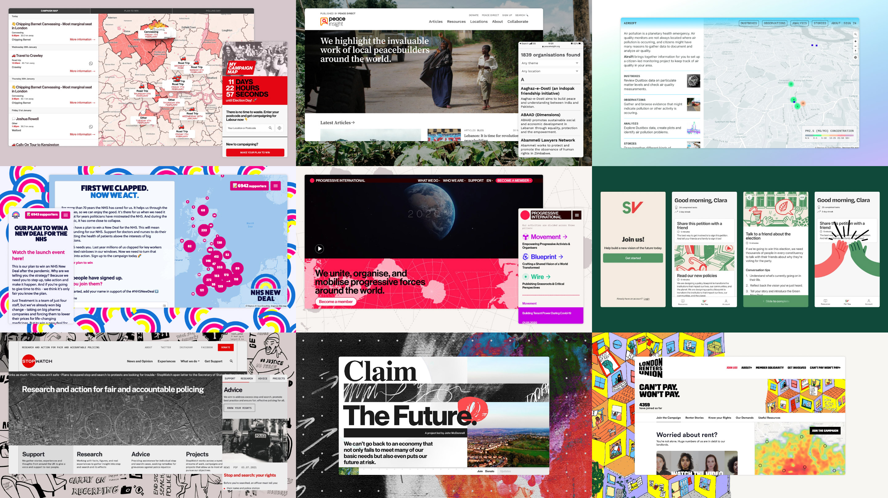

### We’re launching our Supporters Network

Our co-op began in 2018 with a series of experiments to explore how to get people involved in grassroots organising through digital means. The result of this research was a prototype app, *Movement*, which used off-the-shelf tools to connect people who want to get involved in grassroots political activism with relevant groups based on their location, capacity and interests.

In 2019, we switched focus toward partnering with grassroots organisations and using digital technology to augment their capacity. Over this time, we’re proud to have worked on loads of exciting [projects](https://commonknowledge.coop/work): from building My Campaign Map for [Momentum](https://peoplesmomentum.com/) and helping launch [Progressive International](https://progressive.international/) to supporting London Renters Union in their [Side with Renters](https://londonrentersunion.org/2022/side-with-renters-wins/) campaign and creating a vibrant new identity for [Green New Deal Rising](https://www.gndrising.org/).

Over the past few years, we’ve built strong relationships with organisers, tested our ideas in real-world contexts and refined our strategy. We’ve identified needs shared amongst many grassroots groups that demonstrate a clear need for more general solutions.

### **That’s where you come in!**

We want to ramp up our activity building movement infrastructure that can be used by a wide range of organisers. We know that this work is necessary and urgent. Building common infrastructure is going to be much more effective and will substantially reduce costs, which means that we’ll be able to provide tools cheaply (or for free) for those who need it most.

We’ve already begun some of this work, both in our own time and with support from the Rosa Luxemburg Stiftung. In 2021, we created [Groundwork](https://commonknowledge.coop/writing/introducing-groundwork), a framework that makes it easy for developers to set up custom digital tools for grassroots organisations. The first release focuses on mapping features, UK electoral constituencies and representatives, and writing to commonly used tools like Airtable. It’s already in use by a few significant projects and there's much more we'd like to add to it. Future work here will involve writing to commonly used organisers CRMs like Action Network and NationBuilder, for example.

As well as extending Groundwork, we’ve identified a range of other projects that are urgent and important, like building bridges between common organising tools, building a set of “Movement Blocks” for WordPress and developing out-of-the-box versions of existing open source campaigning tools.

### How to support us

You can either [become a regular Supporter](https://opencollective.com/commonknowledge) on Open Collective with donations starting at just £2 per month. You can also make a once-off donation – every little bit counts!

We’re a totally independent, not-for-profit worker cooperative. Your support will help us conduct research, design and build tools, and ultimately support grassroots organisations to do their work.
