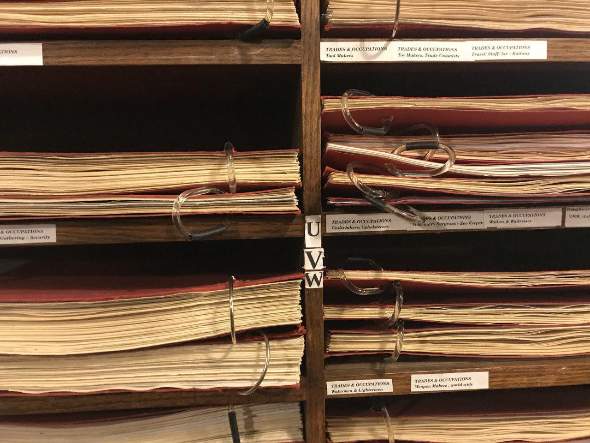

## What we got up to

This week we continued our consultancy work in order to build runway for our non-profit solidarity work, interviewed [MayDay Rooms](https://maydayrooms.org/) about the mutual aid resource network, and helped facilitate a workers’ inquiry session for [Tech Workers Coalition](https://twitter.com/TechWorkersLDN) and a meeting for the [Designers + Cultural Workers](https://twitter.com/UVW_DCW) branch of United Voices of the World.

We also chatted with Shane Kilkelley from the [General Intellect Unit Podcast](https://twitter.com/giunitpod), [Thomas Swann](https://twitter.com/ThomasSwann1) and [James Fox](https://twitter.com/Vinewalker1) about organisational cybernetics, digital technology, direct action and how we might collaborate, and with the [Digital Life Cooperative](https://twitter.com/tech_we_trust) about how they string together open source collaborative tools.

### A Tech Workers Coalition learning club

For a while we’ve had [this workers’ inquiry workshop facilitation guide](https://docs.google.com/document/d/1cM6Nsmvz6JreAYkGhYbMe-1-V8NByIRkWdZ20i9ie-s/mobilebasic) in our backlog of ‘things to try’. It was diligently put together a while back by some Seattle tech workers and found buried in the TWC slack close to the 10,000 message paywall.

Excitingly, there were too many break out group sessions at the last TWC London monthly organising meet for us to try it out, so at the end of that session we proposed an event dedicated to workers’ inquiry Q&As. An email to the venue host, a tweet-out to tech workers, two weeks and a bicycle ride later and we were into the workshop.

It went swimmingly, and besides the even proportion of new and returning tech worker activists, we were also able to introduce workers from the same company.

The principle of this workshop was really simple: people who explore and reflect on how they relate to their fellow workers, workplaces and wider society, with other people in a similar situation, will make grand and in hindsight obvious discoveries.

[This session](https://twitter.com/TechWorkersLDN/status/1195266531631992832) certainly threw some subtle managerial practices into the spotlight! The group also decided it’d be fruitful to explore climate organising in London tech workplaces more substantially.

What’s stuck in our minds since is how smooth and painless and, most of all, **spontaneously** this learning club was organised, thanks to literally back-pocket digital technology:

- We already had access to Mayday Room’s **shared calendar**, so we could confirm availability and send in the booking email there and then, at the end of the previous gathering.

- We had an exercise and a **ready-to-rumble facilitation guide** in our back pockets all along, which made pitching it to the group, and committing there and then to facilitating it, easy and stress-free despite limited time in the week to prepare.

- In the workshop, we actually read through the guide together, so no one in particular was ‘in the know’. The guide was even shared around to all the participants’ phones so they could run through their 1-to-1's.

- (And, of course, we already had comms set up: all new attendants found us through our active Twitter account, and returning activists knew of it from the Slack or the last meeting.)

It reinforced our belief that widely-shared digital infrastructure and facilitation can be radically effective for building grassroots power — and as helpful for experienced activists as for those new to it all. Which begs the [question](https://twitter.com/cmmonknowledge/status/1195793830093742080)…

**The [next monthly organising meet](https://attending.io/events/london-tech-workers-organising-meet-november) for workers around the wide tech industry is 6.30pm, Wednesday 27 November at Mayday Rooms, 88 Fleet Street.**
[**London Tech Workers organising meet**
*We are the London chapter of the Tech Workers Coalition - a coalition of workers in and around the tech industry…*attending.io](https://attending.io/events/london-tech-workers-organising-meet-november)

### Designers + Cultural Workers

The Designers + Cultural Workers branch has only recently been established, so part of this meeting was spent discussing working groups, communication channels and how we relate to the rest of UVW and the other branches within it.

Someone from the [Section of Architecture Workers](https://twitter.com/UVW_SAW), another new branch of the UVW, came along to the meeting and shared insights into how they’ve approached setting up their branch so far.

Together we revisited the list of problems and demands from the last meeting, and discussed how we could begin to action some of these demands.

One key point of discussion was around effective direct action: what options do isolated, precarious freelancers have, if striking isn’t a viable option?

Another important point was that any kind of campaign or action needs to begin with a power-mapping exercise. Within each industry, and related to each problem we’ve identified: who holds the power to effect change, and how might we reach them?

It’s great to see direct communication and collaboration between branches happening organically. There are obviously a lot of considerations and concerns that are shared across industry boundaries.

Thanks to [Rotherhithe Picture Research Library](http://www.sandsfilms.co.uk/rotherhithe-picture-research-library.html) for hosting. We’re glad that one of the DCW members suggested meeting here, as it’s an incredible resource with lots of unexpected discoveries.

## What we’re thinking about

We’re also thinking a lot about activist self-care at the moment.

In [The Happy Healthy Non-Profit](https://happyhealthynonprofit.wordpress.com/), Beth Kanter and Aliza Sherman talk about the “scarcity mindset” shared by many non-profits — believing that there will never be enough (money, time, resources) and acting accordingly.

To combat this tendency, they’ve outlined a simple framework that helps people self-monitor their own signs of burnout, based on a Personal Chaos Index. The framework helps people self-reflect, look for patterns over time and set boundaries for themselves.

We’ve adapted this to make it more relevant for campaigners in [this survey](https://commonknowledge.typeform.com/to/Tch3nW). Please share amongst your network and get in touch to let us know what you think.

Ultimately, we’d like to explore ways that this could be converted into a Collective Chaos Index as well.

We think a tool like this is even more powerful when used to monitor collective mood and alert a group if one of their members is at risk of burning out. We realised that we do daily team check-ins and weekly retrospectives for this reason: it’s not just about personal baselining, it allows us all to adjust ourselves accordingly and provide support as a collective.

## What we’re reading

Generation Rent, London Renters Union, ACORN, Tenants Union UK, Renters’ Rights London and the New Economics Foundation have just put out a [National Renters Manifesto](https://www.rentermanifesto.org/read_the_manifesto_full).

Thomas Swann’s essay in [Ephemera Journal](http://www.ephemerajournal.org/contribution/towards-anarchist-cybernetics-stafford-beer-self-organisation-and-radical-social) on how cybernetic thinking could contribute to radical self-organising tactics.

It’s great to see clear, useful canvassing guides like those put together by [Momentum](https://organise.peoplesmomentum.com/canvassing) and the [Ella Baker School of Organising](https://www.ellabakerorganising.org.uk/canvass-for-labour).

Stuart Melvin shared his archive of [organising manuals](https://drive.google.com/drive/folders/1fsLtJ95DdkXZvKoXtsx91Ve_ktUUk9KO) with us on Twitter, another incredible resource!
