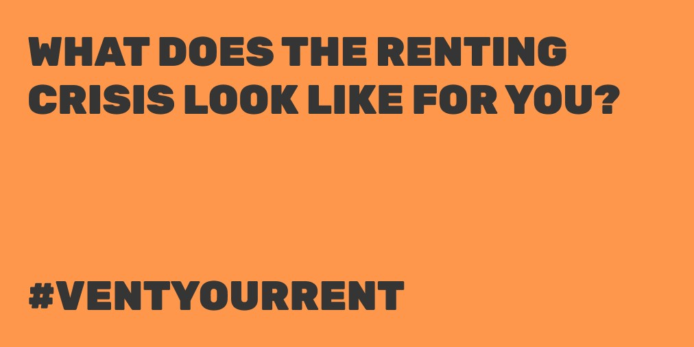

## What we got up to

We spent most of the week working with [Generation Rent](https://www.generationrent.org) on [Vent Your Rent](https://ventyour.rent/), a new tool that encourages renters to add their voice to the General Election campaign and sign the [National Renters Manifesto](https://www.rentermanifesto.org/read_the_manifesto_full). The manifesto was co-written by Generation Rent, London Renters Union, ACORN, Tenants Union UK, Renters’ Rights London and the New Economics Foundation.

We loved working on the project and are very pleased with the results so far. Seeing renters from all over the country share their own rental horror stories has been highlighted just how widespread and systemic the renting crisis is.

Shout out to Dan, Georgie and Caitlin for being amazing collaborators — we look forward to working together again in the future.

We will be blogging a little more about our design and technical choices very soon.

We also released [our tool for self-assessing levels of burnout](https://commonknowledge.typeform.com/to/Tch3nW) a little more widely and shared a Twitter thread about it:

We hope you find it useful.
