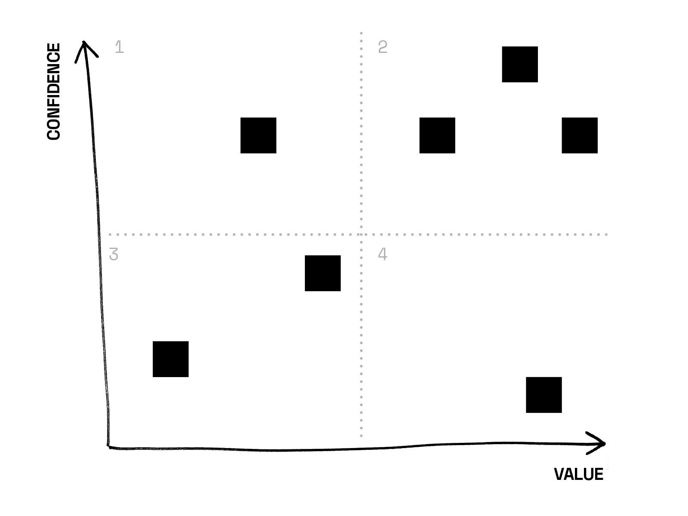
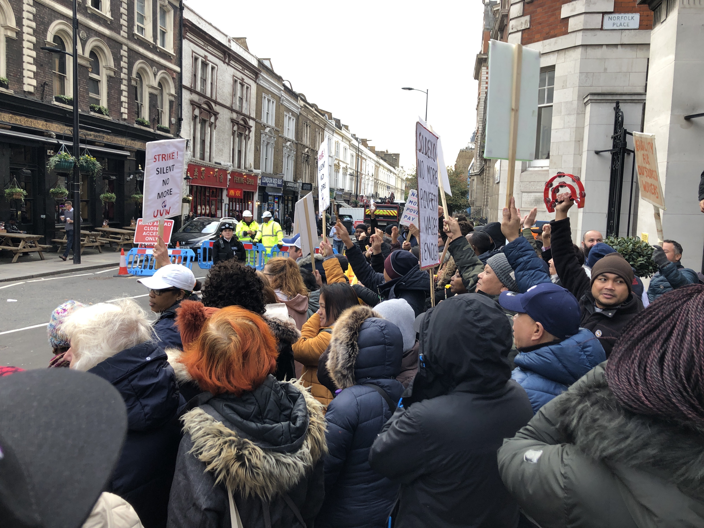
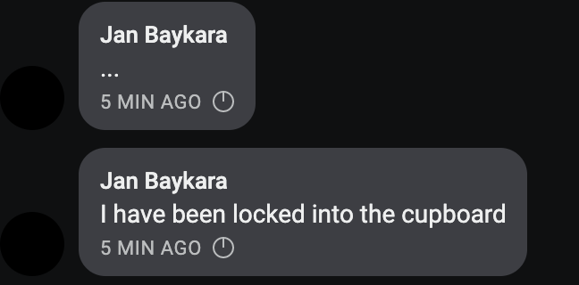

## It was a busy week this week, with a great mix of product work, consultancy and direct organising with striking workers.

## Mutual Aid Resource Network

Last week we were invited to attend a mutual aid working group meet-up. We met organisers who have been spending their own time creating a resource of activists and spaces, which reminded us of our own observations of this big problem.

We were excited as ever to hear what others were thinking about the same kind of challenges as us. As we spoke to them, we realised that a lot of the things they were bringing up sounded like product development problems.

We resolved to dedicate this week on exploring a minimum viable product to meet some activist needs in this area.

## How we approach new ideas

Big new ideas can be daunting to start on, and risky if taken the wrong way. We approach any project by testing our assumptions in the real world, defending against possible risks, and exploring any puzzles we have through user research.

### **1. Scoping**

We first limited the scope of the problem to help us think productively: activists need space all the time for meetings, workshops, training sessions, storage and offices, but often struggle to find them. Simultaneously, the many social centres, spare offices and even living rooms that could be used aren’t always fully utilised. Finally, taking the plunge into booking and hosting space can be anxiety-inducing for those without experience.

This helped us frame our research: _How might we digitally facilitate activists to share and use space?_

### **2. Ideating**

Within the scope we set for ourselves, we mapped any assumptions, puzzles and risks according to [four broad categories](https://svpg.com/four-big-risks/), which we’ve adapted for social movement purposes:

- **Desirability**, or “Does this solve a genuine problem?”

- **Usability**, or “Can people figure out how to use this solution?”

- **Feasibility**, or “Can we realistically build this solution?”

- **Viability**, or “In the long term, is this safe, manageable and beneficial for the progressive movement?”

### **3. Prioritising**

What resulted was a big amorphous blob of sticky notes. To make sense of these, we placed them on a chart with two axes: how confident we were already about an idea or issue, and the value it represented for this project.

There are a lot of other prioritisation tools you can use for this, like [\*RICE](https://www.intercom.com/blog/rice-simple-prioritization-for-product-managers/),\* which scores ideas by potential reach, impact, confidence and estimated effort to build and test.

### **4. Experimenting.**

We divided the stickies into four groups, which let us figure out what to do next:

- From **box 2**: ideas to prototype and test in the real world, that we were confident about and that seemed really central to the project right now

- From **box 4**: puzzles and risks that we felt we’d need to ask people directly about in order to feel more confident about proceeding

- From **box 1**: ideas to save for the future, that we were confident about but didn’t seem central to this project (at least right now)

- We ruthlessly trashed the puzzles that didn’t seem relevant or valuable from **box 3** 😈

## What we’re learning

We think an important part of any new project is looking to past attempts and learning from their successes and failures. We found so many interesting resources on the topic online, including [Radar Squat](https://radar.squat.net/), an aggregator of alternative or radical events, this very [well-maintained Wikipedia article](https://en.wikipedia.org/wiki/Self-managed_social_centres_in_the_United_Kingdom) and [What’s This Place](https://socialcentrestories.files.wordpress.com/2008/06/whats-this-place_lo-res.pdf), a booklet of stories from radical social centres throughout the UK and Ireland. More on this next week.

We looked at the tools and processes that radical social centres are currently using for room bookings, and reached out to some directly to find out about their needs.

We also created a [survey](https://commonknowledge.typeform.com/to/P4QEeE) to gather information on how activists and social groups book spaces for events like trainings, meetings or talks. If this sounds like something you do, we’d really appreciate you taking a few minutes to give us your thoughts, so we can prioritise what we work on.

Meanwhile, we’re also directly interviewing activists and social space organisers. In the process, we will discuss how this could become a more collaborative movement building project. Many activists we work with have similar concerns and we’re eager to facilitate collective knowledge-sharing.

Please take a minute to contribute to our [survey](https://commonknowledge.typeform.com/to/P4QEeE) and share it in your networks. We’ll be publishing our findings and the software we end up making as well.

### Reflecting on the pains of open source

When we kicked off the survey we instinctively reached for Google Forms but made a deliberate side-step after considering the kind of company it is and its approach to stored data. Although we made an effort to find a suitable open source, secure alternative, the options we came across were either abandoned and no longer worked, or required a bit more self-setup than we had energy for right in the moment.

For now, we’ve settled on [Typeform](https://www.typeform.com) but we recognise that secure, privacy-respecting research tools is going to be a persistent requirement. We’ve resolved to research more deeply into this, share what we’ve learned with the activist community and, if necessary, commit to renovating existing or building new open source tooling for this.

If you have recommendations that think would suit our needs, and that of privacy-concerned social researchers more generally, [let us know and we’ll try it and talk about it in a future article](mailto:hello@commonknowledge.coop).

## Out of the building

### We came out to support United Voices of the World’s strike

As part of our ongoing collaborations, we went to support the St Mary’s Hospital picket that kicked off United Voices of the World [union’s strike for their contract staff’s first pay rise in five years](https://www.uvwunion.org.uk/news/2019/10/press-release-strikes-st-marys-hospital-sodexo), as well as working condition improvements.

It was a great chance as ever to note the pain points and opportunities that members and organisers in unions like UVW experience on the street and in their campaigns. We met with organisers to exchange ideas and kick off a new project.

The noise and energy of the picket line was infectious and we know they’re going to win!

### We attended another Tech Workers Coalition meetup

It was very heart-warming to see more and more tech industry colleagues gathering to self-organise proactively on Wednesday night, for the month’s [Tech Workers Coalition London](https://twitter.com/TechWorkersLDN) organising meet. We are really enthusiastic about the group’s commitment to self-education in bread and butter organising techniques.

Helping set up the London branch all those months ago has been a really valuable use of our time. This month, it has allowed concerned tech workers of all stripes to collectively respond to a number of big tech industrial issues that are brewing. We’re managing to create bridges between different arms of the radical trade union and progressive movements, and between different strata of tech workers — from precariously employed cleaners to senior engineers and researchers.

We were also happy that we are able to introduce tech workers to the [MayDay Rooms](https://maydayrooms.org/) radical social centre. Shared physical spaces for campaigners are precious things and help build a greater sense of shared purpose. This is obviously very much in our minds right now through our product work!

Shoutouts from this:

- Come chat with other tech workers at _TWC Learning Club 002: DIY Workers Inquiry_ on 14th November, 7pm at MayDay Rooms

- Join the next general meeting of TWC London on 27th November, 7PM at MayDay Rooms

### We spoke at the first London Notion Meetup

We co-hosted the first [London Notion meet up](https://www.meetup.com/Productivity-Enthusiasts/events/264929065/). Shout out to Yau for organising it with us and [Francesco](https://twitter.com/FrancescoD_Ales) and [Sophie](https://twitter.com/type__error) for being such awesome speakers.

We gave a quick introduction explaining three aspects of Notion that we find particularly interesting:

As a group concerned with questions of organisation, Notion _really_ helps get you organised, with lots of elegance and attention to detail.

It’s a tool that lets you build tools for yourself with fluidity and without requiring technical knowledge. This is empowering and throws back to early software like [HyperCard](https://en.wikipedia.org/wiki/HyperCard). Advancements in digital technology tend towards de-skilling users. In contrast, Notion doesn’t give itself over with total immediacy and requires a creative response to use it well. We like this.

Notion was heavily influenced by 1960s and 70s cybernetic and countercultural figures like [Douglas Engelbart](https://en.wikipedia.org/wiki/Douglas_Engelbart), who focused on how computers could liberate and augment human capacity to the greater good. This is what we are working towards with our digital activist tooling—augmenting and enabling human capacity.

There is a whole book on these visions called [From Counterculture to Cyberculture: Stewart Brand, the Whole Earth Network, and the Rise of Digital Utopianism](https://www.press.uchicago.edu/ucp/books/book/chicago/F/bo3773600.html).

## Oh, and there’s a General Election afoot

Gosh. We’re supporting people as best we can with practical digital advice, and maybe we’ll have more to say about that in coming weeks.

If you are a project that aligns with our [vision, mission and values,](https://github.com/commonknowledge/vision-mission-values) then hit us up at [hello@commonknowledge.coop](mailto:hello@commonknowledge.coop) and we will see what we can do.

And finally, Jan got locked in to the storage cupboard this afternoon. We feel this is a fitting end to a week spent thinking about spaces for activists and proprietary software.

