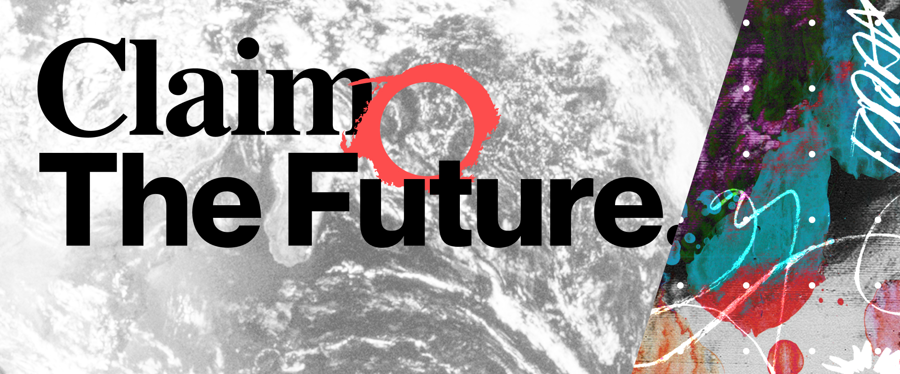
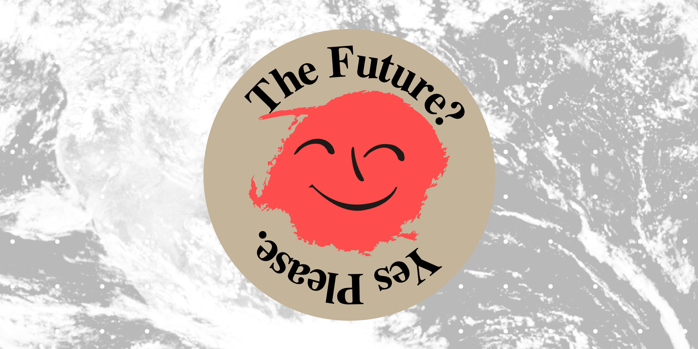

## Claim the Future

This week we launched the website for [Claim the Future](http://claimthefuture.today/), a project initiated by John McDonnell.

Claim the Future aims to respond to the economic and political upheaval caused by the pandemic by building a radical and optimistic vision of the future.

The team has drafted policy position papers to address some of the most pressing economic issues facing our society, with contributions from experts in each field. These papers will provide the vision of the kind of society we want to move towards. 

This strategy will be linked directly to campaigning and action on the ground. The goal of the project is to be participatory and action-oriented, uniting a broad range of political actors to start imagining and building the future together.

You can read John's full launch speech on [LabourList](https://labourlist.org/2020/07/build-better-but-not-back-john-mcdonnells-full-speech/):

> We must claim the future. We have to ask and answer the questions about what lives we want to live, what communities we want to live in and what future there should be for our planet. If we don’t others will. And it will be the establishment politicians and their corporate controllers that will answer these questions for us.

We had a lot of fun working on this project. 

We collaborated with [Michael Oswell](http://michaeloswell.com/) to design the identity and [Ilyanna Kerr](https://www.instagram.com/ilyanna____/) to create a series of illustrations of their policy areas. Our cooperative friends over at [Blake House](http://blake.house/) did a fantastic job making the launch video.

You can get involved by [joining](https://claimthefuture.today/#join) via the website, or by [donating](https://claimthefuture.today/#donate) to the project.

## The World Transformed

[The World Transformed](https://theworldtransformed.org/) have announced their 2020 festival. The festival is going to be digital-first and will run for the whole month of September.

We have been advising them on the technical and social challenges of recreating (and, we hope, even going beyond) the festival experience online. We're really looking forward to it, it's shaping up to be very exciting indeed!

We're also creating the festival website, designed by Robbie Blundell. You can [sign up to their mailing list](https://theworldtransformed.us1.list-manage.com/subscribe?u=7c6d9b034e09da3f08695cbf6&id=ec52e569ee) for updates.

