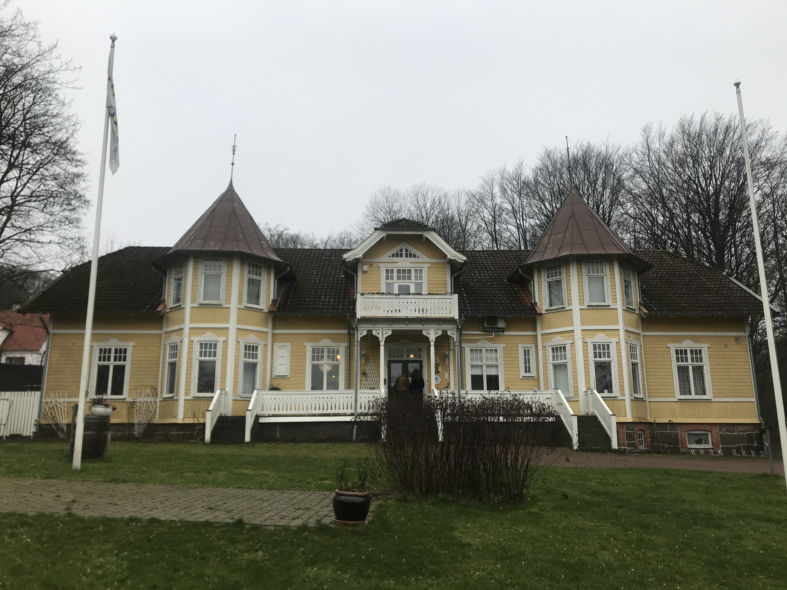
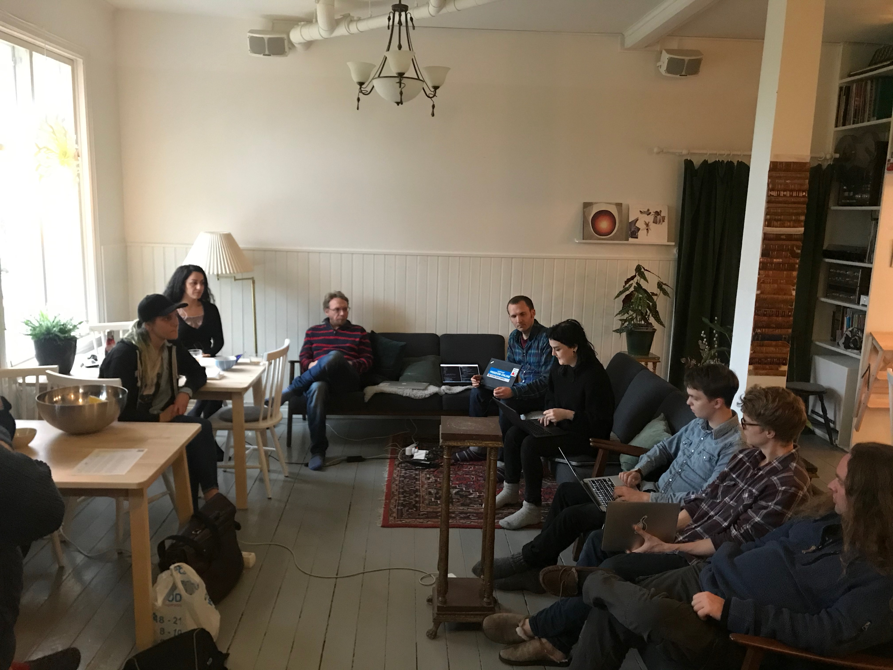

# What we got up to

This week we went to Sweden to join [Zetkin Foundation](https://zetkin.org/en)’s Winter code camp.

Zetkin is a digital platform for organising developed by Sweden’s left party, Vänsterpartiet. We met one of the founders in London late last year and were very impressed when he gave us a demo of the platform. We were happy to have the opportunity to go to Sweden to get to know the organisation and the platform better.

We like Zetkin because their focus is on relational organising: they really get that successful activism is all about building and maintaining relationships with people. The UX has been really well thought-out, developed in direct collaboration with activists and successfully used in Swedish elections over the last five years.

We spent the weekend in a house outside Malmö with about 15 other developers. Everyone worked in pairs to build or fix different feature of the platform, sustained by some delicious home-cooked food.

It was really great to work in such a different setting and with an international community of likeminded people. More on this soon!

# What we're reading

Solidarity with all the university staff on strike from this Thursday. Notes from Below are publishing a weekly bulletin with reports from the strikes – take a look at the [first issue.](https://notesfrombelow.org/article/university-worker-returns-week1-2020)

Our friends at Autonomy just put out a 🔥🔥🔥 new report on [The Future of Work in Valencia.](https://autonomy.work/portfolio/valencia/)

Graham, one of the developers we met in Sweden, has written a great post on the [current limitations of open source.](https://www.sicpers.info/2020/02/empowered-free-software/)

Glad to see that a group inspired by the Angry Workers of West London has begun a [long-term inquiry](https://croydonkickoff.wordpress.com/2020/02/11/plugging-into-the-land-of-dubstep/) in Croydon. We're particularly looking forward to their open publishing approach:

> This blog will be used to report on our progress month-by-month. We aim to use this to keep us accountable to our objectives, and hope that it may serve as one possible example of putting the Angry Workers’ proposal into action (watch this space).

The reviews of the [BERN app](https://app.berniesanders.com/) are really funny and remind us of comments made about My Campaign Map:

> I love this app. User friendly and easy to use. I also love Bernie.

> The app is a great idea, I just wish it did more of the really useful things. For instance, when you go to events it could go straight to your ZIP code instead of the **annoying cumbersome map**. There should be one click management of your events instead of the magic links. And it could be notifying you of events in your area. In short, if it rolled together what's currently scattered across several different platforms (like Bernie Dialer included!) it would be a fantastic app. As is...meh.

And our favourite:

> GO BERNIE! This is an incredible app idea a game changer and MUCH needed as the DNC is cheating the people's candidate again. After the voter suppression and vote manipulation in Iowa the Bernie campaign made this to show his real support. Put pressure on the DNC corruption and demand answers when they report fake numbers. **To those already bitching about the app features...it was rushed out for the cause at hand** give it a rest. It's great and I'm sure it'll improve.

# What we're thinking about

There's lots of hot takes about the BERN app being a privacy nightmare, given you can query anyone's (albeit public) personal information via the electoral roll. We're curious about [(this debate)](https://jarv.is/notes/bernie-sanders-bern-app-data/) and wonder what the repercussions are for future attempts at what we're terming '**distributed relational organising tools**'.
