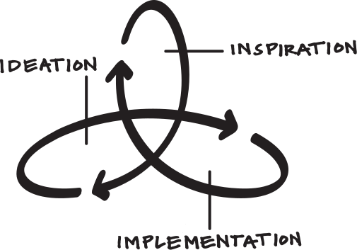

# We are a not-for-profit worker cooperative building digital tools for grassroots activists.

Our team shares a vision of an abundant democratic culture in which people are confident in their capacity to self-organise.

Our aim is to empower people to directly resist all forms of oppression, form more resilient and autonomous communities, and organise themselves at ever larger scales.

---

## What we do

1. Build digital tools and infrastructure
2. Increase the overall capacity of the movement through consultancy and education
3. Facilitate activists to share knowledge and
   resources with each other

---

## How we work

We place a strong focus on building trust and shared understanding with the activists we work with. We listen to their needs, work out we could augment their organisational capacity and directly co-design tools in collaboration with them.

We work in agile sprints: short bursts of focused activity where we follow a build-measure-learn cycle. This enables us to iterate quickly and efficiently, ensuring that we meet real needs without wasting resources on unnecessary features.

---

## Who we are

We have a core team of four members, whose skillset includes political organising, strategy, software engineering, user research, project management, graphic and digital product design.

We all have frontline experience in grassroots organising and an extensive practical and theoretical track record of advancing political change.

#### Alex Worrad-Andrews

Software engineering and project management

#### Chris Devereux

Software engineering

#### Gemma Copeland

Design and user experience

#### Jan Baykara

Software engineering and product design

---

## Advisory board

### Becky Bond

Co-author of Rules for Revolutionaries: How Big Organizing Can Change Everything. She was formerly a senior advisor to the Bernie Sanders 2016 presidential campaign and political director of CREDO Mobile.

### Lizzie O'Shea

Lizzie O’Shea is a lawyer, writer, and broadcaster. She is regularly featured on national television programs and radio to comment on law, digital technology, corporate responsibility, and human rights.

### Richard D Bartlett

One of the cofounders of Loomio, an open source software tool for collective decision-making. Member of Enspiral: a network of self-organising companies.

---

## Support our work

We finance our solidarity work through grants and consultancy for organisations that align with our values and mission.

We have previously received grants from the Andrew Wainwright Reform Trust and Lipman-Miliband Trust. If you're interested in funding our work, please get in touch.

If you are an individual who would like to support our work, you can make a donation directly:
